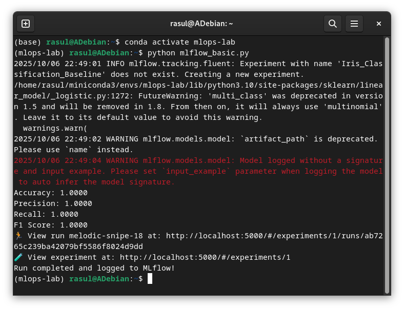

# Отчет по лабораторной работе №1-2
# Лабораторная работа №1-2. Часть 2: Основы трекинга экспериментов с использованием MLflow

**Дата:** 2025-10-16;
**Семестр:** 3;
**Группа:** ПИН-м-о-24-1;
**Дисциплина:** технологии программирования;
**Студент:** Джукаев Расул Русланович.

## Цель работы
Освоить базовые принципы работы с платформой MLflow для управления жизненным циклом
машинного обучения (MLOps). Получить практические навыки логирования параметров, метрик
и артефактов вычислительного эксперимента, а также организации их хранения, визуализации и
сравнения.

## Теоретическая часть
Введение в MLOps и MLflow MLOps (Machine Learning Operations) — это совокупность практик,
направленных на автоматизацию и надежность жизненного цикла машинного обучения
(развертывание, мониторинг, управление данными). Ключевая проблема, которую решает MLOps —
обеспечение воспроизводимости, отслеживаемости и управляемости ML-экспериментов. MLflow — это
open-source платформа для управления end-to-end жизненным циклом машинного обучения. Она
включает в себя четыре основных компонента:
- MLflow Tracking;
- MLflow Projects;
- MLflow Models;
- MLflow Model Registry.
Ключевые концепции MLflow Tracking:
- Эксперимент (Experiment) - контейнер для группы запусков (например, "Оптимизация
гиперпараметров для модели X").
- Запуск (Run) - одно выполнение кода, которое логируется в MLflow. Каждый запуск фиксирует
параметры (parameters), метрики (metrics), артефакты (artifacts), теги (tags).
- Backend Store - хранилище (файловая система или база данных), где сохраняются метаданные 
запусков (параметры, метрики).
- Artifact Store - хранилище (например, локальная папка, S3) для артефактов.
## Практическая часть

### Выполненные задачи
Этап 1: Установка MLflow и запуск Tracking Server
- [x] Задача 1: Активация окружения и установка пакетов
- [x] Задача 2: Запуск MLflow Tracking Server
Этап 2: Написание и запуск скрипта с трекингом эксперимента
- [x] Задача 1: Создание Python-скрипта
- [x] Задача 2: Запуск скрипта
Этап 3: Анализ результатов в MLflow UI
- [x] Задача 1: Открытие UI
- [x] Задача 2: Нахождение своего эксперимента
- [x] Задача 3: Изучение деталей запуска
- [x] Задача 4: Сравнение запусков (опционально, для будущих работ)
### Ключевые фрагменты кода
Код Python-скрипта, который реализует простое обучение модели логистической регрессии
представлен ниже (ссылка на скрипт находится в приложении 1).
```Python
import mlflow
import mlflow.sklearn
from sklearn.datasets import load_iris
from sklearn.linear_model import LogisticRegression
from sklearn.model_selection import train_test_split
from sklearn.metrics import accuracy_score, precision_score, recall_score, f1_score
import matplotlib.pyplot as plt
# Установите URI для отслеживания (указывает на запущенный сервер)
mlflow.set_tracking_uri("http://localhost:5000")
# Создайте или установите активный эксперимент
experiment_name = "Iris_Classification_Baseline"
mlflow.set_experiment(experiment_name)
# Загрузка данных
iris = load_iris()
X = iris.data
y = iris.target
X_train, X_test, y_train, y_test = train_test_split(X, y, test_size=0.2,
random_state=42)
# Определите параметры модели для логирования
params = {
"solver": "lbfgs",
"max_iter": 1000,
"multi_class": "auto",
"random_state": 42
}
# Начало запуска MLflow
with mlflow.start_run():
    # Логирование параметров
    mlflow.log_params(params)
    # Создание и обучение модели
    model = LogisticRegression(**params)
    model.fit(X_train, y_train)
    # Предсказание и расчет метрик
    y_pred = model.predict(X_test)
    accuracy = accuracy_score(y_test, y_pred)
    precision = precision_score(y_test, y_pred, average='weighted')
    recall = recall_score(y_test, y_pred, average='weighted')
    f1 = f1_score(y_test, y_pred, average='weighted')
    # Логирование метрик
    mlflow.log_metric("accuracy", accuracy)
    mlflow.log_metric("precision", precision)
    mlflow.log_metric("recall", recall)
    mlflow.log_metric("f1_score", f1)
    # Логирование модели
    mlflow.sklearn.log_model(model, "model")
    # Создание и логирование артефакта (графика)
    fig, ax = plt.subplots()
    ax.bar(['Accuracy', 'Precision', 'Recall', 'F1'], [accuracy, precision, recall, f1])
    ax.set_ylabel('Score')
    ax.set_title('Model Performance Metrics')
    plt.savefig("metrics_plot.png") # Сохраняем график в файл
    mlflow.log_artifact("metrics_plot.png") # Логируем файл как артефакт
    # Вывод метрик в консоль для удобства
    print(f"Accuracy: {accuracy:.4f}")
    print(f"Precision: {precision:.4f}")
    print(f"Recall: {recall:.4f}")
    print(f"F1 Score: {f1:.4f}")
print("Run completed and logged to MLflow!")
```
## Результаты выполнения

Программа вывела ошибку.



Но график создан и сохранён в файле metrics_plot.png (см приложение 2).
При смене параметров (solver: liblinear, max_iter: 1050) у данного скрипта метрики качества
не меняются.

## Выводы
1. Освоены базовые принципы работы с платформой MLflow для управления жизненным циклом
машинного обучения.
2. Получены практические навыки логирования параметров, метрик и артефактов вычислительного
эксперимента, а также организации их хранения, визуализации и сравнения.
3. Создан скрипт на языке Python для обучения модели логистической регрессии на встроенном
в skkearn наборе данных Iris.

## Приложения
- 1. Ссылка на исходный код [src/mlflow_basic.py](src/mlflow_basic.py)
- 2. Диаграмма Metrics plot (metrics_plot.png)


