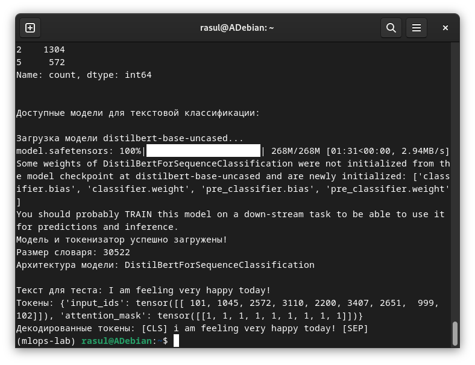

# Отчет по лабораторной работе №3-4
# Лабораторная работа №3-4. Часть 1: Знакомство с платформой Hugging Face Hub

**Дата:** 2025-10-17;
**Семестр:** 3;
**Группа:** ПИН-м-о-24-1;
**Дисциплина:** Технологии программирования;
**Студент:** Джукаев Расул Русланович.

## Цель работы
Освоить базовые принципы работы с платформой Hugging Face Hub - центральным репозиторием моделей,
датасетов и приложений машинного обучения. Получить практические навыки поиска, оценки и загрузки
моделей и датасетов для задачи текстовой классификации

## Теоретическая часть
Hugging Face — это компания и сообщество, создавшее самую популярную в мире open-source платформу
для машинного обучения. Ключевыми продуктами являются Transformers, Hugging Face Hub, Datasets.
Ключевые концепции платформы:
- Модели (Models) - предобученные веса архитектур нейронных сетей (BERT, GPT, ResNet и др.) для
различных задач;
- Датасеты (Datasets) - коллекции данных для обучения и оценки моделей. Могут быть официальными
(от создателей) или community-driven;
- Spaces - интерактивные веб-демонстрации моделей с графическим интерфейсом;
- Tasks: Стандартизированные типы ML-задач (текстовая классификация, суммирование, перевод и
т.д.).
Текстовая классификация — одна из фундаментальных задач NLP, включающая:
- Классификация тональности (sentiment analysis);
- Классификация тем (topic classification).
- Определение спама;
- Категоризация текстов.

## Практическая часть

### Выполненные 
Этап 1: Установка необходимых библиотек
- [x] Задача 1: Активация окружения и установка пакетов

Этап 2: Работа с Hugging Face Hub через веб-интерфейс
- [x] Задача 1: Знакомство с интерфейсом
- [x] Задача 2: Поиск датасета для текстовой классификации
- [x] Задача 3: Поиск модели для текстовой классификации

Этап 3: Программная работа с Hugging Face 
- [x] Задача 1: Создание Python-скрипта для исследования
- [x] Задача 2: Написание кода для загрузки датасета
- [x] Задача 3: Написание кода для исследования моделей
- [x] Задача 4: Загрузка выбранной модели
- [x] Задача 5: Тестирование работы токенизатора
- [x] Задача 6: Запуск скрипта

Этап 4: Сохранение локальных копий
- [x] Задача 1: Создание директории для проекта
- [x] Задача 2: Сохранение информации о выбранных ресурсах

### Ключевые фрагменты кода
Код для загрузки датасета.
```Python
from datasets import load_dataset
from huggingface_hub import list_models, list_datasets
import pandas as pd

# Исследование доступных датасетов
print("Доступные датасеты для текстовой классификации:")
datasets = list_datasets(filter="task_categories:text-classification")
for dataset in datasets:
    print(f"- {dataset.id}")
    
# Загрузка датасета emotion
print("\nЗагрузка датасета emotion...")
dataset = load_dataset("emotion")

# Исследование структуры датасета
print(f"\nСтруктура датасета: {dataset}")
print(f"\nПримеры из train split:")
train_df = pd.DataFrame(dataset['train'][:5])
print(train_df)

# Анализ распределения классов
print("\nРаспределение классов в тренировочных данных:")
label_counts = pd.Series(dataset['train']['label']).value_counts()
print(label_counts)
```
Код для исследования моделей.
```Python
# Исследование доступных моделей 
print("\n\nДоступные модели для текстовой классификации:") 
models = list_models( 
    filter="task:text-classification", 
    sort="downloads", 
    direction=-1, 
    limit=5 
) 
for model in models: 
    print(f"\nМодель: {model.id}") 
    print(f"Загрузок: {model.downloads}") 
    print(f"Тэги: {model.tags}") 
if model.pipeline_tag: 
        print(f"Тип задачи: {model.pipeline_tag}")
```
Загрузка выбранных моделей.
```Python
from transformers import AutoTokenizer, AutoModelForSequenceClassification

# Загрузка токенизатора и модели
model_name = "distilbert-base-uncased"
print(f"\nЗагрузка модели {model_name}...")
tokenizer = AutoTokenizer.from_pretrained(model_name)
model = AutoModelForSequenceClassification.from_pretrained(
    model_name,
    num_labels=6 # Количество классов в датасете emotion
)
print("Модель и токенизатор успешно загружены!")
print(f"Размер словаря: {tokenizer.vocab_size}")
print(f"Архитектура модели: {model.__class__.__name__}")
```
Тестирование работы токенизатора.
```Python
# Тестирование токенизатора
test_text = "I am feeling very happy today!"
print(f"\nТекст для теста: {test_text}")
tokens = tokenizer(test_text, return_tensors="pt")
print(f"Токены: {tokens}")
print(f"Декодированные токены: {tokenizer.decode(tokens['input_ids'][0])}")
```

## Результаты выполнения
Для корректного выполнения необходимо наличие фреймворка pytorch. После установки данного фреймворка
успешно запущен скрипт.



Создана директория для проекта под названием text-classification-project и сохранена информация о
выбранных ресурсах в виде файла [resources.txt](src/text-classification-project/resources.txt).

## Выводы
1. Освоены базовые принципы работы с платформой Hugging Face Hub.
2. Получены практические навыки поиска, оценки и загрузки моделей и датасетов для задачи текстовой
классификации.
3. Создан скрипт для работы над датасетом и моделью.

## Приложения
- Ссылка на исходный код [/src/hf_hub_exploration.py](src/hf_hub_exploration.py)