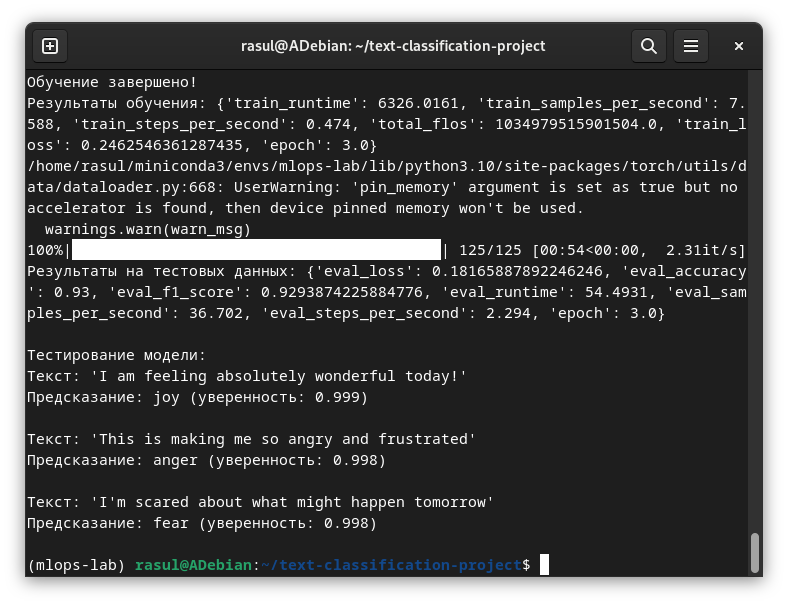

# Отчет по лабораторной работе №3-4
# Лабораторная работа №3-4. Часть 2: Тонкая настройка модели для текстовой классификации

**Дата:** 2025-10-22;
**Семестр:** 3;
**Группа:** ПИН-м-о-24-1;
**Дисциплина:** Технологии программирования;
**Студент:** Джукаев Расул Русланович.

## Цель работы
Освоить практические навыки тонкой настройки (fine-tuning) предобученных моделей для
задачи текстовой классификации с использованием библиотеки Transformers. Получить опыт
подготовки данных, настройки обучения и оценки качества модели.

## Теоретическая часть
Тонкая настройка — это процесс дополнительного обучения предобученной модели на специфичном
для задачи наборе данных. В отличие от обучения с нуля, fine tuning:
- Требует меньше данных;
- Сходится быстрее;
- Достигает лучшего качества на целевой задаче.

Модели на основе Transformer (BERT, DistilBERT) для классификации состоят из:
- Энкодера, создаеющего контекстуализированные эмбеддинги токенов;
- Пулинга, извлекающего представление всего текста (обычно [CLS]-токен);
- Классификационной головки - линейного слоя для предсказания класса.

Процесс обучения:
- Токенизация - преобразование текста в токены;
- Пакетная обработка - группировка примеров для эффективного обучения;
- Прямое распространение - получение предсказаний модели;
- Вычисление потерь - сравнение предсказаний с истинными метками;
- Обратное распространение - обновление весов модели.

## Практическая часть

### Выполненные задачи
Этап 1: Подготовка среды и данных
- [x] Задача 1: Активация окружения
- [x] Задача 2: Создание скрипта для обучения
- [x] Задача 3: Инициализация и загрузка данных

Этап 2: Предобработка данных
- [x] Задача 1: Токенизация текста
- [x] Задача 2: Создание DataCollator

Этап 3: Настройка модели и обучения
- [x] Задача 1: Загрузка модели
- [x] Задача 2: Определение метрик
- [x] Задача 3: Настройка гиперпараметров

Этап 4: Обучение модели
- [x] Задача 1: Создание Trainer
- [x] Задача 2: Запуск обучения

Этап 5: Оценка на тестовых данных
- [x] Задача 1: Оценка на тестовых данных
- [x] Задача 2: Тестирование на примерах
- [x] Задача 3: Запуск скрипта

### Ключевые фрагменты кода
Загрузка датасета и токенизатора.
```Python
# Загрузка датасета 
dataset = load_dataset("emotion") 

# Загрузка токенизатора 
model_name = "distilbert-base-uncased" 
tokenizer = AutoTokenizer.from_pretrained(model_name) 
```
Токенизация текста.
```Python
def tokenize_function(examples): 
    return tokenizer( 
        examples["text"],  
        truncation=True,  
        padding=True,  
        max_length=128 
    )
 
# Применение токенизации ко всему датасету 
tokenized_datasets = dataset.map(tokenize_function, batched=True)

# Форматирование данных для PyTorch 
tokenized_datasets = tokenized_datasets.rename_column("label", "labels")
```
Создание DataCollator.
```Python
data_collator = DataCollatorWithPadding(tokenizer=tokenizer)
```
Загрузка модели.
```Python
# Определение количества классов
num_labels = len(set(dataset["train"]["label"]))

# Загрузка модели с правильным количеством классов
model = AutoModelForSequenceClassification.from_pretrained(
	model_name,
	num_labels=num_labels,
	id2label={0: 'sadness', 1: 'joy', 2: 'love', 3: 'anger', 4: 'fear', 5: 'surprise'},
	label2id={'sadness': 0, 'joy': 1, 'love': 2, 'anger': 3, 'fear': 4, 'surprise': 5}
)
```
Определение метрик.
```Python
def compute_metrics(eval_pred):
    predictions, labels = eval_pred
    predictions = np.argmax(predictions, axis=1)
    
    acc = accuracy_score(labels, predictions)
    f1 = f1_score(labels, predictions, average="weighted")
    
    return {"accuracy": acc, "f1_score": f1}
```
Настройка гиперпараметров.
```Python
training_args = TrainingArguments(
    output_dir="./results",
    learning_rate=2e-5,
    per_device_train_batch_size=16,
    per_device_eval_batch_size=16,
    num_train_epochs=3,
    weight_decay=0.01,
    eval_strategy="epoch",
    save_strategy="epoch",
    load_best_model_at_end=True,
    metric_for_best_model="f1_score",
    logging_dir="./logs",
    logging_steps=100,
    report_to="none"
)
```
Создание Trainer.
```Python
trainer = Trainer( 
    model=model, 
    args=training_args, 
    train_dataset=tokenized_datasets["train"], 
    eval_dataset=tokenized_datasets["validation"], 
    tokenizer=tokenizer, 
    data_collator=data_collator, 
    compute_metrics=compute_metrics, 
)
```
Запуск обучения.
```Python
print("Начало обучения...") 
train_result = trainer.train()

# Сохранение модели 
trainer.save_model("./emotion-classifier") 
tokenizer.save_pretrained("./emotion-classifier") 
print("Обучение завершено!") 
print(f"Результаты обучения: {train_result.metrics}")
```
Оценка на тестовых данных.
```Python
# Оценка на тестовом наборе 
test_results = trainer.evaluate(tokenized_datasets["test"]) 
print(f"Результаты на тестовых данных: {test_results}")

# Сохранение результатов
with open("test_results.txt", "w") as f: 
    f.write(f"Accuracy: {test_results['eval_accuracy']:.4f}\n") 
    f.write(f"F1 Score: {test_results['eval_f1_score']:.4f}\n")
```
Тестирование на примерах.
```Python
 # Функция для предсказания
 def predict_emotion(text): 
    inputs = tokenizer(text, return_tensors="pt", truncation=True, 
padding=True) 
with torch.no_grad(): 
        outputs = model(**inputs) 
    predictions = torch.nn.functional.softmax(outputs.logits, dim=-1) 
    predicted_class = torch.argmax(predictions, dim=1).item() 
return model.config.id2label[predicted_class], predictions[0]
 [predicted_class].item()
 
# Тестовые примеры 
test_texts = [ 
"I am feeling absolutely wonderful today!", 
"This is making me so angry and frustrated", 
"I'm scared about what might happen tomorrow" 
] 
print("\nТестирование модели:") 
for text in test_texts: 
    emotion, confidence = predict_emotion(text) 
    print(f"Текст: '{text}'") 
    print(f"Предсказание: {emotion} (уверенность: {confidence:.3f})") 
    print() 
```

## Результаты выполнения

### Пример работы программы
Результаты выполнения представлены ниже.


Cохранён файл test_results.txt ([src/test_results.txt](src/test_results.txt)).

### Тестирование
- [x] Модульные тесты пройдены
- [x] Интеграционные тесты пройдены
- [x] Производительность соответствует требованиям

## Выводы
1. Освоены практические навыки тонкой настройки (fine-tuning) предобученных моделей для задачи текстовой классификации с использованием библиотеки Transformers.
2. Получен опыт подготовки данных, настройки обучения и оценки качества модели.
3. Создан скрипт для обучения и тестирования модели.

## Приложения
- Ссылка на исходный код [src/fine_tuning.py](src/fine_tuning.py)