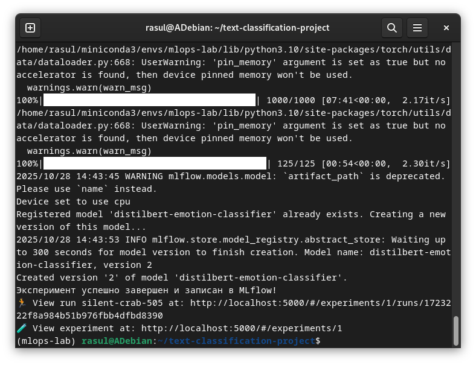
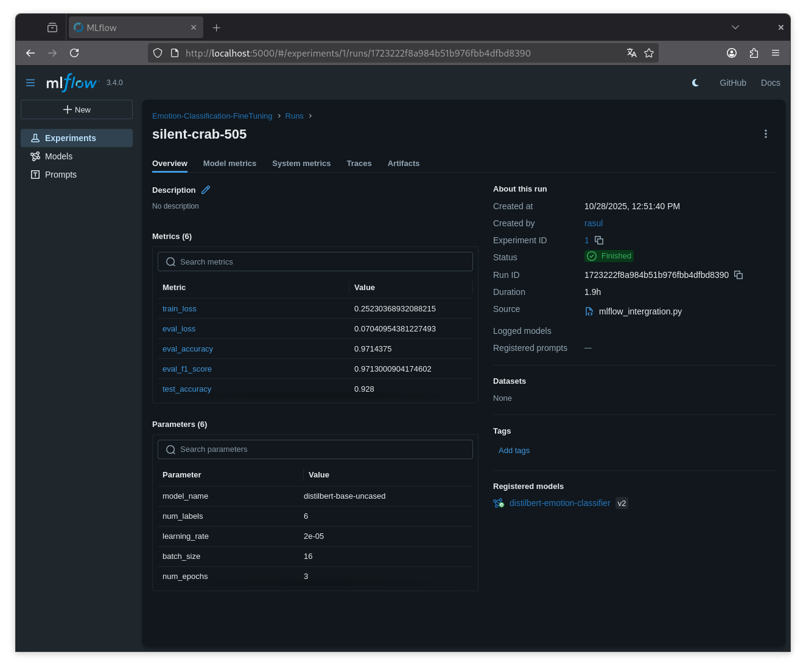
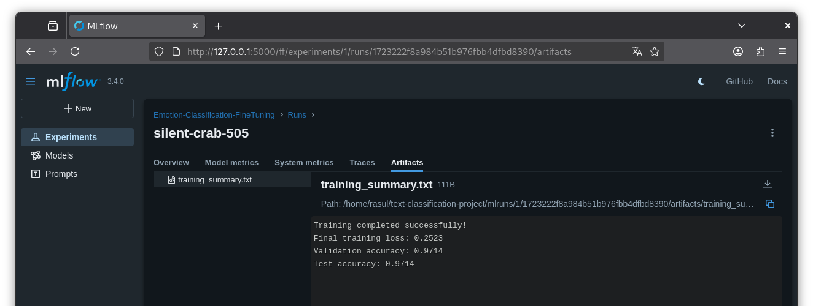
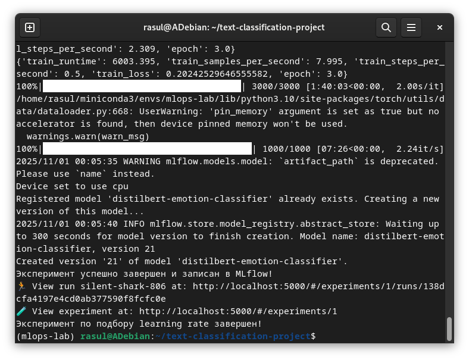
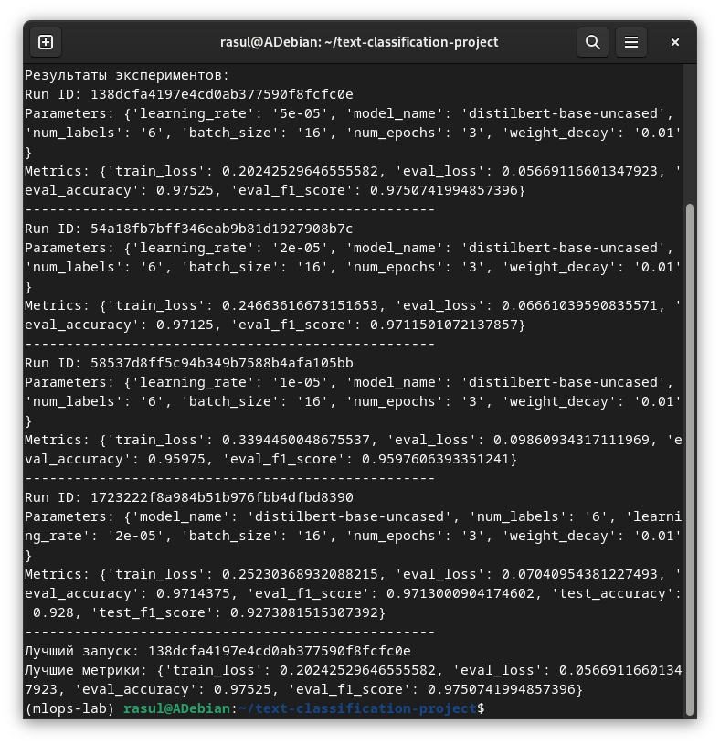

# Отчет по лабораторной работе №3-4
# Лабораторная работа №3-4. Часть 3: Интеграция с MLflow для трекинга экспериментов

**Дата:** 2025-11-01;
**Семестр:** 3;
**Группа:** ПИН-м-о-24-1;
**Дисциплина:** Технологии программирования;
**Студент:** Джукаев Расул Русланович.

## Цель работы
Освоить интеграцию процесса тонкой настройки моделей с платформой MLflow для комплексного
трекинга экспериментов. Научиться автоматически логировать гиперпараметры, метрики,
артефакты и модели в ходе обучения.

## Теоретическая часть
MLflow предоставляет нативные интеграции с популярными ML фреймворками, включая Hugging Face
Transformers. Ключевые возможности:
 - Автоматическое логирование: автологирование параметров, метрик и артефактов;
 - Модельный регистр: версионирование и управление моделями;
 - Воспроизводимость: фиксация всех компонентов эксперимента.
Компоненты трекинга для NLP:
 - Параметры: learning rate, batch size, архитектура модели;
 - Метрики: accuracy, F1-score, perplexity, loss;
 - Артефакты: модель, токенизатор, графики обучения;
 - Тэги: задача, датасет, версия модели.
Стратегии логирования:
 - Ручное логирование: полный контроль над процессом;
 - Автологирование: автоматическая фиксация метрик;
 - Колбэки: интеграция через системные хуки.

## Практическая часть

### Выполненные задачи
Этап 1: Подготовка среды и конфигурация
- [x] Задача 1: Активация окружения и проверка зависимостей
- [x] Задача 2: Запуск MLflow Tracking Server
- [x] Задача 3: Создание скрипта для интегрированного обучения
Этап 2: Модификация скрипта обучения с интеграцией MLflow
- [x] Задача 1: Модификация скрипта обучения с интеграцией MLflow
Этап 3: Запуск и мониторинг эксперимента
- [x] Задача 1: Запуск скрипта
- [x] Задача 2: Мониторинг в MLflow UI
Этап 4: Дополнительные эксперименты
- [x] Задача 1: Создание скрипта для сравнения гиперпараметров
- [x] Задача 2: Код для сравнения разных конфигураций
Этап 5: Анализ результатов
- [x] Задача 1: Создание скрипта для анализа
- [x] Задача 2: Код для анализа экспериментов

### Ключевые фрагменты кода
Скрипт mlflow_integration.py содержит код, приведённый ниже.
```Python
import mlflow
import mlflow.transformers
from datasets import load_dataset
from transformers import (
    AutoTokenizer,
    AutoModelForSequenceClassification,
    TrainingArguments,
    Trainer,
    DataCollatorWithPadding
)
import numpy as np
from sklearn.metrics import accuracy_score, f1_score
import torch
import os

# Настройка MLflow
mlflow.set_tracking_uri("http://localhost:5000")
mlflow.set_experiment("Emotion-Classification-FineTuning")

def compute_metrics(eval_pred):
    predictions, labels = eval_pred
    predictions = np.argmax(predictions, axis=1)
    acc = accuracy_score(labels, predictions)
    f1 = f1_score(labels, predictions, average="weighted")
    
    return {"accuracy": acc, "f1_score": f1}
    
def tokenize_function(examples):
    tokenizer = AutoTokenizer.from_pretrained("distilbert-base-uncased")
    return tokenizer(
        examples["text"],
        truncation=True,
        padding=True,
        max_length=128
    )

# Начало эксперимента MLflow
with mlflow.start_run():
    # Загрузка и подготовка данных
    dataset = load_dataset("emotion")
    tokenized_datasets = dataset.map(tokenize_function, batched=True)
    tokenized_datasets = tokenized_datasets.rename_column("label", "labels")
    tokenized_datasets.set_format("torch", columns=["input_ids", "attention_mask", "labels"])

    # Параметры модели и обучения
    model_params = {
        "model_name": "distilbert-base-uncased",
        "num_labels": 6,
        "learning_rate": 2e-5,
        "batch_size": 16,
        "num_epochs": 3,
		"weight_decay": 0.01,
    }

    # Логирование параметров
    mlflow.log_params(model_params)

    # Загрузка модели
    model = AutoModelForSequenceClassification.from_pretrained(
        model_params["model_name"],
        num_labels=model_params["num_labels"],
        id2label={0: 'sadness', 1: 'joy', 2: 'love', 3: 'anger', 4: 'fear', 5: 'surprise'},
        label2id={'sadness': 0, 'joy': 1, 'love': 2, 'anger': 3, 'fear': 4, 'surprise': 5}
    )

    # Настройка обучения
    training_args = TrainingArguments(
        output_dir="./results",
        learning_rate=model_params["learning_rate"],
        per_device_train_batch_size=model_params["batch_size"],
        per_device_eval_batch_size=model_params["batch_size"],
        num_train_epochs=model_params["num_epochs"],
        weight_decay=model_params["weight_decay"],
        eval_strategy="epoch",
        save_strategy="epoch",
        load_best_model_at_end=True,
        metric_for_best_model="f1_score",
        logging_dir="./logs",
        logging_steps=100,
        report_to="none",
    )

    data_collator = DataCollatorWithPadding(tokenizer=AutoTokenizer.from_pretrained(model_params["model_name"]))

    # Создание тренера
    trainer = Trainer(
        model=model,
        args=training_args,
        train_dataset=tokenized_datasets["train"],
        eval_dataset=tokenized_datasets["validation"],
        tokenizer=AutoTokenizer.from_pretrained(model_params["model_name"]),
        data_collator=data_collator,
        compute_metrics=compute_metrics,
    )

    # Обучение с логированием метрик
    print("Начало обучения с трекингом в MLflow...")
    train_result = trainer.train()

    # Логирование метрик обучения
    evaluation = trainer.evaluate(tokenized_datasets["train"])
    mlflow.log_metrics({
        "train_loss": train_result.metrics["train_loss"],
        "eval_loss": evaluation["eval_loss"],
        "eval_accuracy": evaluation["eval_accuracy"],
        "eval_f1_score": evaluation["eval_f1_score"]
    })

    # Оценка на тестовых данных
    test_results = trainer.evaluate(tokenized_datasets["test"])
    mlflow.log_metrics({
		"test_accuracy": test_results["eval_accuracy"],
		"test_f1_score": test_results["eval_f1_score"]
    })

    # Сохранение и логирование модели
    model_path = "./emotion-classifier-mlflow"
    trainer.save_model(model_path)

    # Логирование модели в MLflow
    mlflow.transformers.log_model(
    transformers_model={
        "model": model,
        "tokenizer": AutoTokenizer.from_pretrained(model_params["model_name"])
    },
    artifact_path="emotion-classifier",
    registered_model_name="distilbert-emotion-classifier"
    )

    # Логирование дополнительных артефактов
    with open("training_summary.txt", "w") as f:
        f.write(f"Training completed successfully!\n")
        f.write(f"Final training loss: {train_result.metrics['train_loss']:.4f}\n")
        f.write(f"Validation accuracy: {evaluation['eval_accuracy']:.4f}\n")
        f.write(f"Test accuracy: {evaluation['eval_accuracy']:.4f}\n")
    mlflow.log_artifact("training_summary.txt")

    print("Эксперимент успешно завершен и записан в MLflow!")
```
Код скрипта hyperparameter.py, рассчитанный для эксперимента с разными learning rates представлен ниже.
Во избежание ошибок при импорте модуля создан скрипт на основе mlfow_integration.py, адаптированный для
выполнения hyperparameter.py и сохранённый под названием mlflow_integration_2.py. 
```Python
import mlflow
from mlflow_integration_2 import train_model

# Эксперимент с разными learning rates
learning_rates = [1e-5, 2e-5, 5e-5]

for lr in learning_rates:
    with mlflow.start_run(nested=True):
        mlflow.log_param("learning_rate", lr)
        results = train_model(learning_rate=lr)
        mlflow.log_metrics(results)

print("Эксперимент по подбору learning rate завершен!")
```
Ниже представлен код mlflow_integration_2.py.
```Python
import mlflow
import mlflow.transformers
from datasets import load_dataset
from transformers import (
    AutoTokenizer,
    AutoModelForSequenceClassification,
    TrainingArguments,
    Trainer,
    DataCollatorWithPadding
)
import numpy as np
from sklearn.metrics import accuracy_score, f1_score
import torch
import os

# Настройка MLflow
mlflow.set_tracking_uri("http://localhost:5000")
mlflow.set_experiment("Emotion-Classification-FineTuning")

def compute_metrics(eval_pred):
    predictions, labels = eval_pred
    predictions = np.argmax(predictions, axis=1)
    acc = accuracy_score(labels, predictions)
    f1 = f1_score(labels, predictions, average="weighted")
    
    return {"accuracy": acc, "f1_score": f1}
    
def tokenize_function(examples):
    tokenizer = AutoTokenizer.from_pretrained("distilbert-base-uncased")
    return tokenizer(
        examples["text"],
        truncation=True,
        padding=True,
        max_length=128
    )
	
def train_model(learning_rate):	
	# Загрузка и подготовка данных
	dataset = load_dataset("emotion")
	tokenized_datasets = dataset.map(tokenize_function, batched=True)
	tokenized_datasets = tokenized_datasets.rename_column("label", "labels")
	tokenized_datasets.set_format("torch", columns=["input_ids", "attention_mask", "labels"])
	# Параметры модели и обучения
	model_params = {
		"model_name": "distilbert-base-uncased",
		"num_labels": 6,
		"learning_rate": learning_rate,
		"batch_size": 16,
		"num_epochs": 3,
		"weight_decay": 0.01,
	}

	# Логирование параметров
	mlflow.log_params(model_params)

	# Загрузка модели
	model = AutoModelForSequenceClassification.from_pretrained(
		model_params["model_name"],
		num_labels=model_params["num_labels"],
		id2label={0: 'sadness', 1: 'joy', 2: 'love', 3: 'anger', 4: 'fear', 5: 'surprise'},
		label2id={'sadness': 0, 'joy': 1, 'love': 2, 'anger': 3, 'fear': 4, 'surprise': 5}
		)

	# Настройка обучения
	training_args = TrainingArguments(
		output_dir="./results",
		learning_rate=model_params["learning_rate"],
		per_device_train_batch_size=model_params["batch_size"],
		per_device_eval_batch_size=model_params["batch_size"],
		num_train_epochs=model_params["num_epochs"],
		weight_decay=model_params["weight_decay"],
		eval_strategy="epoch",
		save_strategy="epoch",
		load_best_model_at_end=True,
		metric_for_best_model="f1_score",
		logging_dir="./logs",
		logging_steps=100,
		report_to="none",
	)

	data_collator = DataCollatorWithPadding(tokenizer=AutoTokenizer.from_pretrained(model_params["model_name"]))

	# Создание тренера
	trainer = Trainer(
		model=model,
		args=training_args,
		train_dataset=tokenized_datasets["train"],
		eval_dataset=tokenized_datasets["validation"],
		tokenizer=AutoTokenizer.from_pretrained(model_params["model_name"]),
		data_collator=data_collator,
		compute_metrics=compute_metrics,
	)

	# Обучение с логированием метрик
	print("Начало обучения с трекингом в MLflow...")
	train_result = trainer.train()


    # Логирование метрик обучения
	evaluation = trainer.evaluate(tokenized_datasets["train"])
	results = {
		"train_loss": train_result.metrics["train_loss"],
		"eval_loss": evaluation["eval_loss"],
		"eval_accuracy": evaluation["eval_accuracy"],
		"eval_f1_score": evaluation["eval_f1_score"]
	}

	# Логирование модели в MLflow
	mlflow.transformers.log_model(
	transformers_model={
		"model": model,
		"tokenizer": AutoTokenizer.from_pretrained(model_params["model_name"])
	},
	artifact_path="emotion-classifier",
	registered_model_name="distilbert-emotion-classifier"
	)
	print("Эксперимент успешно завершен и записан в MLflow!")
	return results
```
Скрипт для анализа и сравнения результатов представлен ниже.
```Python
import mlflow
from mlflow.tracking import MlflowClient

mlflow.set_tracking_uri("http://localhost:5000")
client = MlflowClient()

# Получение всех запусков эксперимента
experiment = client.get_experiment_by_name("Emotion-Classification-FineTuning")
runs = client.search_runs(experiment.experiment_id)

print("Результаты экспериментов:")
for run in runs:
    print(f"Run ID: {run.info.run_id}")
    print(f"Parameters: {run.data.params}")
    print(f"Metrics: {run.data.metrics}")
    print("-" * 50)

# Нахождение лучшего запуска
best_run = min(runs, key=lambda x: x.data.metrics.get('eval_loss', float('inf')))
print(f"Лучший запуск: {best_run.info.run_id}")
print(f"Лучшие метрики: {best_run.data.metrics}")
```

## Результаты выполнения

### Пример работы программы
При выполнении программы mlflow_integration.py выведены результаты, представленные ниже.


Модель зарегистрирована в MLflow.


Сохранены метрики в файле [training_summary.txt](src/training_summary.txt).


Результаты выполнения скрипта hyperparameter_tuning.py представлены ниже.


Результаты выполнения программы analyze_results.py представлены ниже. 


По ним можно понять, что лучшие запуск и метрики есть у модели с наибольшей величиной learning rate.

### Тестирование
- [x] Модульные тесты пройдены
- [x] Интеграционные тесты пройдены
- [x] Производительность соответствует требованиям

## Выводы
1. Освоена интеграция процесса тонкой настройки моделей с платформой MLflow для комплексного трекинга
экспериментов. 
2. Получены умения автоматически логировать гиперпараметры, метрики, артефакты и модели в ходе обучения.
3. Обучены и логированы модели, а также проведено сравнение между ними.

## Приложения
- Ссылки на исходный код
1. analyze_results.py: [src/analyze_results.py](src/analyze_results.py)
2. hyperparameter_tuning.py: [src/hyperparameter_tuning.py](src/hyperparameter_tuning.py)
3. mlflow_integration.py: [src/mlflow_integration.py](src/mlflow_integration.py)
4. mlflow_integration_2.py: [src/mlflow_integration_2.py](src/mlflow_integration_2.py)
- Ссылка на файл training_summary.txt: [src/training_summary.txt](src/training_summary.txt)