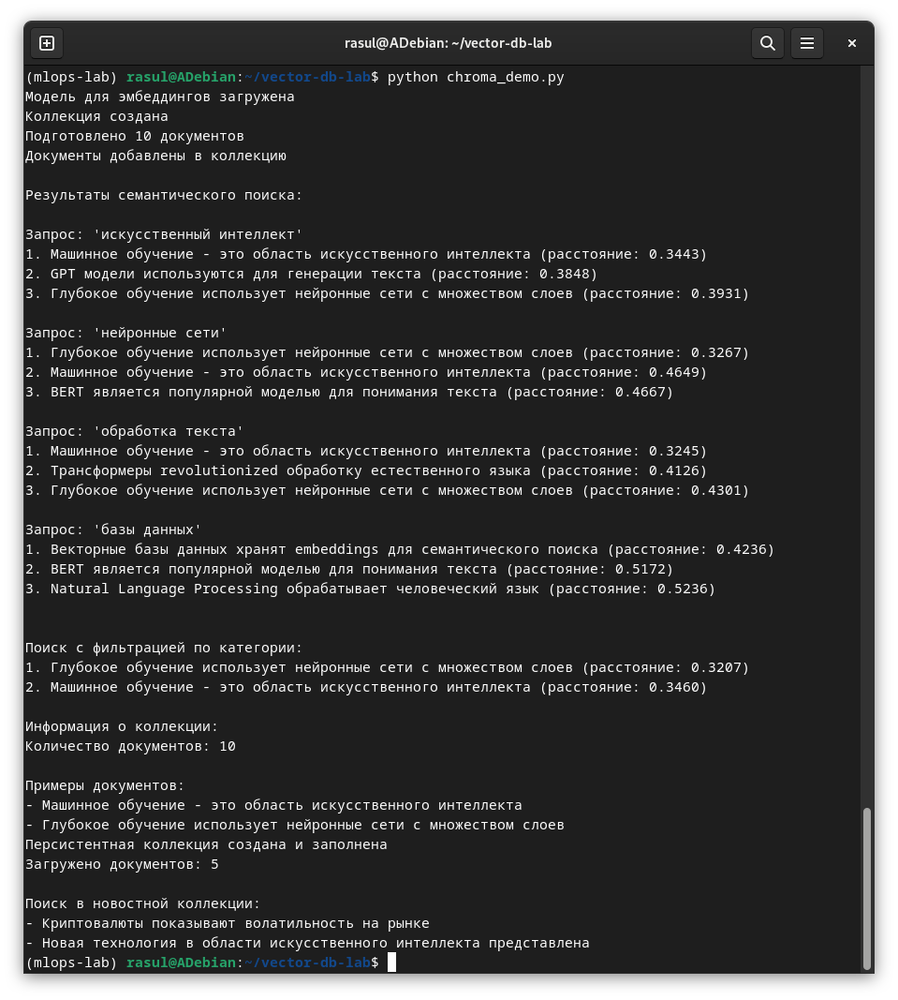

# Отчет по лабораторной работе №5-6
# Лабораторная работа №5-6. Часть 1: Работа с векторными базами данных (ChromaDB)

**Дата:** 2025-11-04;
**Семестр:** 3;
**Группа:** ПИН-м-о-24-1;
**Дисциплина:** Технологии программирования;
**Студент:** Джукаев Расул Русланович.

## Цель работы
Освоить принципы работы с векторными базами данных на примере ChromaDB. Получить
практические навыки создания коллекций, генерации эмбеддингов, выполнения
семантического поиска и интеграции с ML-моделями.

## Теоретическая часть
Векторные базы данных Векторные БД предназначены для хранения и поиска векторных
представлений данных (эмбеддингов). Ключевые особенности:
 - Хранение векторов: оптимизированы для работы с высокоразмерными векторами;
 - Семантический поиск: поиск по смыслу, а не точному совпадению;
 - Ближайшие соседи: эффективный поиск похожих объектов.

ChromaDB Open-source векторная БД с простым API:
 - Локальный режим: работа в памяти или с персистентным хранилищем;
 - Клиент-сервер: разделение на клиент и сервер;
 - Python-first: простая интеграция с Python-экосистемой.

Применение в NLP:
 - Поиск похожих документов;
 - Векторизация текстовых данных;
 - Основа для RAG-систем.

## Практическая часть

### Выполненные задачи
Этап 1: Установка и настройка окружения
- [x] Задача 1: Активация окружения и установка пакетов
- [x] Задача 2: Создание рабочей директории

Этап 2: Подготовка данных и модели
- [x] Задача 1: Создание скрипта для работы с ChromaDB
- [x] Задача 2: Импорт библиотек и загрузка модели

Этап 3: Создание и настройка базы данных
- [x] Задача 1: Инициализация ChromaDB

Этап 4: Подготовка и векторизация данных
- [x] Задача 1: Создание тестового набора документов
- [x] Задача 2: Генерация эмбеддингов и добавление в коллекцию

Этап 5: Семантический поиск
- [x] Задача 1: Функция для выполнения запросов

Этап 6: Расширенная функциональность
- [x] Задача 1: Работа с метаданными и фильтрация
- [x] Задача 2: Анализ коллекции

Этап 7: Сохранение и загрузка базы данных
- [x] Задача 1: Персистентное хранение

Этап 8: Интеграция с реальными данными
- [x] Задача 1: Загрузка датасета для тестирования
- [x] Задача 2: Запуск скрипта

### Ключевые фрагменты кода
Импорт библиотек и загрузка модели.
```Python
import chromadb 
from sentence_transformers import SentenceTransformer 
import pandas as pd 
import numpy as np 
from typing import List, Dict 
# Загрузка модели для создания эмбеддингов 
model = SentenceTransformer('all-MiniLM-L6-v2') 
print("Модель для эмбеддингов загружена")
```
Инициализация ChromaDB и создание коллекции.
```Python
# Создание клиента ChromaDB (в памяти) 
client = chromadb.Client()

# Создание коллекции 
collection = client.create_collection( 
    name="documents_collection", 
    metadata={"hnsw:space": "cosine"}  # Использование косинусного 
расстояния 
)

print("Коллекция создана") 
```
Создание тестового набора документов.
```Python
 # Примеры документов для базы знаний 
documents = [ 
    "Машинное обучение - это область искусственного интеллекта", 
    "Глубокое обучение использует нейронные сети с множеством слоев", 
    "Трансформеры revolutionized обработку естественного языка", 
    "BERT является популярной моделью для понимания текста", 
    "GPT модели используются для генерации текста", 
    "Векторные базы данных хранят embeddings для семантического поиска", 
    "ChromaDB - это open-source векторная база данных", 
    "Semantic search позволяет находить документы по смыслу", 
    "Neural networks inspired биологическими нейронными сетями", 
    "Natural Language Processing обрабатывает человеческий язык" 
]

# Создание метаданных и идентификаторов 
metadata = [{"category": "AI", "source": "educational"} for _ in 
range(len(documents))] 
ids = [f"doc_{i}" for i in range(len(documents))]

print(f"Подготовлено {len(documents)} документов")
```
Генерация эмбеддингов и добавление в коллекцию.
```Python
 # Генерация эмбеддингов для документов 
embeddings = model.encode(documents).tolist()

# Добавление документов в коллекцию 
collection.add( 
    documents=documents, 
    embeddings=embeddings, 
    metadatas=metadata, 
    ids=ids 
)

print("Документы добавлены в коллекцию")
```
Реализация семантического поиска.
```Python
def semantic_search(query: str, n_results: int = 3): 
# Генерация эмбеддинга для запроса 
    query_embedding = model.encode([query]).tolist() 

    # Поиск похожих документов 
    results = collection.query( 
        query_embeddings=query_embedding, 
        n_results=n_results,
        include=["documents", "distances", "metadatas"] 
    )

    return results 
# Тестовые запросы 
test_queries = [ 
    "искусственный интеллект", 
    "нейронные сети", 
    "обработка текста", 
    "базы данных" 
]

print("\nРезультаты семантического поиска:") 
for query in test_queries: 
    print(f"\nЗапрос: '{query}'") 
    results = semantic_search(query)

    for i, (doc, distance) in enumerate(zip(results['documents'][0], results['distances'][0])): 
        print(f"{i+1}. {doc} (расстояние: {distance:.4f})")
```
Реализация поиска с фильтрацией.
```Python
def filtered_search(query: str, filter_dict: Dict, n_results: int = 2): 
    query_embedding = model.encode([query]).tolist() 
    
    results = collection.query( 
        query_embeddings=query_embedding, 
        n_results=n_results, 
        where=filter_dict, 
        include=["documents", "distances", "metadatas"] 
    )

    return results

# Поиск с фильтрацией 
print("\n\nПоиск с фильтрацией по категории:") 
results = filtered_search( 
    "модели машинного обучения", 
    {"category": "AI"}, 
    n_results=2 
) 
for i, (doc, distance) in enumerate(zip(results['documents'][0], 
results['distances'][0])): 
    print(f"{i+1}. {doc} (расстояние: {distance:.4f})") 
```
Анализ коллекции
```Python
 # Получение информации о коллекции 
print(f"\nИнформация о коллекции:") 
print(f"Количество документов: {collection.count()}")

# Получение нескольких документов 
sample_docs = collection.get(ids=["doc_0", "doc_1"]) 
print("\nПримеры документов:") 
for doc in sample_docs['documents']: 
    print(f"- {doc}")
```
Персистентное хранение.
```Python
# Создание персистентного клиента 
persistent_client = chromadb.PersistentClient(path="./chroma_db")

# Создание персистентной коллекции 
persistent_collection = persistent_client.create_collection( 
    name="persistent_docs", 
    metadata={"hnsw:space": "cosine"} 
)

# Добавление документов в персистентную коллекцию 
persistent_collection.add( 
    documents=documents[:5],  # Первые 5 документов 
    embeddings=embeddings[:5], 
    metadatas=metadata[:5], 
    ids=ids[:5] 
)
 
print("Персистентная коллекция создана и заполнена") 
# Проверка загрузки 
loaded_collection = persistent_client.get_collection("persistent_docs") 
print(f"Загружено документов: {loaded_collection.count()}")
```
Загрузка датасета для тестирования.
```Python
# Создание коллекции с реальными данными
def create_news_collection(): 
    # Пример данных (в реальности можно загрузить из файла) 
    news_data = [
        "Рынок акций вырос на 2% сегодня", 
        "Новая технология в области искусственного интеллекта представлена", 
        "Криптовалюты показывают волатильность на рынке", 
        "Ученые сделали breakthrough в квантовых вычислениях", 
        "Центральные банки обсуждают monetary policy" 
    ] 
    news_metadata = [ 
        {"category": "finance", "date": "2024-01-15"}, 
        {"category": "technology", "date": "2024-01-15"}, 
        {"category": "crypto", "date": "2024-01-14"}, 
        {"category": "science", "date": "2024-01-14"}, 
        {"category": "economics", "date": "2024-01-13"} 
    ] 
    news_ids = [f"news_{i}" for i in range(len(news_data))] 
    news_embeddings = model.encode(news_data).tolist() 
    news_collection = client.create_collection(name="news_collection") 
    news_collection.add( 
        documents=news_data, 
        embeddings=news_embeddings, 
        metadatas=news_metadata, 
        ids=news_ids 
    )

    return news_collection 

# Тестирование новостной коллекции 
news_coll = create_news_collection() 
results = news_coll.query( 
    query_embeddings=model.encode(["финансовые новости"]).tolist(), 
    n_results=2 
)

print("\nПоиск в новостной коллекции:") 
for doc in results['documents'][0]: 
    print(f"- {doc}")    
```

## Результаты выполнения

### Пример работы программы
Результаты выполнения представлены ниже.


### Тестирование
- [x] Модульные тесты пройдены
- [x] Интеграционные тесты пройдены
- [x] Производительность соответствует требованиям

## Выводы
1. Освоены принципы работы с векторными базами данных на примере ChromaDB.
2. Получены практические навыки создания коллекций, генерации эмбеддингов, выполнения
семантического поиска и интеграции с ML-моделями.
3. Создан скрипт для работы с базой данных с применением ChromaDB.

## Приложения
- Ссылка на исходный код (скрипт chroma_demo.py) [src/chroma_demo.py](src/chroma_demo.py)