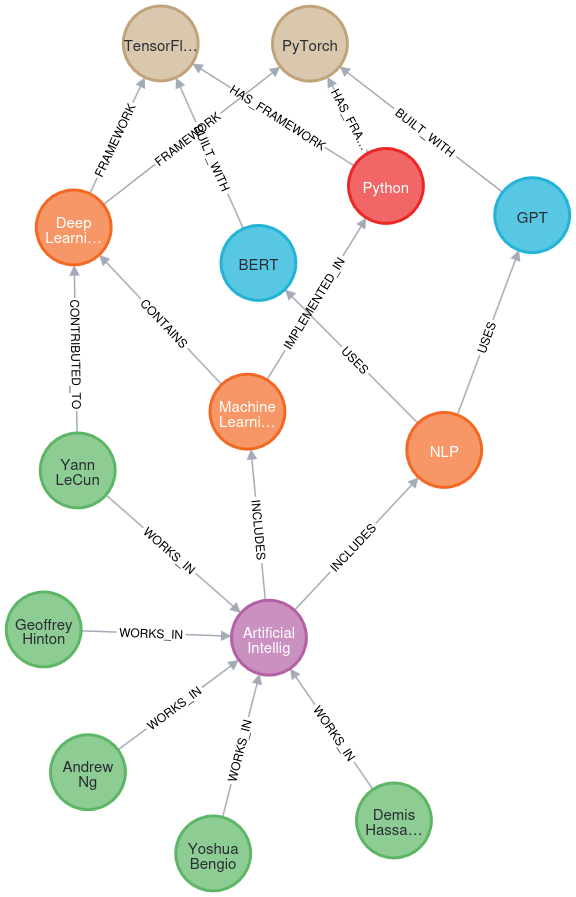

# Отчет по лабораторной работе №5-6
# Лабораторная работа №5-6. Часть 2: Работа с графовыми базами данных (Neo4j)

**Дата:** 2025-11-08;
**Семестр:** 3;
**Группа:** ПИН-м-о-24-1;
**Дисциплина:** Технологии программирования;
**Студент:** Джукаев Расул Русланович.

## Цель работы
Освоить принципы работы с графовыми базами данных на примере Neo4j. Получить
практические навыки создания узлов и связей, выполнения запросов на языке Cypher
и визуализации графовых структур.

## Теоретическая часть
Графовые БД предназначены для хранения и обработки данных в виде графов (узлов и
связей). Ключевые особенности:
 - Узлы (Nodes): сущности данных (объекты);
 - Связи (Relationships): отношения между узлами;
 - Свойства (Properties): атрибуты узлов и связей;
 - Метки (Labels): категории узлов.

Neo4j - ведущая графовая база данных с открытым исходным кодом:
 - Cypher: декларативный язык запросов;
 - ACID-совместимость: поддержка транзакций;
 - Визуализация: интерактивный просмотр графов.

Применение в управлении знаниями:
 - Построение онтологий и знанийых графов;
 - Анализ социальных сетей;
 - Рекомендательные системы;
 - Поиск паттернов и взаимосвязей.

## Практическая часть

### Выполненные задачи
Этап 1: Запуск Neo4j в Docker
- [x] Задача 1: Запуск Neo4j контейнера
- [x] Задача 2: Проверка работы контейнера 

Этап 2: Подключение к Neo4j Browser
- [x] Задача 1: Открытие веб-интерфейса
- [x] Задача 2: Изменение пароля

Этап 3: Основы языка Cypher
- [x] Задача 1: Создание скрипта для работы с Neo4j
- [x] Задача 2: Подключение к базе данных

Этап 4: Создание онтологии предметной области
- [x] Задача 1: Создание узлов и связей

Этап 5: Выполнение базовых запросов
- [x] Задача 1: Поиск всех узлов
- [x] Задача 2: Поиск связей

Этап 6: Сложные запросы и анализ
- [x] Задача 1: Поиск путей
- [x] Задача 2: Анализ степени связности

Этап 7: Работа с реальными данными
- [x] Задача 1: Импорт данных из CSV
- [x] Задача 2: Создание связей с существующей онтологией

Этап 8: Визуализация и экспорт
- [x] Задача 1: Визуализация графа через Neo4j Browser
- [x] Задача 2: Экспорт данных
- [x] Задача 3: Закрытие соединения
- [x] Задача 4: Остановка контейнера

### Ключевые фрагменты кода
Подключение к базе данных.
```Python
from neo4j import GraphDatabase
import pandas as pd

# Настройки подключения
URI = "bolt://localhost:7687"
AUTH = ("neo4j", "graphdb2024")

# Создание драйвера
driver = GraphDatabase.driver(URI, auth=AUTH)
def test_connection():
    with driver.session() as session:
        result = session.run("RETURN 'Connected to Neo4j' AS message")
        return result.single()["message"]

print(test_connection())
```
Создание узлов и связей.
```Python
 def create_knowledge_graph(tx): 
    # Очистка базы данных 
    tx.run("MATCH (n) DETACH DELETE n") 

    # Создание узлов (сущностей) 
    query = """ 
    CREATE  
    (ai:Domain {name: 'Artificial Intelligence'}), 
    (ml:Technology {name: 'Machine Learning', type: 'ML'}), 
    (dl:Technology {name: 'Deep Learning', type: 'DL'}), 
    (nlp:Technology {name: 'NLP', type: 'NLP'}), 
    (bert:Model {name: 'BERT', developer: 'Google'}), 
    (gpt:Model {name: 'GPT', developer: 'OpenAI'}), 
    (python:Language {name: 'Python', paradigm: 'multi-paradigm'}), 
    (pytorch:Framework {name: 'PyTorch', language: 'Python'}), 
    (tf:Framework {name: 'TensorFlow', language: 'Python'}), 
    // Создание связей 
    (ai)-[:INCLUDES]->(ml), 
    (ai)-[:INCLUDES]->(nlp), 
    (ml)-[:CONTAINS]->(dl), 
    (nlp)-[:USES]->(bert), 
    (nlp)-[:USES]->(gpt), 
    (ml)-[:IMPLEMENTED_IN]->(python), 
    (dl)-[:FRAMEWORK]->(pytorch), 
    (dl)-[:FRAMEWORK]->(tf), 
    (bert)-[:BUILT_WITH]->(tf), 
    (gpt)-[:BUILT_WITH]->(pytorch), 
    (python)-[:HAS_FRAMEWORK]->(pytorch), 
    (python)-[:HAS_FRAMEWORK]->(tf) 
    """ 
    tx.run(query)
     
with driver.session() as session: 
    session.execute_write(create_knowledge_graph) 
    print("База знаний создана") 
```
Поиск узлов и связей.
```Python
def get_all_nodes(tx):
    result = tx.run("MATCH (n) RETURN n.name AS name, labels(n) AS labels")
    return [{"name": record["name"], "labels": record["labels"]} for record in result]

print("Все узлы в базе:")
nodes = get_all_nodes(driver.session())
for node in nodes:
    print(f"{node['name']} - {node['labels']}")

def get_relationships(tx):
    query = """
    MATCH (a)-[r]->(b)
    RETURN a.name AS source, type(r) AS relationship, b.name AS target
    """
    result = tx.run(query)
    return [{"source": record["source"], "relationship": record["relationship"], "target": record["target"]} for record in result]

print("\nСвязи в графе:")
relationships = get_relationships(driver.session())
for rel in relationships:
    print(f"{rel['source']} --{rel['relationship']}--> {rel['target']}")
```
Поиск путей и анализ степени связности.
```Python
def find_paths(tx, start_node, end_node): 
    query = """ 
    MATCH path = (a {name: $start_node})-[*]->(b {name: $end_node}) 
    RETURN [node in nodes(path) | node.name] AS path_nodes, 
           [rel in relationships(path) | type(rel)] AS relationships 
    """ 
    result = tx.run(query, start_node=start_node, end_node=end_node) 
    return [{"nodes": record["path_nodes"], "relationships": record["relationships"]} for record in result] 

print("\nПути от AI до BERT:") 
paths = find_paths(driver.session(), "Artificial Intelligence", "BERT") 
for path in paths: 
    print(f"Путь: {' -> '.join(path['nodes'])}")

def analyze_connectivity(tx):
    query = """
    MATCH (n)
    RETURN n.name AS node,
        COUNT{(n)--()} AS degree,
        labels(n)[0] AS type
    ORDER BY degree DESC
    """
    result = tx.run(query)
    return [{"node": record["node"], "degree": record["degree"], "type": record["type"]} for record in result]

print("\nАнализ связности узлов:")
connectivity = analyze_connectivity(driver.session())
for node in connectivity:
    print(f"{node['node']} ({node['type']}): {node['degree']} связей")
```
Работа с реальными данными из CSV (требуются права пользователя при запуске на запись).
```Python
def import_ai_researchers(tx):
    # Создание узлов исследователей
    query = """
    LOAD CSV WITH HEADERS FROM 'file:///ai_researchers.csv' AS row
    CREATE (:Researcher {
        name: row.name,
        affiliation: row.affiliation,
        field: row.field,
        h_index: toInteger(row.h_index)
    })
    """
    
    tx.run(query)
    
# Создание CSV файла для импорта
researchers_data = """name,affiliation,field,h_index
Yann LeCun,Facebook AI Research,Computer Vision,180
Andrew Ng,Stanford University,Machine Learning,150
Yoshua Bengio,MILA,Deep Learning,170
Geoffrey Hinton,University of Toronto,Neural Networks,200
Demis Hassabis,Google DeepMind,Reinforcement Learning,80
"""

with open("neo4j/import/ai_researchers.csv", "w") as f:
    f.write(researchers_data)

with driver.session() as session:
    session.execute_write(import_ai_researchers)
    print("Данные исследователей импортированы")

def connect_researchers_to_domains(tx):
    query = """
    MATCH (r:Researcher), (d:Domain {name: 'Artificial Intelligence'})
    CREATE (r)-[:WORKS_IN]->(d)
    WITH r
    MATCH (r:Researcher {name: 'Yann LeCun'}), (dl:Technology {name: 'Deep Learning'})
    CREATE (r)-[:CONTRIBUTED_TO]->(dl)
    WITH r
    MATCH (r:Researcher {name: 'Andrew Ng'}), (ml:Technology {name: 'Machine Learning'})
    CREATE (r)-[:CONTRIBUTED_TO]->(ml)
    """
    tx.run(query)

with driver.session() as session:
    session.execute_write(connect_researchers_to_domains)
    print("Связи исследователей созданы")
```
Экспорт данных и закрытие соединения.
```Python
def export_graph_data(tx):
    query = """
    MATCH (n)
    RETURN n.name AS name,
        labels(n) AS labels,
        properties(n) AS properties
    """
    result = tx.run(query)
    df = pd.DataFrame([dict(record) for record in result])
    df.to_csv("graph_export.csv", index=False)
    return df

graph_data = export_graph_data(driver.session())
print("\nЭкспортированные данные:")
print(graph_data.head())
driver.close()
print("Соединение с Neo4j закрыто")
```

## Результаты выполнения

### Пример работы программы
Результаты выполнения программы представлены ниже. Для успешного выполнения должны быть
установлены права пользователя на запись в папке import (иначе может возникнуть ошибка
Permission Error).


Также создан CSV-файл [ai_researches](src/ai_researchers.csv).

После выполнения приведённого ниже запроса в Neo4j Browser получился результат, визуализация
которого представлена ниже (граф [graph.png](docs/graph.png)).


### Тестирование
- [x] Модульные тесты пройдены
- [x] Интеграционные тесты пройдены
- [x] Производительность соответствует требованиям

## Выводы
1. Освоены принципы работы с графовыми базами данных на примере Neo4j.
2. Получены практические навыки создания узлов и связей, выполнения запросов на языке Cypher
и визуализации графовых структур.
3. Создан скрипт в соответствии с задачами.

## Приложения
- Ссылка на исходный код (скрипт neo4j_demo.py) [src/neo4j_demo.py](src/neo4j_demo.py)
- Граф базы данных, полученный после выполнения запроса


- Ссылка на CSV-файл (ai_researchers.csv) [src/ai_researchers.csv](src/ai_researchers.csv)