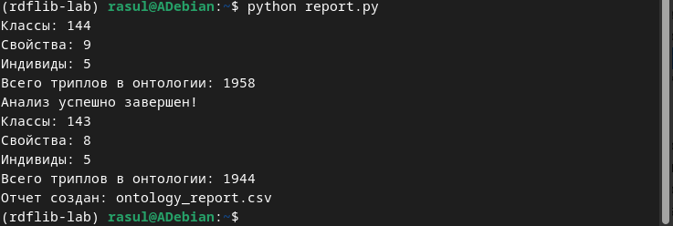
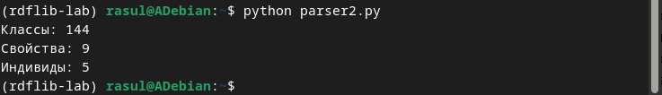

# Отчет по лабораторной работе №7-8
# Лабораторная работа №7-8. Часть 1: Знакомство с онтологиями в Protégé

**Дата:** 2025-11-20;
**Семестр:** 3;
**Группа:** ПИН-мо-24-1;
**Дисциплина:** Технологии программирования;
**Студент:** Джукаев Расул Русланович.

## Цель работы
Освоить базовые принципы работы с онтологиями и семантическими технологиями через инструмент 
Protégé. Получить практические навыки изучения структуры онтологий, работы с классами, 
свойствами и индивидами.

## Теоретическая часть
Онтология — формальное представление знаний в виде иерархии понятий и отношений между ними. 
Ключевые компоненты:
- Классы (Concepts): категории объектов предметной области;
- Свойства (Properties): отношения между объектами;
- Индивиды (Individuals): конкретные экземпляры классов;
- Аксиомы (Axioms): правила и ограничения.

Язык OWL (Web Ontology Language) - стандарт W3C для создания онтологий:
- OWL DL: поддержка сложных логических конструкций;
- Семантика описательной логики: формальная основа для логического вывода;
- Инференс: автоматическое выведение новых знаний.

Protégé - ведущий open-source инструмент для работы с онтологиями:
- Визуальный редактор: графическое создание и редактирование онтологий;
- Поддержка рассуждений: интеграция с reasoners (HermiT, Pellet);
- Расширяемость: поддержка плагинов.

## Практическая часть

### Выполненные задачи
Этап 1: Установка и настройка Protégé
- [x] Задача 1: Установка Java (требование для Protégé)
- [x] Задача 2: Скачивание и установка Protégé 
- [x] Задача 3: Запуск Protégé

Этап 2: Загрузка и изучение образовательной онтологии
- [x] Задача 1: Загрузка Pizza Ontology
- [x] Задача 2: Изучение интерфейса Protégé

Этап 3: Анализ структуры онтологии
- [x] Задача 1: Изучение вкладки "Classes"
- [x] Задача 2: Анализ свойств объекта
- [x] Задача 3: Изучение индивидов

Этап 4: Работа с классами и свойствами
- [x] Задача 1: Создание нового класса
- [x] Задача 2: Определение свойств класса
- [x] Задача 3: Создание объектаных свойств

Этап 5: Использование reasoner для логического вывода
- [x] Задача 1: Выбор и запуск reasoner
- [x] Задача 2: Анализ результатов
- [x] Задача 3: Создание запроса

Этап 6: Сохранение и экспорт онтологии
- [x] Задача 1: Сохранение в разных форматах
- [x] Задача 2: Создание отчета о онтологии

Этап 7: Документирование онтологии
- [x] Задача 1: Создание документации

### Ключевые фрагменты кода
Код для анализа онтологии, сохранённый в виде файла report.py, представлен ниже.
```Python
from rdflib import Graph, URIRef, RDF, OWL, RDFS
import pandas as pd

def analyze_ontology(file_path):
    g = Graph()
    
    # Определяем формат по расширению файла
    if file_path.endswith('.ttl'):
        g.parse(file_path, format="turtle")
    elif file_path.endswith('.rdf') or file_path.endswith('.owl'):
        g.parse(file_path, format="xml")
    else:
        g.parse(file_path)  # Автоопределение
    
    # Более надежный подсчет классов
    owl_class = URIRef("http://www.w3.org/2002/07/owl#Class")
    
    # Находим все объявленные классы
    declared_classes = set()
    for s in g.subjects(RDF.type, owl_class):
        declared_classes.add(s)
    
    # Также находим классы через rdfs:subClassOf (иерархия)
    for s in g.subjects(RDFS.subClassOf, None):
        declared_classes.add(s)
    
    # Объектные свойства
    object_property = URIRef("http://www.w3.org/2002/07/owl#ObjectProperty")
    properties = list(g.subjects(RDF.type, object_property))
    
    # Индивиды
    named_individual = URIRef("http://www.w3.org/2002/07/owl#NamedIndividual")
    individuals = list(g.subjects(RDF.type, named_individual))
    
    print(f"Классы: {len(declared_classes)}")
    print(f"Свойства: {len(properties)}")
    print(f"Индивиды: {len(individuals)}")
    
    # Дополнительная информация
    print(f"Всего триплов в онтологии: {len(g)}")
    
    return {
        "classes": len(declared_classes),
        "properties": len(properties),
        "individuals": len(individuals),
        "triples": len(g)
    }

# Тестируем на файле
try:
    stats_modified = analyze_ontology("pizza_russian.rdf")
    print("Анализ успешно завершен!")
except Exception as e:
    print(f"Ошибка при анализе: {e}")

# Для сравнения с оригиналом (если есть)
try:
    stats_original = analyze_ontology("pizza.owl")
    
    # Создание отчета
    report = pd.DataFrame([stats_original, stats_modified], 
                         index=["Original", "Modified"])
    report.to_csv("ontology_report.csv")
    print("Отчет создан: ontology_report.csv")
except FileNotFoundError:
    print("Оригинальный файл pizza.owl не найден, создаю отчет только для модифицированной онтологии")
    report = pd.DataFrame([stats_modified], index=["Modified"])
    report.to_csv("ontology_report.csv")
```
Ниже представлен более простой способ парсинга и подсчёта (с применением файла pizza_russian.rdf),
код которого сохранён в виде файла parser2.py.
```Python
from rdflib import Graph
import pandas as pd

def simple_ontology_analysis(file_path):
    g = Graph()
    
    # Парсим с автоопределением формата
    g.parse(file_path)
    
    # Простой подсчет через SPARQL запрос
    query = """
    PREFIX owl: <http://www.w3.org/2002/07/owl#>
    PREFIX rdf: <http://www.w3.org/1999/02/22-rdf-syntax-ns#>
    
    SELECT (COUNT(DISTINCT ?class) as ?classes) 
           (COUNT(DISTINCT ?prop) as ?properties) 
           (COUNT(DISTINCT ?ind) as ?individuals)
    WHERE {
      { ?class a owl:Class }
      UNION
      { ?prop a owl:ObjectProperty }
      UNION  
      { ?ind a owl:NamedIndividual }
    }
    """
    
    result = g.query(query)
    for row in result:
        classes = row.classes
        properties = row.properties
        individuals = row.individuals
    
    print(f"Классы: {classes}")
    print(f"Свойства: {properties}")
    print(f"Индивиды: {individuals}")
    
    return {
        "classes": classes,
        "properties": properties,
        "individuals": individuals
    }

# Использование
stats = simple_ontology_analysis("pizza_russian.rdf")
```

## Результаты выполнения

### Пример работы программы
Результаты выполнения скрипта report.py с присутствием созданных в Protégé файлов (pizza.owl, 
pizza_russian.rdf) представлены ниже. Отчёт создан в виде ontology_report.csv.


Вывод программы из parser2.py выглядит следующим образом.


### Тестирование
- [x] Модульные тесты пройдены
- [x] Интеграционные тесты пройдены
- [x] Производительность соответствует требованиям

## Выводы
1. Освоены базовые принципы работы с онтологиями и семантическими технологиями через
инструмент Protégé.
2. Получены практические навыки изучения структуры онтологий, работы с классами, свойствами и
индивидами.
3. Отредактированы и сохранены онтологии, созданы скрипты для их анализа и получены отчёты о результатах данного анализа.

## Приложения
- Ссылки на исходный код
1. report.py: [src/report.py](src/report.py)
2. parser2.py: [src/parser2.py](src/parser2.py)
- Ссылка на файл ontology_report.csv: [src/ontology_report.csv](src/ontology_report.csv)