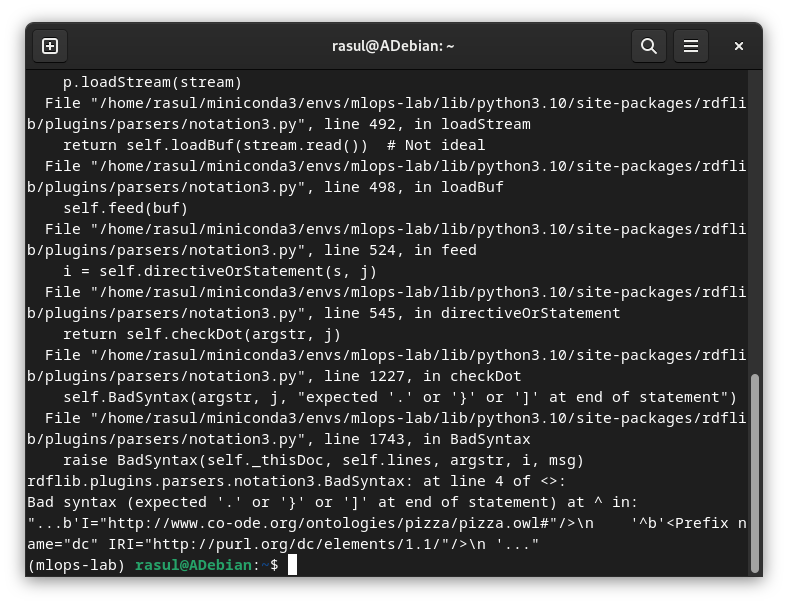
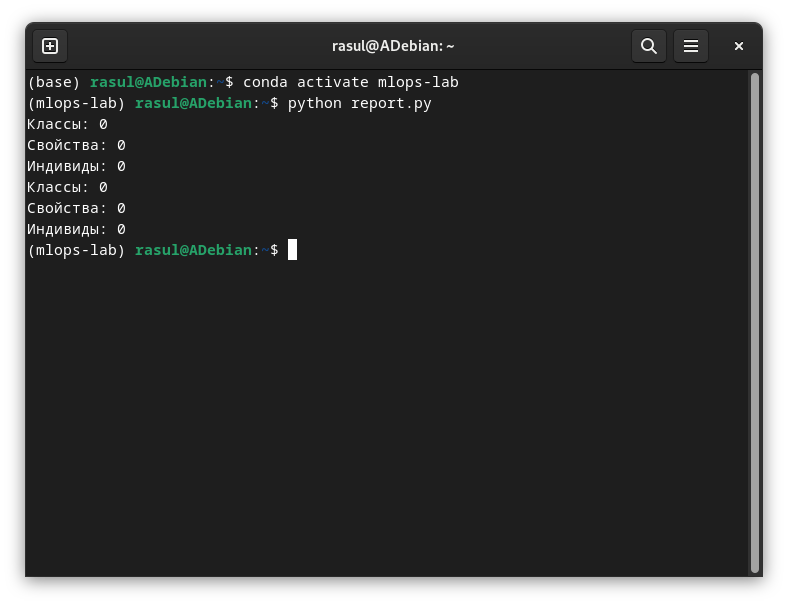

## Сообщение об ошибке

**Дата:** 2025-11-18;
**Семестр:** 3;
**Группа:** ПИН-м-о-24-1;
**Дисциплина:** Технологии программирования;
**Студент:** Джукаев Расул Русланович

Здравствуйте. При выполнении Л/Р №7-8, части 1 "Знакомство с онтологиями в Protégé" запустил скрипт для анализа онтологии, сохранённый в файле report.py, но в результате вышла ошибка, связанная с выполнением функции parse файла pizza формата OWX (OWL-файл Protégé по умолчанию не сохраняет).

В коде заменил формат в адресной строке файла pizza на TTL (в строке №28), данная ошибка исчезла, но возникла другая проблема: содержимое файла не парсится на классы, свойства и индивиды, поэтому на выводе значений количеств получается 0.

Содержимое скрипта report.py представлено ниже:
```Python
# Скрипт для анализа онтологии
from rdflib import Graph
import pandas as pd

def analyze_ontology(file_path):
    g = Graph()
    g.parse(file_path, format="turtle")

    # Статистика онтологии
    classes = list(g.subjects(predicate="http://www.w3.org/1999/02/22-rdf-syntax-ns#type", object="http://www.w3.org/2002/07/owl#Class"))

    properties = list(g.subjects(predicate="http://www.w3.org/1999/02/22-rdf-syntax-ns#type", object="http://www.w3.org/2002/07/owl#ObjectProperty"))
    
    individuals = list(g.subjects(predicate="http://www.w3.org/1999/02/22-rdf-syntax-ns#type", object="http://www.w3.org/2002/07owl#NamedIndividual"))

    print(f"Классы: {len(classes)}")
    print(f"Свойства: {len(properties)}")
    print(f"Индивиды: {len(individuals)}")
    
    
    return {
        "classes": len(classes),
        "properties": len(properties),
        "individuals": len(individuals)
    }

# Анализ оригинальной и модифицированной онтологии
stats_original = analyze_ontology("pizza.ttl")
stats_modified = analyze_ontology("pizza_russian.ttl")

# Создание отчета
report = pd.DataFrame([stats_original, stats_modified], index=["Original", "Modified"])
report.to_csv("ontology_report.csv")
```
Ссылка на скрипт: [report.py](report.py)

Ссылки на файлы форматов owx и ttl: [pizza.owx](pizza.owx), [pizza.ttl](pizza.ttl), [pizza_russian.ttl](pizza_russian.ttl)