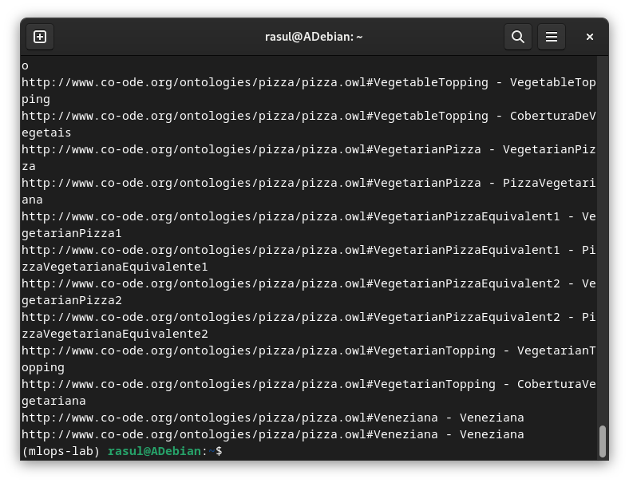
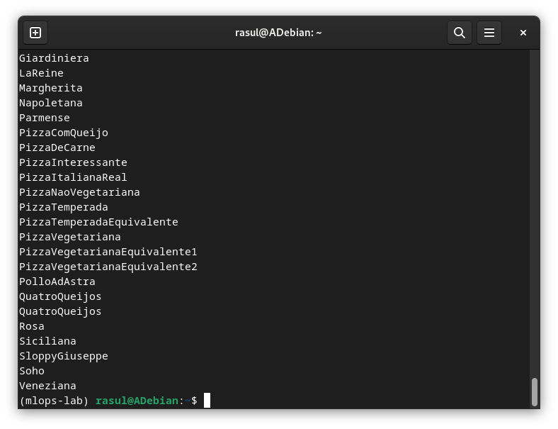
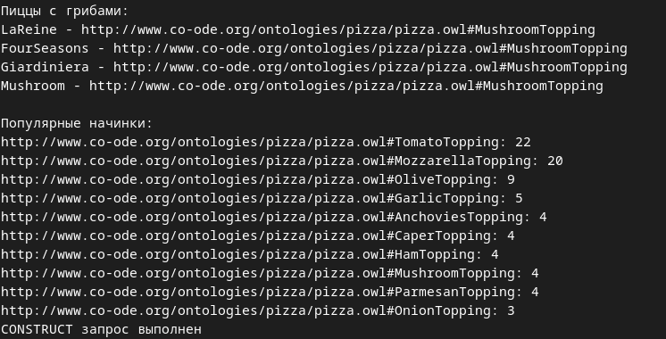
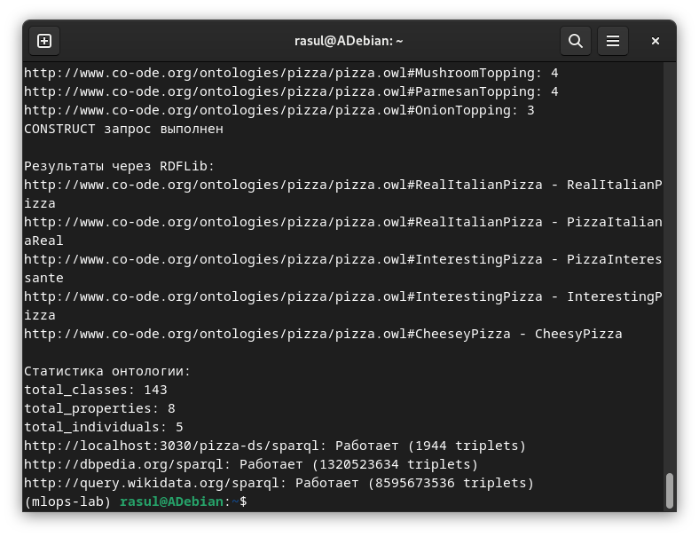

# Отчет по лабораторной работе №7-8
# Лабораторная работа №7-8. Часть 2: Работа с SPARQL-запросами

**Дата:** 2025-11-26;
**Семестр:** 3;
**Группа:** ПИН-мо-24-1;
**Дисциплина:** Технологии программирования;
**Студент:** Джукаев Расул Русланович.

## Цель работы
Освоить язык запросов SPARQL для работы с семантическими данными. Получить практические
навыки подключения к семантическому хранилищу, выполнения различных типов запросов и анализа
результатов.

## Теоретическая часть
Язык SPARQL SPARQL (SPARQL Protocol and RDF Query Language) — стандартный язык запросов для
RDF-данных. Основные типы запросов:
- SELECT: возвращает таблицу результатов;
- CONSTRUCT: создает новый RDF-граф;
- ASK: возвращает boolean-ответ;
- DESCRIBE: возвращает RDF-описание ресурса.

Apache Jena Fuseki Сервер SPARQL с веб-интерфейсом для работы с RDF-данными:
- Поддержка SPARQL 1.1: полная реализация стандарта;
- Веб-интерфейс: интерактивное выполнение запросов;
- REST API: программный доступ к данным.

Структура SPARQL-запроса:
- PREFIX: определение пространств имен;
- SELECT/CONSTRUCT: цель запроса;
- WHERE: шаблон для сопоставления;
- FILTER: условия фильтрации;
- OPTIONAL: необязательные совпадения;
- ORDER BY/LIMIT: сортировка и ограничения.

## Практическая часть

### Выполненные задачи
Этап 1: Установка и запуск Apache Jena Fuseki
- [x] Задача 1: Скачивание и установка
- [x] Задача 2: Запуск Fuseki сервера
- [x] Задача 3: Проверка работы

Этап 2: Загрузка онтологии в Fuseki
- [x] Задача 1: Загрузка данных через веб-интерфейс
- [x] Задача 2: Загрузка онтологии
- [x] Задача 3: Проверка загрузки

Этап 3: Написание базовых SPARQL-запросов
- [x] Задача 1: Создание скрипта для работы с SPARQL
- [x] Задача 2: Настройка подключения
- [x] Задача 3: Запрос 1: получение всех классов онтологии
- [x] Задача 4: Запрос 2: поиск всех пицц

Этап 4: Сложные запросы с фильтрацией
- [x] Задача 1: Запрос 3: пиццы с определенной начинкой
- [x] Задача 2: Запрос 4: статистика по начинкам

Этап 5: CONSTRUCT-запросы для создания новых данных
- [x] Задача 1: Запрос 5: создание RDF-графа вегетарианских пицц

Этап 6: Работа с онтологией через RDFLib
- [x] Задача 1: Альтернативный способ работы с данными

Этап 7: Создание комплексных отчетов
- [x] Задача 1: Генерация отчета по онтологии

Этап 8: Интеграционные тесты
- [x] Задача 1: Тестирование различных endpoint

### Ключевые фрагменты кода
Настройка подключения.
```Python
from SPARQLWrapper import SPARQLWrapper, JSON, XML
import pandas as pd

# Настройка SPARQL endpoint
sparql = SPARQLWrapper("http://localhost:3030/pizza-ds/sparql")
sparql.setReturnFormat(JSON)

def run_query(query):
    sparql.setQuery(query)
    try:
        results = sparql.query().convert()
        return results
    except Exception as e:
        print(f"Ошибка выполнения запроса: {e}")
        return None
```
Получение всех классов онтологии.
```Python
query1 = """
PREFIX owl: <http://www.w3.org/2002/07/owl#>
PREFIX rdfs: <http://www.w3.org/2000/01/rdf-schema#>

SELECT DISTINCT ?class ?label
WHERE {
    ?class a owl:Class .
    OPTIONAL { ?class rdfs:label ?label }
}
ORDER BY ?class
"""

results1 = run_query(query1)
print("Классы онтологии:")
for result in results1["results"]["bindings"]:
    print(f"{result['class']['value']} - {result.get('label', {}).get('value', 'No label')}")
```
Поиск всех пицц.
```Python
query2 = """
PREFIX pizza: <http://www.co-ode.org/ontologies/pizza/pizza.owl#>
PREFIX rdfs: <http://www.w3.org/2000/01/rdf-schema#>
PREFIX owl: <http://www.w3.org/2002/07/owl#>

SELECT ?pizza ?name
WHERE {
  	{
    	?pizza owl:equivalentClass ?Class .
    	?Class owl:intersectionOf ?intersec .
    	?intersec ?about pizza:Pizza .
  		?pizza rdfs:label ?name .
 	}
  	UNION
  	{
  		?pizza rdfs:subClassOf pizza:NamedPizza .
    	?pizza rdfs:label ?name .
  	}
}
ORDER BY ?name
"""

results2 = run_query(query2)
print("\nВсе пиццы:")
for result in results2["results"]["bindings"]:
    print(result['name']['value'])
```
Получение названий пицц с определённой начинкой.
```Python
query3 = """
PREFIX pizza: <http://www.co-ode.org/ontologies/pizza/pizza.owl#>
PREFIX rdfs: <http://www.w3.org/2000/01/rdf-schema#>
PREFIX owl: <http://www.w3.org/2002/07/owl#>

SELECT ?pizza ?name ?topping
WHERE {
  	{
    	?pizza owl:equivalentClass ?Class .
    	?Class owl:intersectionOf ?intersec .
    	?intersec ?about pizza:Pizza .
  		?pizza rdfs:label ?name .
 	}
  	UNION
  	{
  		?pizza rdfs:subClassOf pizza:NamedPizza .
    	?pizza rdfs:label ?name .
  	}
  	?pizza rdfs:subClassOf ?Restriction .
  	?Restriction owl:someValuesFrom ?topping .
  	FILTER STRENDS(STR(?topping), "MushroomTopping")
    FILTER (lang(?name) = "en")
}
"""

results3 = run_query(query3)
print("\nПиццы с грибами:")
for result in results3["results"]["bindings"]:
    print(f"{result['name']['value']} - {result['topping']['value']}")
```
Статистика по начинкам.
```Python
query4 = """
PREFIX rdf: <http://www.w3.org/1999/02/22-rdf-syntax-ns#>
PREFIX pizza: <http://www.co-ode.org/ontologies/pizza/pizza.owl#>
PREFIX rdfs: <http://www.w3.org/2000/01/rdf-schema#>
PREFIX owl: <http://www.w3.org/2002/07/owl#>

SELECT ?topping (COUNT(?pizza) AS ?count)
WHERE {
  	{
    	?pizza owl:equivalentClass ?Class .
    	?Class owl:intersectionOf ?intersec .
    	?intersec ?about pizza:Pizza .
 	}
  	UNION
  	{
  		?pizza rdfs:subClassOf pizza:NamedPizza .
  	}
    # Получение начинок
    {
  		?pizza owl:equivalentClass ?Class .
    	?Class owl:intersectionOf ?intersec .
  		?intersec rdf:rest*/rdf:first ?Restriction .
  		?Restriction owl:someValuesFrom ?topping .
  	}
  	UNION
  	{
  		?pizza rdfs:subClassOf ?Restriction .
  		?Restriction owl:someValuesFrom ?topping .
  	}
}
GROUP BY ?topping
ORDER BY DESC(?count)
LIMIT 10
"""
results4 = run_query(query4)
print("\nПопулярные начинки:")
for result in results4["results"]["bindings"]:
    print(f"{result['topping']['value']}: {result['count']['value']}")
```
Создание RDF-графа вегетарианских пицц.
```Python
query5 = """
PREFIX rdf: <http://www.w3.org/1999/02/22-rdf-syntax-ns#>
PREFIX pizza: <http://www.co-ode.org/ontologies/pizza/pizza.owl#>
PREFIX rdfs: <http://www.w3.org/2000/01/rdf-schema#>
PREFIX owl: <http://www.w3.org/2002/07/owl#>
PREFIX ex: <http://example.org/vegetarian#>

CONSTRUCT {
	?pizza ex:isVegetarian true .
	?pizza ex:hasTopping ?topping .
}
WHERE {
  	{
    	?pizza owl:equivalentClass ?Class .
    	?Class owl:intersectionOf ?intersec .
    	?intersec ?about pizza:Pizza .
    	?pizza rdfs:label ?name .
 	}
  	UNION
  	{
  		?pizza rdfs:subClassOf pizza:NamedPizza .
    	?pizza rdfs:label ?name .
  	}
  	# Получение начинок
  	{
  		?pizza owl:equivalentClass ?Class .
    	?Class owl:intersectionOf ?intersec .
  		?intersec rdf:rest*/rdf:first ?Restriction .
  		?Restriction owl:someValuesFrom ?topping .
  	}
  	UNION
  	{
  		?pizza rdfs:subClassOf ?Restriction .
  		?Restriction owl:someValuesFrom ?topping .
  	}
    FILTER (?topping != pizza:MeatTopping)
}
"""

# Для CONSTRUCT запросов меняем формат вывода
sparql.setReturnFormat(XML)
results5 = run_query(query5)
print("CONSTRUCT запрос выполнен")

# Сохранение результатов
results5.serialize("vegetarian_pizzas.rdf", format="xml")
```
Альтернативный способ работы с данными.
```Python
# Создание графа с SPARQL endpoint
store = sparqlstore.SPARQLUpdateStore()
store.open(('http://localhost:3030/pizza-ds/sparql', 'http://localhost:3030/pizza-ds/update'))
g = Graph(store)
# Определение namespace
PIZZA = Namespace("http://www.co-ode.org/ontologies/pizza/pizza.owl#")
RDFS = Namespace("http://www.w3.org/2000/01/rdf-schema#")

# Запрос через RDFLib
query6 = """
PREFIX owl: <http://www.w3.org/2002/07/owl#>

SELECT ?pizza ?name
WHERE {
  	{
    	?pizza owl:equivalentClass ?Class .
    	?Class owl:intersectionOf ?intersec .
    	?intersec ?about pizza:Pizza .
  		?pizza rdfs:label ?name .
 	}
  	UNION
  	{
  		?pizza rdfs:subClassOf pizza:NamedPizza .
    	?pizza rdfs:label ?name .
  	}
}
LIMIT 5
"""

results6 = g.query(query6, initNs={"pizza": PIZZA, "rdfs": RDFS})
print("\nРезультаты через RDFLib:")
for row in results6:
    print(f"{row.pizza} - {row.name}")
```
Генерация отчёта по онтологии.
```Python
import xml.etree.ElementTree as ET
#from xml.dom import minidom

def generate_ontology_report():
    queries = {
        "total_classes": """
            PREFIX owl: <http://www.w3.org/2002/07/owl#>
            SELECT (COUNT(DISTINCT ?class) AS ?count)
            WHERE { ?class a owl:Class }
        """,
        "total_properties": """
            PREFIX owl: <http://www.w3.org/2002/07/owl#>
            SELECT (COUNT(DISTINCT ?prop) AS ?count)
            WHERE { ?prop a owl:ObjectProperty }
        """,
        "total_individuals": """
            PREFIX owl: <http://www.w3.org/2002/07/owl#>
            SELECT (COUNT(DISTINCT ?ind) AS ?count)
            WHERE { ?ind a owl:NamedIndividual }
        """
    }
    
    report = {}
    for name, query in queries.items():
        results = ET.fromstring(run_query(query).toxml())
        if results:
            count = results[1][0][0][0].text
            report[name] = count

    # Сохранение отчета
    df = pd.DataFrame([report])
    df.to_csv("ontology_report.csv", index=False)
    return report

ontology_stats = generate_ontology_report()
print("\nСтатистика онтологии:")
for key, value in ontology_stats.items():
    print(f"{key}: {value}")
```

## Результаты выполнения

### Пример работы программы
Результат выполнения первого запроса (конечная часть) представлен ниже.


Ниже показан результат выполнения второго запроса (конечная часть).


Далее, получены выводы программы по 3, 4 и 5 SPARQL-кодов. Результат выполнения 5 кода
(CONSTRUCT-запроса) сохранён в виде файла vegetarian_pizza.rdf.


Ниже приведены результаты выполнения через RDFLib, а также создания и сохранения отчёта по
онтологии в виде файла ontology_report.csv.


### Тестирование
- [x] Модульные тесты пройдены
- [x] Интеграционные тесты пройдены
- [x] Производительность соответствует требованиям

## Выводы
1. Освоен язык запросов SPARQL для работы с семантическими данными.
2. Получены практические навыки подключения к семантическому хранилищу, выполнения различных
типов запросов и анализа результатов.
3. Создан скрипт с запросами, получены файлы из результатов выполнения.

## Приложения
- Ссылка на исходный код (скрипт sparql_queries.py) [src/sparql_queries.py](src/sparql_queries.py)
- Файл vegetarian_pizzas.xml [src/vegetarian_pizzas.rdf](src/vegetarian_pizzas.rdf)
- Файл ontology_report.csv [src/ontology_report.csv](src/ontology_report.csv)