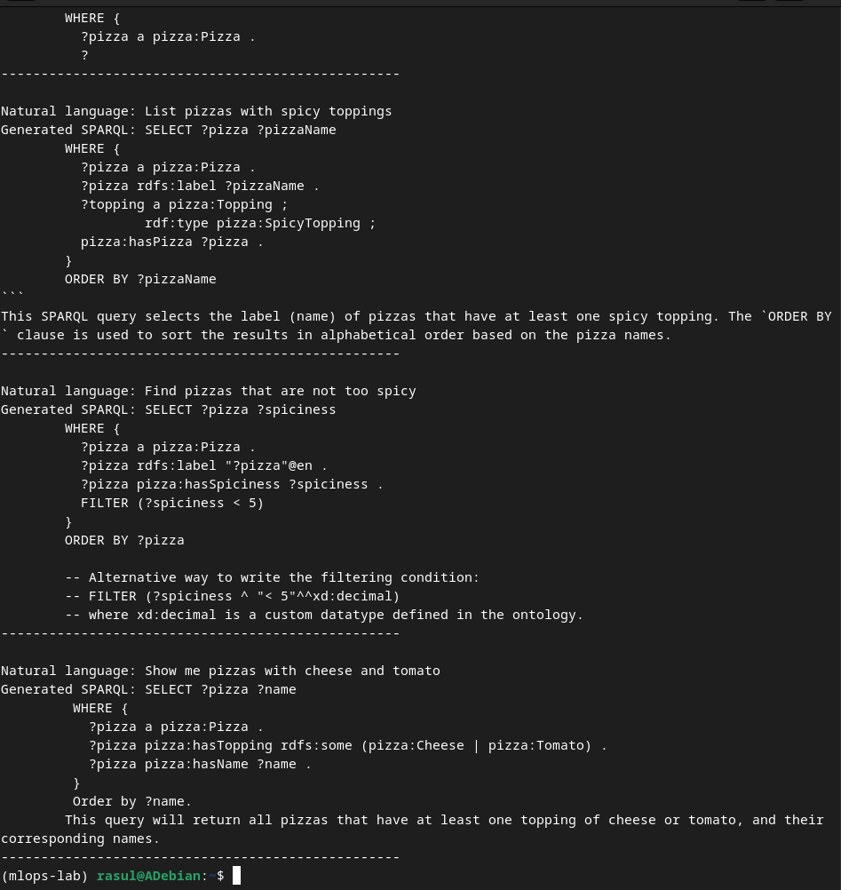
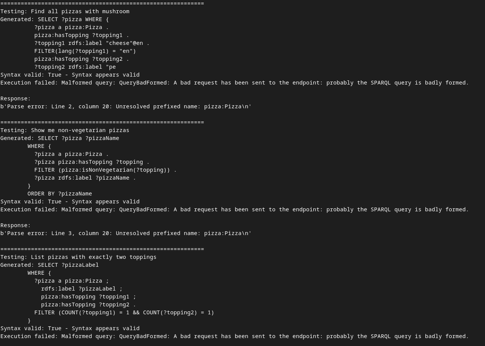
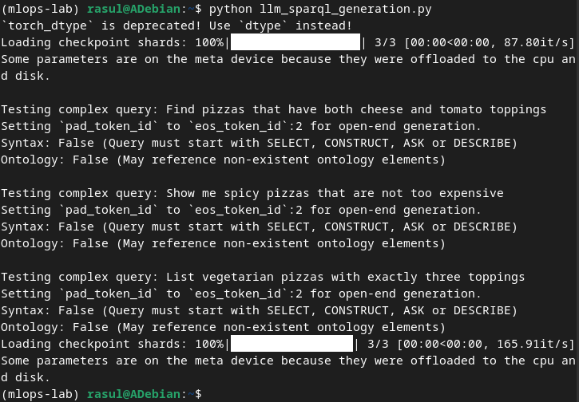
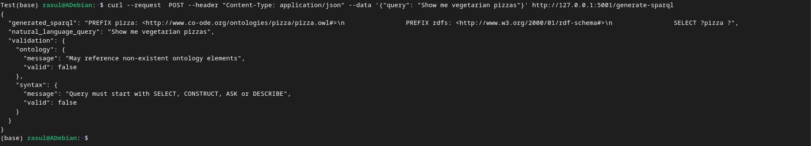

# Отчет по лабораторной работе №7-8
# Лабораторная работа №7-8. Часть 3: Извлечение данных с помощью LLM

**Дата:** 2025-12-10;
**Семестр:** 3;
**Группа:** ПИН-мо-24-1;
**Дисциплина:** Технологии программирования;
**Студент:** Джукаев Расул Русланович.

## Цель работы
Исследовать возможности использования языковых моделей для генерации SPARQL запросов по 
текстовым описаниям на естественном языке. Получить практические навыки интеграции LLM с 
семантическими технологиями.

## Теоретическая часть
Генерация SPARQL через NL-to-SPARQL - преобразование естественного языка (Natural Language) в
SPARQL. Она включает следующее:
- Zero-shot подход: генерация без примеров;
- Few-shot подход: генерация с несколькими примерами;
- Fine-tuning: специализированное обучение на парах (вопрос-SPARQL).

Архитектура решения:
- Вход: текстовый запрос на естественном языке;
- Обработка: LLM генерирует SPARQL-запрос;
- Валидация: проверка синтаксиса и выполнение запроса;
- Итерация: исправление ошибок через feedback loop.

Оценка качества:
- Синтаксическая корректность: правильность SPARQL-синтаксиса;
- Семантическая корректность: соответствие intent пользователя;
- Эффективность: оптимальность выполнения запроса.

## Практическая часть

### Выполненные задачи
Этап 1: Настройка окружения и подключение к LLM
- [x] Задача 1: Установка необходимых пакетов
- [x] Задача 2: Создание скрипта для работы с LLM 
- [x] Задача 3: Настройка подключения к LLM (Hugging Face)

Этап 2: Базовая генерация SPARQL-запросов
- [x] Задача 1: Функция для тестирования генерации

Этап 3: Валидация и выполнение сгенерированных запросов
- [x] Задача 1: SPARQL валидатор и исполнитель

Этап 4: Few-shot обучение через промпты
- [x] Задача 1: Улучшенный генератор с примерами

Этап 5: Интеграция с семантическим валидатором
- [x] Задача 1: Расширенная валидация с семантической проверкой

Этап 6: Оценка качества и метрики
- [x] Задача 1: Система оценки сгенерированных запросов

Этап 7: Создание демонстрационного интерфейса
- [x] Задача 1: Простой веб-интерфейс с Flask

### Ключевые фрагменты кода
Настройка подключения к LLM, создание генератора.
```Python
from transformers import pipeline, AutoTokenizer, AutoModelForCausalLM
import torch

class SPARQLGenerator:
    def __init__(self, model_name="mistralai/Mistral-7B-Instruct-v0.2"):
        self.tokenizer = AutoTokenizer.from_pretrained(model_name)
        self.model = AutoModelForCausalLM.from_pretrained(
            model_name,
            torch_dtype=torch.bfloat16,
            device_map="auto"
        )
        self.tokenizer.pad_token = self.tokenizer.eos_token

    def generate_sparql(self, natural_language_query):
        prompt = f"""
        Convert the following natural language query to SPARQL for the Pizza ontology. 
        Use prefixes: PREFIX pizza: <http://www.co-ode.org/ontologies/pizza/pizza.owl#> 
        PREFIX rdfs: <http://www.w3.org/2000/01/rdf-schema#> 
        
        Natural language: {natural_language_query} 
        SPARQL:
        """
        
        inputs = self.tokenizer(prompt, return_tensors="pt", truncation=True, max_length=512)
        with torch.no_grad():
            outputs = self.model.generate(
                **inputs,
                max_new_tokens=200,
                temperature=0.7,
                do_sample=True,
                pad_token_id=self.tokenizer.eos_token_id
            )
    
        generated_text = self.tokenizer.decode(outputs[0], skip_special_tokens=True)
        sparql_query = generated_text.split("SPARQL:")[-1].strip()
    
        return sparql_query
```
Функция для тестирования генерации.
```Python
def test_basic_generation():
    generator = SPARQLGenerator()

    test_queries = [
        "Find all pizzas that have mushroom as topping",
        "Show me vegetarian pizzas",
        "List pizzas with spicy toppings",
        "Find pizzas that are not too spicy",
        "Show me pizzas with cheese and tomato"
    ]

    for query in test_queries:
        print(f"\nNatural language: {query}")
        sparql = generator.generate_sparql(query)
        print(f"Generated SPARQL: {sparql}")
        print("-" * 50)

test_basic_generation()
```
SPARQL валидатор и исполнитель.
```Python
from SPARQLWrapper import SPARQLWrapper, JSON, SPARQLExceptions
import re

class SPARQLValidator:
    def __init__(self, endpoint="http://localhost:3030/ds/sparql"):
        self.endpoint = endpoint
        self.sparql = SPARQLWrapper(endpoint)
        self.sparql.setReturnFormat(JSON)

    def validate_syntax(self, query):
        """Проверка синтаксиса SPARQL"""
        try:
            # Базовая проверка структуры
            if not query.strip().upper().startswith(('SELECT', 'CONSTRUCT', 'ASK', 'DESCRIBE')):
                return False, "Query must start with SELECT, CONSTRUCT, ASK or DESCRIBE"

        # Проверка наличия WHERE clause
            if "WHERE" not in query.upper():
                return False, "Missing WHERE clause"

            return True, "Syntax appears valid"
        except Exception as e:
            return False, f"Syntax validation error: {e}"
    def execute_query(self, query):
        """Выполнение SPARQL-запроса"""
        try:
            self.sparql.setQuery(query)
            results = self.sparql.query().convert()
            return True, results
        except SPARQLExceptions.QueryBadFormed as e:
            return False, f"Malformed query: {e}"
        except Exception as e:
            return False, f"Execution error: {e}"

def test_generated_queries():
    generator = SPARQLGenerator()
    validator = SPARQLValidator()

    test_cases = [
        "Find all pizzas with mushroom",
        "Show me non-vegetarian pizzas",
        "List pizzas with exactly two toppings"
    ]
    
    for query in test_cases:
        print(f"\n{'='*60}")
        print(f"Testing: {query}")
    
        # Генерация SPARQL
        sparql = generator.generate_sparql(query)
        print(f"Generated: {sparql}")
    
        # Валидация синтаксиса
        is_valid, syntax_msg = validator.validate_syntax(sparql)
        print(f"Syntax valid: {is_valid} - {syntax_msg}")
    
        # Выполнение запроса
        if is_valid:
            success, result = validator.execute_query(sparql)
            if success:
                print("Query executed successfully!")
                if "results" in result and "bindings" in result["results"]:
                    bindings = result["results"]["bindings"]
                    print(f"Results: {len(bindings)} found")
                    for i, binding in enumerate(bindings[:3]):
                        print(f" {i+1}. {binding}")
            else:
                print(f"Execution failed: {result}")

#test_generated_queries()
```
Улучшенный генератор с примерами.
```Python
class ImprovedSPARQLGenerator(SPARQLGenerator):
    def __init__(self, model_name="mistralai/Mistral-7B-Instruct-v0.2"):
        super().__init__(model_name)
        self.examples = [
            {
                "nl": "Find all pizzas with mushroom topping",
                "sparql": """
                PREFIX pizza: <http://www.co-
                ode.org/ontologies/pizza/pizza.owl#>
                PREFIX rdfs: <http://www.w3.org/2000/01/rdf-schema#>
                SELECT ?pizza ?name
                WHERE {
                    ?pizza a pizza:Pizza .
                    ?pizza rdfs:label ?name .
                    ?pizza pizza:hasTopping ?topping .
                    ?topping rdfs:label ?toppingName .
                    FILTER (CONTAINS(LCASE(?toppingName), "mushroom"))
                }
                """
            },
            {
                "nl": "Show me vegetarian pizzas",
                "sparql": """
                PREFIX pizza: <http://www.co-ode.org/ontologies/pizza/pizza.owl#>
                PREFIX rdfs: <http://www.w3.org/2000/01/rdf-schema#>
                
                SELECT ?pizza ?name
                WHERE {
                    ?pizza a pizza:Pizza .
                    ?pizza rdfs:label ?name .
                    FILTER NOT EXISTS {
                        ?pizza pizza:hasTopping ?topping .
                        ?topping a pizza:MeatTopping .
                    }
                }
                """
            }
        ]
    def generate_with_examples(self, natural_language_query):
        prompt = "Convert natural language queries to SPARQL for Pizza ontology.\n\n"

        # Добавление примеров
        for example in self.examples:
            prompt += f"NL: {example['nl']}\nSPARQL: {example['sparql']}\n\n"
    
        prompt += f"NL: {natural_language_query}\nSPARQL:"
    
        inputs = self.tokenizer(prompt, return_tensors="pt", truncation=True, max_length=1024)
        with torch.no_grad():
            outputs = self.model.generate(
                **inputs,
                max_new_tokens=300,
                temperature=0.3, # Более детерминированное поколение
                do_sample=True
            )
            
        generated_text = self.tokenizer.decode(outputs[0], skip_special_tokens=True)
        sparql_query = generated_text.split("SPARQL:")[-1].strip()
    
        return sparql_query
```
Семантический валидатор и тестирование.
```Python
class SemanticValidator(SPARQLValidator):
    def validate_ontology_compatibility(self, query):
        """Проверка совместимости с онтологией"""
        try:
            # Проверка использования правильных префиксов
            if "pizza:" not in query:
                return False, "Missing pizza prefix usage"
            
            # Проверка существующих классов/свойств
            class_check = self.execute_query("""
                PREFIX pizza: <http://www.co-ode.org/ontologies/pizza/pizza.owl#>
                SELECT DISTINCT ?class WHERE { ?class a owl:Class }
            """)
            
            if class_check[0]:
                valid_classes = [str(r['class']['value']) for r in class_check[1]['results']['bindings']]
                # Простая проверка на наличие pizza:Pizza в запросе
                if "pizza:Pizza" in query and "http://www.co-ode.org/ontologies/pizza/pizza.owl#Pizza" in valid_classes:
                    return True, "Ontology compatibility check passed"
            
            return False, "May reference non-existent ontology elements"
        
        except Exception as e:
            return False, f"Ontology validation error: {e}"

def comprehensive_test():
    generator = ImprovedSPARQLGenerator()
    validator = SemanticValidator
    complex_queries = [
        "Find pizzas that have both cheese and tomato toppings",
        "Show me spicy pizzas that are not too expensive",
        "List vegetarian pizzas with exactly three toppings"
    ]
    
    results = []
    for query in complex_queries:
        print(f"\nTesting complex query: {query}")
    
        # Генерация с примерами
        sparql = generator.generate_with_examples(query)
    
        # Многоуровневая валидация
        syntax_ok, syntax_msg = validator.validate_syntax(sparql)
        ontology_ok, ontology_msg = validator.validate_ontology_compatibility(sparql)
    
        result = {
            "query": query,
            "generated_sparql": sparql,
            "syntax_valid": syntax_ok,
            "ontology_compatible": ontology_ok,
            "execution_result": None
        }
        if syntax_ok and ontology_ok:
            success, exec_result = validator.execute_query(sparql)
            result["execution_success"] = success
            result["execution_result"] = exec_result if success else str(exec_result)
        
        results.append(result)
        
        # Вывод результатов
        print(f"Syntax: {syntax_ok} ({syntax_msg})")
        print(f"Ontology: {ontology_ok} ({ontology_msg})")
        if result.get("execution_success"):
            print("Execution: Successful")
    
    return results

#comprehensive_test()
```
Оценка сгенерированных запросов.
```Python
def evaluate_sparql_generation():
    test_dataset = [
        {
            "nl": "Find pizzas with mushroom",
            "expected_patterns": ["pizza:hasTopping", "mushroom", "FILTER"],
            "min_results": 1
        },
        {
            "nl": "Show vegetarian pizzas",
            "expected_patterns": ["FILTER NOT EXISTS", "pizza:MeatTopping"],
            "min_results": 3
        }
    ]

    generator = ImprovedSPARQLGenerator()
    validator = SemanticValidator()

    evaluation_results = []

    for test_case in test_dataset:
        nl_query = test_case["nl"]
        print(f"\nEvaluating: {nl_query}")

        # Генерация
        sparql = generator.generate_with_examples(nl_query)

        # Проверка ожидаемых паттернов
        pattern_matches = sum(1 for pattern in test_case["expected_patterns"] if pattern in sparql)
        pattern_score = pattern_matches / len(test_case["expected_patterns"])

        # Выполнение и проверка результатов
        exec_success, exec_result = validator.execute_query(sparql)
        result_count = len(exec_result["results"]["bindings"]) if exec_success else 0
        result_score = 1.0 if result_count >= test_case["min_results"] else result_count / test_case["min_results"]

        # Общая оценка
        total_score = (pattern_score * 0.6) + (result_score * 0.4)
    
        evaluation_results.append({
            "query": nl_query,
            "generated_sparql": sparql,
            "pattern_score": pattern_score,
            "result_score": result_score,
            "total_score": total_score,
            "status": "PASS" if total_score >= 0.7 else "FAIL"
        })
    
        print(f"Score: {total_score:.2f} (Patterns: {pattern_score:.2f}, Results: {result_score:.2f})")
        print(f"Status: {evaluation_results[-1]['status']}")

    # Сохранение результатов оценки
    import json
    with open("sparql_generation_evaluation.json", "w") as f:
        json.dump(evaluation_results, f, indent=2)
    return evaluation_results

#evaluate_sparql_generation()
```
Простой веб-интерфейс с Flask.
```Python
from flask import Flask, request, jsonify, render_template
import threading

app = Flask(__name__)
generator = ImprovedSPARQLGenerator()
validator = SemanticValidator()

@app.route('/generate-sparql', methods=['POST'])
def generate_sparql_endpoint():
    data = request.json
    nl_query = data.get('query', '')
    if not nl_query:
        return jsonify({"error": "No query provided"}), 400

    try:
        # Генерация SPARQL
        sparql = generator.generate_with_examples(nl_query)
    
         # Валидация
        syntax_ok, syntax_msg = validator.validate_syntax(sparql)
        ontology_ok, ontology_msg = validator.validate_ontology_compatibility(sparql)
    
        response = {
            "natural_language_query": nl_query,
            "generated_sparql": sparql,
            "validation": {
                "syntax": {"valid": syntax_ok, "message": syntax_msg},
                "ontology": {"valid": ontology_ok, "message": ontology_msg}
            }
        }
    
        return jsonify(response)
    
    except Exception as e:
        return jsonify({"error": str(e)}), 500
    
def run_flask_app():
    app.run(host='0.0.0.0', port=5001, debug=True)

# Запуск в отдельном потоке
#flask_thread = threading.Thread(target=run_flask_app)
#flask_thread.start()

#run_flask_app()
```

## Результаты выполнения

### Пример работы программы
Результат запуска функции для тестирования генерации (test_basic_generation) представлен ниже.


Вывод после запуска функции для тестирования генерации и валидации (test_generated_queries) 
приведен ниже. Перед стартом был запущен Jena Fuseki с данными.


Результат выполнения подпрограммы для проверки работы улучшенного генератора и семантического 
валидатора (comprehensive_test) представлен ниже.


Был запущен процесс оценки сгененированных запросов с помощью функции 
evaluate_sparql_generation. Результат сохранён в виде файла sparql_generation_evaluation.json.


Было запущено созданное с помощью Flask веб-приложение. Для её работы передан HTTP-запрос, 
имеющий тип контента application/json и пример пользовательского запроса про показ 
вегетарианских пицц, с помощью команды curl.


### Тестирование
- [x] Модульные тесты пройдены
- [x] Интеграционные тесты пройдены
- [x] Производительность соответствует требованиям

## Выводы
1. Исследованы возможности использования языковых моделей для генерации SPARQL запросов по 
текстовым описаниям на естественном языке.
2. Получены практические навыки интеграции LLM с семантическими технологиями.
3. Создан скрипт для запуска генерации текста и валидации.

## Приложения
- Ссылка на исходный код [src/llm_sparql_generation.py](src/llm_sparql_generation.py)
- Ссылка на результаты оценки в формате JSON [src/sparql_generation_evaluation.json](src/sparql_generation_evaluation.json)