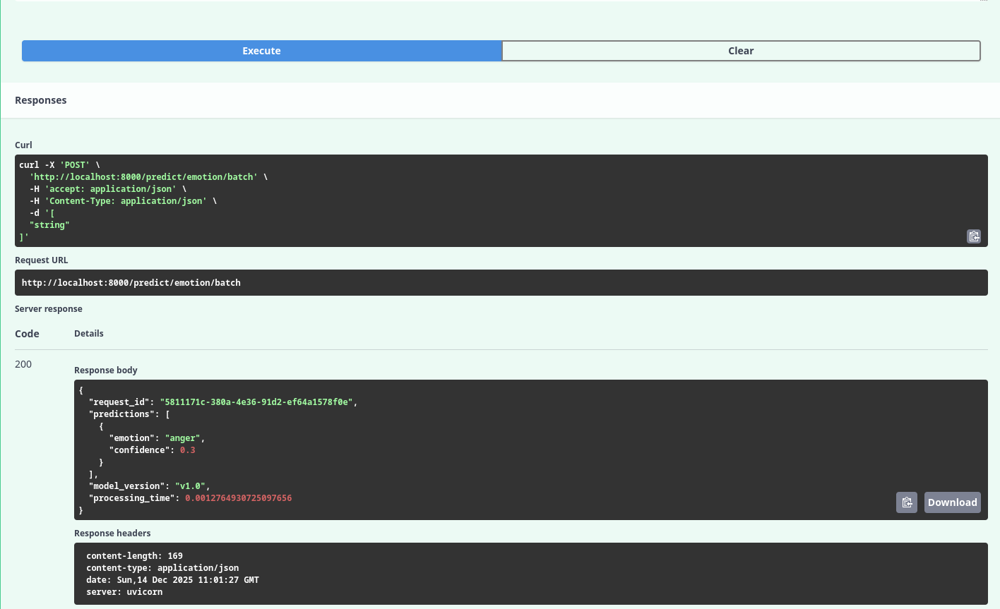
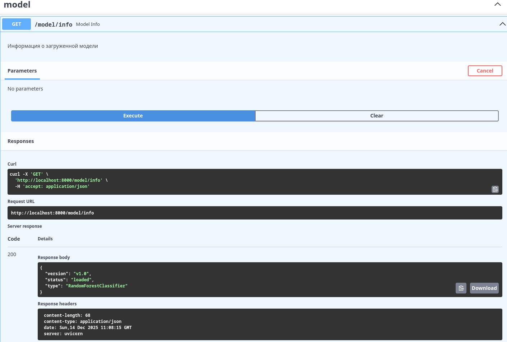
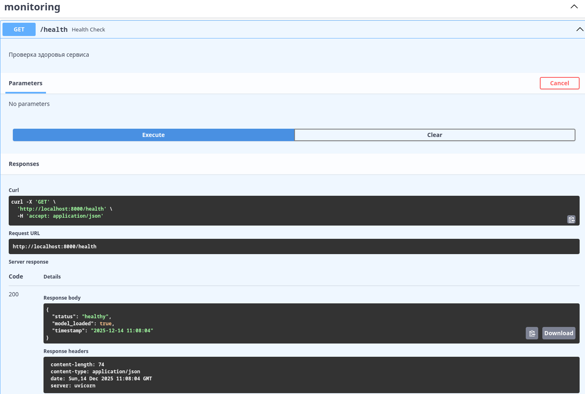
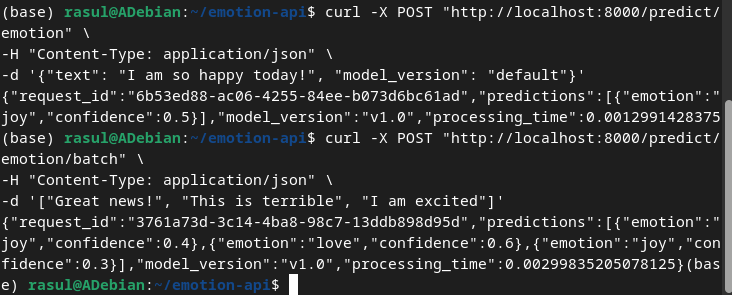
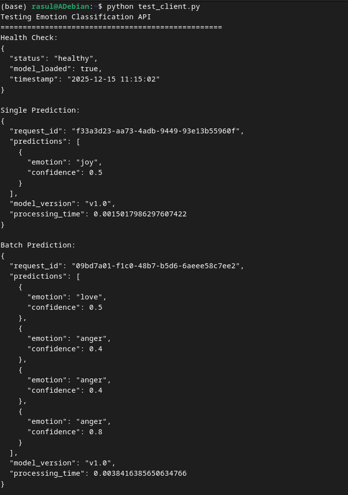
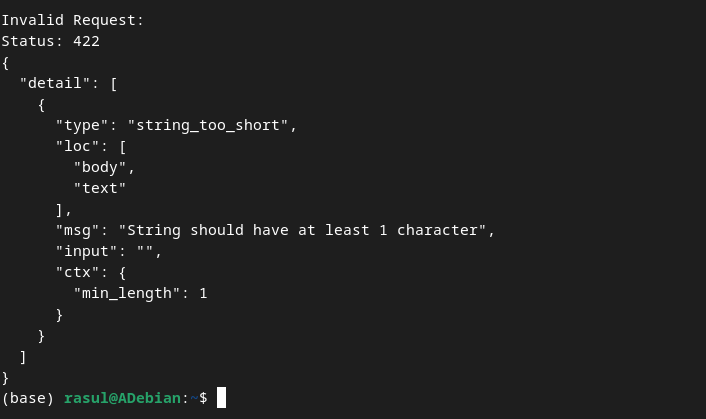

# Отчет по лабораторной работе №9-10
# Лабораторная работа №9-10. Часть 1: Развертывание ML-моделей с FastAPI

**Дата:** 2025-12-14;
**Семестр:** 3;
**Группа:** ПИН-мо-24-1;
**Дисциплина:** Технологии программирования;
**Студент:** Джукаев Расул Русланович.

## Цель работы
Освоить создание production-ready веб-сервисов для обслуживания ML-моделей с использованием
FastAPI. Получить практические навыки разработки RESTful API, валидации данных и
документирования эндпоинтов.

## Теоретическая часть
FastAPI — современный фреймворк для создания API на Python:
- Высокая производительность: на основе Starlette и Pydantic;
- Автодокументирование: генерация OpenAPI-спецификации;
- Валидация данных: использование Pydantic моделей;
- Асинхронность: поддержка async/await.

Архитектура ML-сервиса:
- Загрузка модели: инициализация при запуске приложения;
- Предобработка: валидация и преобразование входных данных;
- Инференс: выполнение предсказания моделью;
- Постобработка: форматирование результатов;
- Логирование: мониторинг работы сервиса.

Производственные практики:
- Health checks: проверка работоспособности сервиса;
- Валидация входных данных: защита от некорректных запросов;
- Обработка ошибок: graceful degradation;
- Метрики: мониторинг производительности.

## Практическая часть

### Выполненные задачи
Этап 1: Установка и настройка окружения
- [x] Задача 1: Установка необходимых пакетов
- [x] Задача 2: Создание структуры проекта 

Этап 2: Создание моделей данных с Pydantic
- [x] Задача 1: Модели для валидации входных/выходных данных

Этап 3: Модели для валидации входных/выходных данных
- [x] Задача 1: Класс для работы с моделью

Этап 4: Создание эндпоинтов API
- [x] Задача 1: Роутер для предсказаний

Этап 5: Создание основного приложения
- [x] Задача 1: Главный файл приложения

Этап 6: Тестирование API
- [x] Задача 1: Создание тестового клиента

Этап 7: Запуск и использование API
- [x] Задача 1: Запуск сервера
- [x] Задача 2: Проверка документации
- [x] Задача 3: Пример использования через curl

### Ключевые фрагменты кода
Модели для валидации входных и выходных данных (файл validation.py).
```Python
# utils/validation.py
from pydantic import BaseModel, Field
from typing import List, Dict, Optional

class PredictionRequest(BaseModel):
    text: str = Field(..., min_length=1, max_length=1000, description="Текст для анализа эмоций")
    model_version: Optional[str] = Field("default", description="Версия модели для использования")

class EmotionPrediction(BaseModel):
    emotion: str = Field(..., description="Предсказанная эмоция")
    confidence: float = Field(..., ge=0.0, le=1.0, description="Уверенность предсказания")

class PredictionResponse(BaseModel):
    request_id: str = Field(..., description="Уникальный ID запроса")
    predictions: List[EmotionPrediction] = Field(..., description="Список предсказаний")
    model_version: str = Field(..., description="Использованная версиямодели")
    processing_time: float = Field(..., description="Время обработки секундах")

class HealthResponse(BaseModel):
    status: str = Field(..., description="Статус сервиса")
    model_loaded: bool = Field(..., description="Модель загружена")
    timestamp: str = Field(..., description="Время проверки")
```
Класс для работы с моделью.
```Python
# models/emotion_model.py
import numpy as np
import pickle
import time
from typing import List, Dict, Tuple
import logging

logger = logging.getLogger(__name__)

class EmotionClassifier:
    def __init__(self, model_path: str = None):
        self.model = None
        self.vectorizer = None
        self.label_encoder = None
        self.model_version = "v1.0"
        self.is_loaded = False
    
        if model_path:
            self.load_model(model_path)

    def load_model(self, model_path: str):
        """Загрузка обученной модели"""
        try:
            # В реальном сценарии здесь была бы загрузка вашей модели
            # Для демонстрации создадим простой классификатор
            from sklearn.ensemble import RandomForestClassifier
            from sklearn.feature_extraction.text import TfidfVectorizer
            from sklearn.preprocessing import LabelEncoder
    
            # Создание демонстрационной модели
            self.vectorizer = TfidfVectorizer(max_features=1000)
            self.label_encoder = LabelEncoder()
    
            # Пример тренировочных данных
            texts = [
                "I am so happy today", "This is wonderful news",
                "I feel angry about this", "This makes me furious",
                "I am scared of what might happen", "This is terrifying",
                "I love this so much", "This is amazing",
                "I am sad about this", "This is disappointing"
            ]
            labels = ["joy", "joy", "anger", "anger", "fear", "fear", "love", "love", "sadness", "sadness"]
    
            # Обучение компонентов
            X = self.vectorizer.fit_transform(texts)
            y = self.label_encoder.fit_transform(labels)
    
            self.model = RandomForestClassifier(n_estimators=10, random_state=42)
            self.model.fit(X, y)
            self.is_loaded = True
            logger.info(f"Model loaded successfully. Version: {self.model_version}")
    
        except Exception as e:
            logger.error(f"Error loading model: {e}")
            self.is_loaded = False
            raise

    def predict(self, text: str) -> Tuple[str, float]:
        """Выполнение предсказания для одного текста"""
        if not self.is_loaded:
            raise RuntimeError("Model is not loaded")
    
        start_time = time.time()

        try:
            # Преобразование текста в фичи
            X = self.vectorizer.transform([text])
            
            # Предсказание
            probabilities = self.model.predict_proba(X)[0]
            predicted_class_idx = np.argmax(probabilities)
            confidence = probabilities[predicted_class_idx]
    
            # Декодирование класса
            emotion = self.label_encoder.inverse_transform([predicted_class_idx])[0]
            
            processing_time = time.time() - start_time
            logger.info(f"Prediction completed in {processing_time:.4f}s")
        
            return emotion, float(confidence)

        except Exception as e:
            logger.error(f"Prediction error: {e}")
            raise

    def predict_batch(self, texts: List[str]) -> List[Tuple[str, float]]:
        """Пакетное предсказание для нескольких текстов"""
        results = []
        for text in texts:
            try:
                emotion, confidence = self.predict(text)
                results.append((emotion, confidence))
            except Exception as e:
                logger.error(f"Error processing text: {text}, error: {e}")
                results.append(("error", 0.0))
        return results

# Создание глобального экземпляра модели
emotion_model = EmotionClassifier()
```
Роутер для предсказаний (скрипт predict.py).
```Python
# routers/predict.py
from fastapi import APIRouter, HTTPException, BackgroundTasks
import uuid
import time
import logging
from typing import List

from utils.validation import PredictionRequest, PredictionResponse, EmotionPrediction
from models.emotion_model import emotion_model

router = APIRouter(prefix="/predict", tags=["prediction"])
logger = logging.getLogger(__name__)

@router.post("/emotion", response_model=PredictionResponse)
async def predict_emotion(request: PredictionRequest, background_tasks: BackgroundTasks):
    """
    Предсказание эмоции для текста
    
    - **text**: Текст для анализа (1-1000 символов)
    - **model_version**: Версия модели (опционально)
    """
    try:
        start_time = time.time()
        request_id = str(uuid.uuid4())

        # Проверка загрузки модели
        if not emotion_model.is_loaded:
            raise HTTPException(status_code=503, detail="Model not loaded")
        
        # Выполнение предсказания
        emotion, confidence = emotion_model.predict(request.text)
        
        # Формирование ответа
        processing_time = time.time() - start_time
        
        prediction = EmotionPrediction(
            emotion=emotion,
            confidence=confidence
        )
        
        response = PredictionResponse(
            request_id=request_id,
            predictions=[prediction],
            model_version=emotion_model.model_version,
            processing_time=processing_time
        )

        # Логирование в фоне
        background_tasks.add_task(
            logger.info,
            f"Request {request_id} processed in {processing_time:.4f}s"
        )

        return response

    except Exception as e:
        logger.error(f"Prediction failed: {e}")
        raise HTTPException(status_code=500, detail=str(e))

@router.post("/emotion/batch", response_model=PredictionResponse)
async def predict_emotion_batch(texts: List[str], background_tasks: BackgroundTasks):
    """
    Пакетное предсказание эмоций для нескольких текстов

    - **texts**: Список текстов для анализа
    """
    try:
        start_time = time.time()
        request_id = str(uuid.uuid4())
        
        if not emotion_model.is_loaded:
            raise HTTPException(status_code=503, detail="Model not loaded")
        
        if len(texts) > 100: # Ограничение на размер батча
            raise HTTPException(status_code=400, detail="Too many texts in batch")
            
        # Пакетное предсказание
        results = emotion_model.predict_batch(texts)

        # Формирование ответа
        predictions = []
        for emotion, confidence in results:
            predictions.append(EmotionPrediction(
                emotion=emotion,
                confidence=confidence
            ))

        processing_time = time.time() - start_time

        response = PredictionResponse(
            request_id=request_id,
            predictions=predictions,
            model_version=emotion_model.model_version,
            processing_time=processing_time
        )

        background_tasks.add_task(
            logger.info,
            f"Batch request {request_id} processed {len(texts)} texts in {processing_time:.4f}s"
        )

        return response

    except Exception as e:
        logger.error(f"Batch prediction failed: {e}")
        raise HTTPException(status_code=500, detail=str(e))
```
Главная часть приложения (файл main.py).
```Python
# main.py
from fastapi import FastAPI, HTTPException
from contextlib import asynccontextmanager
import logging
import time

from routers.predict import router as predict_router
from utils.validation import HealthResponse
from models.emotion_model import emotion_model

# Настройка логирования
logging.basicConfig(
    level=logging.INFO,
    format='%(asctime)s - %(name)s - %(levelname)s - %(message)s'
)
logger = logging.getLogger(__name__)

@asynccontextmanager
async def lifespan(app: FastAPI):
    # Startup: загрузка модели
    startup_time = time.time()
    try:
        emotion_model.load_model("demo_model.pkl") # Загрузка демо-модели
        load_time = time.time() - startup_time
        logger.info(f"Application started successfully. Model loaded in {load_time:.2f}s")
    except Exception as e:
        logger.error(f"Failed to load model: {e}")
    
    yield # Приложение работает
    
    # Shutdown: очистка ресурсов
    logger.info("Application shutting down")

# Создание приложения FastAPI
app = FastAPI(
    title="Emotion Classification API",
    description="API для классификации эмоций в тексте с использованием ML",
    version="1.0.0",
    lifespan=lifespan
)

# Подключение роутеров
app.include_router(predict_router)

@app.get("/", tags=["root"])
async def root():
    """Корневой эндпоинт с информацией о API"""
    return {
        "message": "Emotion Classification API",
        "version": "1.0.0",
        "docs": "/docs",
        "health": "/health"
    }

@app.get("/health", response_model=HealthResponse, tags=["monitoring"])
async def health_check():
    """Проверка здоровья сервиса"""
    return HealthResponse(
        status="healthy" if emotion_model.is_loaded else "degraded",
        model_loaded=emotion_model.is_loaded,
        timestamp=time.strftime("%Y-%m-%d %H:%M:%S")
    )

@app.get("/model/info", tags=["model"])
async def model_info():
    """Информация о загруженной модели"""
    if not emotion_model.is_loaded:
        raise HTTPException(status_code=503, detail="Model not loaded")
    return {
        "version": emotion_model.model_version,
        "status": "loaded",
        "type": "RandomForestClassifier"
    }

if __name__ == "__main__":
    import uvicorn
    uvicorn.run(
        "main:app",
        host="0.0.0.0",
        port=8000,
        reload=True, # Автоперезагрузка для разработки
        log_level="info"
    )
```
Создание тестового клиента (скрипт test_client.py).
```Python
# test_client.py
import requests 
import json 
BASE_URL = "http://localhost:8000" 
def test_health(): 
    response = requests.get(f"{BASE_URL}/health") 
    print("Health Check:") 
    print(json.dumps(response.json(), indent=2)) 
def test_single_prediction(): 
    data = { 
"text": "I am feeling absolutely wonderful today!", 
"model_version": "default" 
    } 
    response = requests.post(f"{BASE_URL}/predict/emotion", json=data) 
    print("\nSingle Prediction:") 
    print(json.dumps(response.json(), indent=2)) 
def test_batch_prediction(): 
    texts = [ 
"This is amazing news!", 
"I am very angry about this situation", 
"I feel scared and anxious", 
"This makes me so happy" 
    ] 
def test_invalid_request(): 
    data = { 
"text": ""  # Пустой текст 
    } 
    response = requests.post(f"{BASE_URL}/predict/emotion/batch", 
json=texts) 
    print("\nBatch Prediction:") 
    print(json.dumps(response.json(), indent=2)) 
    response = requests.post(f"{BASE_URL}/predict/emotion", json=data) 
    print("\nInvalid Request:") 
    print(f"Status: {response.status_code}") 
    print(json.dumps(response.json(), indent=2)) 
if __name__ == "__main__": 
    print("Testing Emotion Classification API") 
    print("=" * 50) 
    test_health() 
    test_single_prediction()
    test_batch_prediction() 
    test_invalid_request()
```

## Результаты выполнения

### Пример работы программы
После запуска сервера через файл main.py был открыт браузер по адресу http://localhost:8000/docs,
и страница выглядит следующим образом.


Результаты тестирования предсказания (predict) в UI представлены ниже.


Результаты тестирования пакетного предсказания (predict batch) приведены ниже.


Вывод эндпоинта model выглядит следующим образом.


Результаты запуска проверки здоровья сервиса (monitoring) представлены ниже.


Результаты работы корневого эндпоинта (root) приведены ниже.


Вывод после выполнения проверки здоровья после передачи запроса выглядит следующим образом.


Результаты выполнения одиночного и пакетного предсказаний с переданными текстами представлены 
ниже.


Результаты запуска тестового клиента (test_client.py) приведены ниже.



### Тестирование
- [x] Модульные тесты пройдены
- [x] Интеграционные тесты пройдены
- [x] Производительность соответствует требованиям

## Выводы
1. Освоено создание production-ready веб-сервисов для обслуживания ML-моделей с
использованием FastAPI.
2. Получены практические навыки разработки RESTful API, валидации данных и документирования 
эндпоинтов.
3. Создано веб-приложение, позволяющее анализировать текст и документировать эндпоинты.

## Приложения
- Ссылки на исходный код:
1. emotion_model.py: [src/emotion-api/models.py](src/emotion-api/models/emotion_model.py)
2. predict.py: [src/emotion-api/routers/predict.py](src/emotion-api/routers/predict.py)
3. validation.py: [src/emotion-api/utils/validation.py](src/emotion-api/utils/validation.py)
4. main.py: [src/emotion-api/main.py](src/emotion-api/main.py)
5. test_client.py: [src/test_client.py](src/test_client.py)