# Отчет по лабораторной работе №11-12
# Лабораторная работа №11-12 (все части)

**Дата:** 2025-12-19;
**Семестр:** 3;
**Группа:** ПИН-мо-24-1;
**Дисциплина:** Технологии программирования;
**Студент:** Джукаев Расул Русланович.

## Цель работы
Освоить принципы построения RAG (Retrieval-Augmented Generation) систем путем интеграции векторного поиска и языковых моделей. Создать работающий прототип системы, способной находить релевантную информацию в базе знаний и генерировать осмысленные ответы на основе извлеченного контекста.

Освоить продвинутые техники настройки и оптимизации языковых моделей для использования в качестве генеративного компонента RAG-системы. Получить практические навыки работы с различными архитектурами моделей, оптимизации промптинга и оценки качества генерации.

Реализовать полный конвейер RAG-системы, интегрирующий семантический поиск и генерацию ответов. Освоить проектирование надежных пайплайнов, обработку ошибок, мониторинг производительности и оптимизацию взаимодействия между компонентами системы.

Освоить методы и метрики для комплексной оценки качества RAG-системы. Научиться проводить объективное тестирование ретривера и генератора, анализировать результаты и выявлять направления для улучшения системы.

## Теоретическая часть
RAG (Retrieval-Augmented Generation) — это гибридный подход, сочетающий поиск информации и генерацию текста:
- Retriever (Поисковый модуль): находит релевантные документы в базе знаний по запросу пользователя.
- Generator (Генеративный модуль): создает осмысленный ответ на основе найденных документов и исходного запроса.

Преимущества RAG:
- Актуальность: может работать с самыми свежими данными.
- Точность: снижает вероятность "галлюцинаций" модели.
- Объяснимость: можно отследить источники информации.
- Специализация: легко адаптируется к конкретной предметной области.

Ключевые компоненты RAG-пайплайна:
- Загрузка данных: подготовка и обработка документов.
- Чанкинг: разбиение документов на семантически осмысленные фрагменты.
- Векторизация: преобразование текста в векторные представления.
- Поиск: нахождение наиболее релевантных чанков.
- Конструирование промта: формирование контекста для языковой модели.
- Генерация: создание финального ответа.

Метрики оценки RAG-систем:
- Retrieval metrics: Precision@K, Recall@K, NDCG.
- Generation metrics: BLEU, ROUGE, Semantic similarity.
- End-to-end metrics: человеческая оценка, Task completion rate.

Различные архитектуры подходят для разных сценариев использования в RAG:
- Авторегрессивные модели (GPT-2, GPT-Neo): идеальны для генерации последовательного текста.
- Seq2Seq модели (T5, BART): хороши для задач переформулирования и суммирования.
- Инструктивные модели (Alpaca, Vicuna): специализированы для следования инструкциям.
- Многомодальные модели: могут работать с различными типами данных.

Методы оптимизации для production
- Квантование (Quantization): уменьшение точности весов для экономии памяти.
- Дистилляция (Knowledge Distillation): обучение меньшей модели на выходах большой.
- PEFT/LoRA: эффективная тонкая настройка с минимальными параметрами.
- Градиентный чекпоинтинг: экономия памяти при обучении.

Критерии выбора модели для RAG:
- Качество генерации: способность создавать связные и релевантные ответы.
- Скорость инференса: время отклика для реального использования.
- Потребление памяти: совместимость с доступными ресурсами.
- Контекстное окно: способность обрабатывать длинные промпты с контекстом.

Архитектура полного RAG-конвейера - производственный RAG-пайплайн состоит из взаимосвязанных этапов:
- Прием запроса: валидация и предобработка входного вопроса.
- Семантический поиск: Поиск релевантных документов в векторной БД
- Ранжирование и фильтрация: Отбор наиболее релевантных фрагментов
- Конструирование промта: Формирование оптимального контекста для модели
- Генерация ответа: Создание финального ответа языковой моделью
- Постобработка: Форматирование и валидация выходных данных

Критические аспекты production-систем:
- Обработка ошибок: graceful degradation при сбоях компонентов.
- Таймауты: контроль времени выполнения каждого этапа.
- Кэширование: уменьшение нагрузки на повторяющиеся запросы.
- Мониторинг: отслеживание метрик производительности и качества.
- Масштабируемость: поддержка увеличения нагрузки.

Стратегии оптимизации производительности:
- Асинхронная обработка: параллельное выполнение независимых операций.
- Пакетная обработка: группировка запросов для эффективного использования ресурсов.
- Предварительная загрузка: кэширование часто используемых данных.
- Балансировка нагрузки: распределение запросов между несколькими экземплярами.

Метрики оценки RAG-систем Оценка RAG-системы проводится на трех уровнях:
- Retrieval Quality: оценка качества поиска релевантных документов.
- Generation Quality: оценка качества сгенерированных ответов.
- End-to-End Quality: общая оценка работы системы.

Метрики для ретривера:
- Precision@K: доля релевантных документов среди top-K результатов.
- Recall@K: доля найденных релевантных документов от общего числа релевантных.
- NDCG@K: учет порядка релевантных документов в результатах.
- MRR (Mean Reciprocal Rank): среднее обратное рангов релевантных документов.

Метрики для генератора:
- ROUGE: сравнение с reference-ответами по n-граммам.
- BLEU: оценка качества машинного перевода (адаптируется для QA).
- Semantic Similarity: косинусная схожесть эмбеддингов ответов.
- Answer Relevance: оценка релевантности ответа вопросу.

Human Evaluation
- Correctness: фактическая точность ответа.
- Completeness: полнота охвата темы.
- Coherence: логическая связность ответа.
- Helpfulness: практическая полезность ответа.

## Практическая часть

### Выполненные задачи
**Часть 1: Построение прототипа RAG-системы**

Этап 1: Подготовка окружения и данных
- [x] Задача 1: Установка необходимых пакетов
- [x] Задача 2: Создание структуры проекта 
- [x] Задача 3: Подготовка тестовых данных

Этап 2: Реализация модуля поиска (Retriever)
- [x] Задача 1: Создание класса для работы с векторной БД

Этап 3: Реализация модуля генерации (Generator)
- [x] Задача 1: Создание класса для работы с языковой моделью

Этап 4: Интеграция компонентов в RAG-пайплайн
- [x] Задача 1: Создание основного класса RAG-системы

Этап 5: Тестирование системы
- [x] Задача 1: Запуск и тестирование RAG-системы
- [x] Задача 2: Анализ результатов
- [x] Задача 3: Создание тестового отчета

**Часть 2: Настройка языковой модели в качестве генератора**

Этап 1: Сравнение различных моделей-генераторов
- [x] Задача 1: Создание тестового стенда для сравнения моделей

Этап 2: Оптимизация генерации с помощью продвинутых техник
- [x] Задача 1: Реализация оптимизированного генератора

Этап 3: Сравнительный анализ моделей
- [x] Задача 1: Создание системы бенчмаркинга

Этап 4: Интеграция оптимизированного генератора в RAG-систему
- [x] Задача 1: Модификация основной RAG-системы

Этап 5: Создание отчета о настройке генератора
- [x] Задача 1: Генерация сравнительного отчета

**Часть 3: Создание конвейера RAG-системы**

Этап 1: Проектирование архитектуры конвейера
- [x] Задача 1: Создание конфигурации системы

Этап 2: Реализация основного конвейера
- [x] Задача 1: Создание класса RAG-конвейера

Этап 3: Создание FastAPI-сервиса для конвейера
- [x] Задача 1: Реализация API-эндпоинтов

Этап 4: Тестирование и валидация конвейера
- [x] Задача 1: Создание комплексного теста

Этап 5: Демонстрация работы системы
- [x] Задача 1: Создание демонстрационного скрипта

**Часть 4: Оценка качества работы системы**

Этап 1: Подготовка тестового датасета
- [x] Задача 1: Создание эталонного датасета для оценки

Этап 2: Реализация системы оценки ретривера
- [x] Задача 1: Создание модуля оценки поиска

Этап 3: Реализация системы оценки генератора
- [x] Задача 1: Создание модуля оценки генерации

Этап 4: Комплексная оценка RAG-системы
- [x] Задача 1: Создание комплексного оценщика

Этап 5: Визуализация и анализ результатов
- [x] Задача 1: Создание модуля визуализации

Этап 6: Запуск комплексной оценки
- [x] Задача 1: Создание скрипта для оценки

### Ключевые фрагменты кода
Подготовка документов для базы знаний (файл tech_docs.py).
```Python
# documents/tech_docs.py
DOCUMENTS = [
    {
        "id": "doc_001",
        "title": "Машинное обучение",
        "content": "Машинное обучение — это область искусственного интеллекта, которая использует статистические методы для создания моделей, способных обучаться на данных и делать предсказания. Основные типы машинного обучения включают обучение с учителем, без учителя и с подкреплением.",
        "category": "AI"
    },
    {
        "id": "doc_002",
        "title": "Глубокое обучение",
        "content": "Глубокое обучение использует нейронные сети с множеством слоев для извлечения иерархических признаков из данных. Популярные архитектуры включают сверточные нейронные сети для компьютерного зрения и трансформеры для обработки естественного языка.",
        "category": "AI"
    },
    {
        "id": "doc_003",
        "title": "Трансформеры в NLP",
        "content": "Архитектура трансформеров revolutionized обработку естественного языка. Модели типа BERT и GPT используют механизм внимания для учета контекста во всем входном последовательности. BERT предназначен для понимания текста, а GPT — для генерации.",
        "category": "NLP"
    },
    {
        "id": "doc_004",
        "title": "Векторные базы данных",
        "content": "Векторные базы данных оптимизированы для хранения и поиска векторных представлений данных. Они используют алгоритмы приближенного поиска ближайших соседей для эффективного семантического поиска. ChromaDB — популярная open-source векторная БД.",
        "category": "Databases"
    },
    {
        "id": "doc_005",
        "title": "RAG-архитектура",
        "content": "RAG (Retrieval-Augmented Generation) сочетает поиск информации в векторной базе данных с генерацией текста языковой моделью. Это позволяет моделям работать с актуальными данными и снижает вероятность галлюцинаций.",
        "category": "Architecture"
    }
]
```
Создание класса для работы с векторной БД (файл vector_store.py).
```Python
# retriever/vector_store.py
import chromadb
from sentence_transformers import SentenceTransformer
from typing import List, Dict, Any
import logging

logger = logging.getLogger(__name__)

class VectorStore:
    def __init__(self, collection_name: str = "rag_documents"):
        self.client = chromadb.Client()
        self.collection_name = collection_name
        self.model = SentenceTransformer('all-MiniLM-L6-v2')

        try:
            self.collection = self.client.get_collection(collection_name)
            logger.info(f"Loaded existing collection: {collection_name}")
        except:
            self.collection = self.client.create_collection(
                name=collection_name,
                metadata={"hnsw:space": "cosine"}
            )
            logger.info(f"Created new collection: {collection_name}")

    def add_documents(self, documents: List[Dict[str, Any]]):
        """Добавление документов в векторное хранилище"""
        ids = [doc["id"] for doc in documents]
        texts = [doc["content"] for doc in documents]
        metadatas = [{
            "title": doc["title"],
            "category": doc["category"],
            "source": "tech_docs"
        } for doc in documents]
        
        # Генерация эмбеддингов
        embeddings = self.model.encode(texts).tolist()
        
        # Добавление в коллекцию
        self.collection.add(
            documents=texts,
            embeddings=embeddings,
            metadatas=metadatas,
            ids=ids
        )
        logger.info(f"Added {len(documents)} documents to collection")

    def search(self, query: str, n_results: int = 3) -> List[Dict[str, Any]]:
        """Поиск релевантных документов"""
        query_embedding = self.model.encode([query]).tolist()
        
        results = self.collection.query(
            query_embeddings=query_embedding,
            n_results=n_results,
            include=["documents", "metadatas", "distances"]
        )
        
        # Форматирование результатов
        formatted_results = []
        for i, (doc, metadata, distance) in enumerate(zip(
            results['documents'][0],
            results['metadatas'][0],
            results['distances'][0]
        )):
            formatted_results.append({
                "content": doc,
                "metadata": metadata,
                "similarity_score": 1 - distance, # Конвертируем расстояние в схожесть
                "rank": i + 1
            })
        
        return formatted_results

    def get_collection_info(self) -> Dict[str, Any]:
        """Получение информации о коллекции"""
        return {
            "name": self.collection_name,
            "document_count": self.collection.count()
        }
```
Создание класса для работы с языковой модели (скрипт llm_client.py).
```Python
# generator/llm_client.py
from transformers import pipeline, AutoTokenizer, AutoModelForCausalLM
import torch
from typing import List, Dict, Any
import logging

logger = logging.getLogger(__name__)

class LLMGenerator:
    def __init__(self, model_name: str = "microsoft/DialoGPT-medium"):
        self.model_name = model_name
        self.tokenizer = AutoTokenizer.from_pretrained(model_name)
        self.model = AutoModelForCausalLM.from_pretrained(model_name)
        self.tokenizer.pad_token = self.tokenizer.eos_token

        # Альтернативно, можно использовать pipeline
        self.generator = pipeline(
            task="text-generation",
            model=model_name,
            tokenizer=self.tokenizer,
            torch_dtype=torch.float16,
            device_map="auto"
        )
        logger.info(f"Loaded language model: {model_name}")
    
    def generate_response(self, query: str, context: List[Dict[str, Any]]) -> str:
        """Генерация ответа на основе запроса и контекста"""

        # Формирование промта с контекстом
        context_text = self._build_context_string(context)
        prompt = self._construct_prompt(query, context_text)
        try:
        
            # Генерация ответа
            response = self.generator(
                prompt,
                max_length=512,
                num_return_sequences=1,
                temperature=0.7,
                do_sample=True,
                pad_token_id=self.tokenizer.eos_token_id,
                truncation=True
            )      
            generated_text = response[0]['generated_text']
            # Извлекаем только сгенерированную часть (после промта)
            answer = generated_text[len(prompt):].strip()
    
            return answer

        except Exception as e:
            logger.error(f"Generation error: {e}")
            return "Извините, произошла ошибка при генерации ответа."

    def _build_context_string(self, context: List[Dict[str, Any]]) -> str:
        """Построение строки контекста из найденных документов"""
        context_parts = []
        for i, doc in enumerate(context):
            content = doc['content']
            title = doc['metadata']['title']
            score = doc['similarity_score']
            context_parts.append(f"[Документ {i+1}] {title} (схожесть {score:.3f}): {content}")
        
        return "\n\n".join(context_parts)

    def _construct_prompt(self, query: str, context: str) -> str:
        """Конструирование промта для языковой модели"""
        prompt = f"""На основе предоставленного контекста, ответь на вопрос пользователя. Если в контексте нет достаточной информации, скажи об этом. Контекст: {context} Вопрос: {query} Ответ: """
        return prompt
```
Создание основного класса RAG-системы (файл main.py).
```Python
# main.py
from retriever.vector_store import VectorStore
from generator.llm_client import LLMGenerator
from documents.tech_docs import DOCUMENTS
import logging
from typing import List, Dict, Any

logging.basicConfig(level=logging.INFO)
logger = logging.getLogger(__name__)

class RAGSystem:
    def __init__(self):
        self.retriever = VectorStore()
        self.generator = LLMGenerator()
        self._initialize_database()

    def _initialize_database(self):
        """Инициализация базы данных с документами"""
        if self.retriever.get_collection_info()["document_count"] == 0:
            logger.info("Initializing database with documents...")
            self.retriever.add_documents(DOCUMENTS)
        else:
            logger.info("Database already initialized")

    def ask(self, question: str, n_documents: int = 3) -> Dict[str, Any]:
        """Основной метод для вопросов к RAG-системе"""
        logger.info(f"Processing question: {question}")

        # Шаг 1: Поиск релевантных документов
        retrieved_docs = self.retriever.search(question, n_results=n_documents)
        logger.info(f"Retrieved {len(retrieved_docs)} documents")
        
        # Шаг 2: Генерация ответа на основе контекста
        answer = self.generator.generate_response(question, retrieved_docs)

        # Формирование полного ответа
        response = {
            "question": question,
            "answer": answer,
            "retrieved_documents": retrieved_docs,
            "document_count": len(retrieved_docs)
        }

        return response

    def get_system_info(self) -> Dict[str, Any]:
        """Получение информации о системе"""
        return {
            "retriever": self.retriever.get_collection_info(),
            "generator": {"model": self.generator.model_name},
            "status": "ready"
        }

# Пример использования
if __name__ == "__main__":
    rag_system = RAGSystem()
    
    # Тестовые вопросы
    test_questions = [
        "Что такое машинное обучение?",
        "Какие бывают типы машинного обучения?",
        "Как работают трансформеры в NLP?",
        "Что такое RAG-архитектура?"
    ]
    for question in test_questions:
        print(f"\n{'='*60}")
        print(f"Вопрос: {question}")
        response = rag_system.ask(question)
        print(f"Ответ: {response['answer']}")
        print(f"Найдено документов: {response['document_count']}")
        print(f"Лучший документ: {response['retrieved_documents'][0]['metadata']['title']}")
```
Тестирование системы (скрипт test_rag_system.py).
```Python
# test_rag_system.py
from main import RAGSystem

def test_rag_system():
    rag = RAGSystem()
    
    test_cases = [
        {
            "question": "Что такое машинное обучение?",
            "expected_keywords": ["искусственный интеллект", "статистические методы", "предсказания"]
        },
        {
            "question": "Какие нейронные сети используются в глубоком обучении?",
            "expected_keywords": ["сверточные", "трансформеры", "слои"]
        }
    ]

    print("Тестирование RAG-системы:")
    print("=" * 50)
    
    for i, test_case in enumerate(test_cases, 1):
        print(f"\nТест {i}: {test_case['question']}")
        response = rag.ask(test_case['question'])
        print(f"Ответ: {response['answer']}")
        print(f"Найдено документов: {response['document_count']}")
    
        # Проверка ключевых слов
        answer_lower = response['answer'].lower()
        found_keywords = [kw for kw in test_case['expected_keywords'] if kw in answer_lower]
        print(f"Найдено ключевых слов: {len(found_keywords)}/{len(test_case['expected_keywords'])}")
        print(f"Ключевые слова: {found_keywords}")

if __name__ == "__main__":
    test_rag_system()
```
Создание тестового стенда для сравнения моделей (скрипт model_comparison.py).
```Python
# generator/model_comparison.py
from transformers import (
    pipeline,
    AutoTokenizer,
    AutoModelForCausalLM,
    AutoModelForSeq2SeqLM,
    GenerationConfig
)
import torch
from typing import List, Dict, Any
import time
import logging
from datetime import datetime

logger = logging.getLogger(__name__)

class ModelComparator:
    def __init__(self):
        self.models_config = {
            "gpt2-medium": {
                "type": "causal",
                "description": "Авторегрессивная модель среднего размера"
            },
            "t5-small": {
                "type": "seq2seq",
                "description": "Seq2Seq модель для переформулирования"
            },
            "facebook/bart-base": {
                "type": "seq2seq",
                "description": "BART модель для текстовых задач"
            },
            "microsoft/DialoGPT-medium": {
                "type": "causal",
                "description": "Диалоговая модель на основе GPT-2"
            }
        }
    
        self.loaded_models = {}

    def load_model(self, model_name: str):
        """Загрузка модели с обработкой ошибок"""
        try:
            logger.info(f"Loading model: {model_name}")
            start_time = time.time()
    
            if self.models_config[model_name]["type"] == "causal":
                tokenizer = AutoTokenizer.from_pretrained(model_name)
                model = AutoModelForCausalLM.from_pretrained(
                    model_name,
                    torch_dtype=torch.float16,
                    device_map="auto"
                )
                tokenizer.pad_token = tokenizer.eos_token
    
            else: # seq2seq
                tokenizer = AutoTokenizer.from_pretrained(model_name)
                model = AutoModelForSeq2SeqLM.from_pretrained(
                    model_name,
                    torch_dtype=torch.float16,
                    device_map="auto"
                )
    
            load_time = time.time() - start_time
    
            self.loaded_models[model_name] = {
                "model": model,
                "tokenizer": tokenizer,
                "type": self.models_config[model_name]["type"],
                "load_time": load_time
            }
    
            logger.info(f"Successfully loaded {model_name} in {load_time:.2f}s")

        except Exception as e:
            logger.error(f"Failed to load {model_name}: {e}")

    def generate_with_model(self, model_name: str, prompt: str, max_length: int = 200) -> Dict[str, Any]:
        """Генерация текста с указанной моделью"""
        if model_name not in self.loaded_models:
            self.load_model(model_name)
        
        model_info = self.loaded_models[model_name]
        tokenizer = model_info["tokenizer"]
        model = model_info["model"]
        
        start_time = time.time()
    
        try:
            if model_info["type"] == "causal":
                inputs = tokenizer(prompt, return_tensors="pt", truncation=True, max_length=512)
                
                with torch.no_grad():
                    outputs = model.generate(
                        **inputs,
                        max_length=max_length,
                        num_return_sequences=1,
                        temperature=0.7,
                        do_sample=True,
                        pad_token_id=tokenizer.eos_token_id,
                        repetition_penalty=1.1
                    )
                
                generated_text = tokenizer.decode(outputs[0], skip_special_tokens=True)
                # Удаляем промт из сгенерированного текста
                answer = generated_text[len(prompt):].strip()
            
            else: # seq2seq
                inputs = tokenizer(prompt, return_tensors="pt", truncation=True, max_length=512)
                with torch.no_grad():
                    outputs = model.generate(
                    **inputs,
                    max_length=max_length,
                    num_return_sequences=1,
                    temperature=0.7,
                    do_sample=True
                )
    
                answer = tokenizer.decode(outputs[0], skip_special_tokens=True)
    
            generation_time = time.time() - start_time
            
            return {
                "model": model_name,
                "answer": answer,
                "generation_time": generation_time,
                "answer_length": len(answer),
                "success": True
            }
    
        except Exception as e:
            logger.error(f"Generation failed for {model_name}: {e}")
            return {
                "model": model_name,
                "answer": f"Error: {str(e)}",
                "generation_time": 0,
                "answer_length": 0,
                "success": False
            }
```
Реализация оптимизированного генератора (скрипт optimized_generation.py).
```Python
# generator/optimized_generator.py
from transformers import (
    AutoTokenizer,
    AutoModelForCausalLM,
    BitsAndBytesConfig,
    GenerationConfig
)
import torch
from typing import List, Dict, Any
import time
import logging

logger = logging.getLogger(__name__)

class OptimizedLLMGenerator:
    def __init__(self, model_name: str = "microsoft/DialoGPT-medium"):
        self.model_name = model_name
        self.quantization_config = None
        self.generation_config = None
        self._setup_quantization()
        self._setup_generation_config()
        self._load_model()
    
    def _setup_quantization(self):
        """Настройка квантования для экономии памяти"""
        self.quantization_config = BitsAndBytesConfig(
            load_in_4bit=True,
            bnb_4bit_use_double_quant=True,
            bnb_4bit_quant_type="nf4",
            bnb_4bit_compute_dtype=torch.float16
        )
    def _setup_generation_config(self):
        """Настройка параметров генерации"""
        self.generation_config = GenerationConfig(
            max_new_tokens=150,
            temperature=0.7,
            do_sample=True,
            top_p=0.9,
            top_k=50,
            repetition_penalty=1.1,
            pad_token_id=50256 # EOS token for most models
        )

    def _load_model(self):
        """Загрузка модели с оптимизациями"""
        logger.info(f"Loading optimized model: {self.model_name}")
        
        self.tokenizer = AutoTokenizer.from_pretrained(self.model_name)
        self.tokenizer.pad_token = self.tokenizer.eos_token
        
        self.model = AutoModelForCausalLM.from_pretrained(
            self.model_name,
            quantization_config=self.quantization_config,
            device_map="auto",
            torch_dtype=torch.float16,
            trust_remote_code=True
        )
        
        logger.info("Model loaded successfully with optimizations")

    def generate_optimized_response(self, query: str, context: List[Dict[str, Any]]) -> Dict[str, Any]:
        """Оптимизированная генерация ответа"""
        start_time = time.time()
        
        # Построение улучшенного промта
        prompt = self._construct_enhanced_prompt(query, context)
        
        try:
            # Токенизация с оптимизацией
            inputs = self.tokenizer(
                prompt,
                return_tensors="pt",
                truncation=True,
                max_length=1024
            )
            
            # Генерация с кастомизированными параметрами
            with torch.no_grad():
                outputs = self.model.generate(
                    **inputs,
                    generation_config=self.generation_config
                )
            
            # Декодирование с пропуском специальных токенов
            generated_text = self.tokenizer.decode(
                outputs[0],
                skip_special_tokens=True
            )
            
            # Извлечение ответа
            answer = generated_text[len(prompt):].strip()
            
            generation_time = time.time() - start_time
            
            return {
                "answer": answer,
                "generation_time": generation_time,
                "prompt_length": len(prompt),
                "answer_length": len(answer),
                "model": self.model_name,
                "optimized": True
            }
            
        except Exception as e:
            logger.error(f"Optimized generation failed: {e}")
            return {
                "answer": f"Generation error: {str(e)}",
                "generation_time": 0,
                "prompt_length": 0,
                "answer_length": 0,
                "model": self.model_name,
                "optimized": False
            }
    
    def _construct_enhanced_prompt(self, query: str, context: List[Dict[str, Any]]) -> str:
        """Улучшенное конструирование промта"""
        context_text = self._build_structured_context(context)
    
        enhanced_prompt = f"""Ты - AI-ассистент, который отвечает на вопросы на основе предоставленного контекста.
        ИНСТРУКЦИИ:
        1. Используй только информацию из предоставленного контекста
        2. Если в контексте нет ответа, честно скажи об этом
        3. Будь точным и информативным
        4. Отвечай на русском языке
        КОНТЕКСТ: {context_text}
        ВОПРОС: {query}
        ОТВЕТ: """

        return enhanced_prompt
    
    def _build_structured_context(self, context: List[Dict[str, Any]]) -> str:
        """Структурированное построение контекста"""
        context_parts = []
        for i, doc in enumerate(context, 1):
            content = doc['content']
            title = doc['metadata']['title']
            category = doc['metadata']['category']
            score = doc['similarity_score']
            
            context_parts.append(
                f"Документ {i}:\n"
                f"Заголовок: {title}\n"
                f"Категория: {category}\n"
                f"Релевантность: {score:.3f}\n"
                f"Содержание: {content}\n"
            )

        return "\n" + "="*50 + "\n".join(context_parts) + "="*50
```
Создание системы бенчмаркинга (файл benchmark_system.py).
```Python
# generator/benchmark_system.py
import pandas as pd
import time
from typing import List, Dict, Any
from .model_comparison import ModelComparator
from .optimized_generator import OptimizedLLMGenerator
import logging

logger = logging.getLogger(__name__)

class ModelBenchmark:
    def __init__(self):
        self.comparator = ModelComparator()
        self.test_questions = [
            {
                "question": "Что такое машинное обучение?",
                "context": [{
                    "content": "Машинное обучение — это область искусственного интеллекта, которая использует статистические методы для создания моделей, способных обучаться на данных и делать предсказания.",
                    "metadata": {"title": "Машинное обучение", "category": "AI"},
                    
                    "similarity_score": 0.95
                }]
            },
            {
                "question": "Какие типы нейронных сетей вы знаете?",
                "context": [{
                "content": "Популярные архитектуры нейронных сетей включают сверточные нейронные сети для компьютерного зрения и трансформеры для обработки естественного языка.",
                "metadata": {"title": "Глубокое обучение", "category": "AI"},
                
                "similarity_score": 0.88
                }]
            }
        ]

    def run_benchmark(self, model_names: List[str]) -> pd.DataFrame:
        """Запуск сравнительного тестирования моделей"""
        results = []
        
        for model_name in model_names:
            logger.info(f"Benchmarking model: {model_name}")
            
            # Загрузка модели
            self.comparator.load_model(model_name)
            
            for test_case in self.test_questions:
                question = test_case["question"]
                context = test_case["context"]
                
                # Генерация ответа
                result = self.comparator.generate_with_model(model_name, question)

                # Оценка качества
                evaluation = self._evaluate_response(
                    result["answer"],
                    question,
                    context
                )
                benchmark_result = {
                    "model": model_name,
                    "question": question,
                    "answer": result["answer"],
                    "generation_time": result["generation_time"],
                    "answer_length": result["answer_length"],
                    "success": result["success"]
                }
                
                benchmark_result.update(evaluation)
                
                results.append(benchmark_result)
                
                # Пауза между запросами
                time.sleep(1)
        
        return pd.DataFrame(results)

    def _evaluate_response(self, answer: str, question: str, context: List[Dict]) -> Dict[str, Any]:
        """Базовая оценка качества ответа"""
        # Простые метрики для демонстрации
        context_keywords = self._extract_keywords_from_context(context)
        answer_keywords = self._extract_keywords(answer)
        
        # Вычисление покрытия ключевых слов
        matched_keywords = set(context_keywords) & set(answer_keywords)
        keyword_coverage = len(matched_keywords) / len(context_keywords) if context_keywords else 0
        
        return {
            "keyword_coverage": keyword_coverage,
            "matched_keywords_count": len(matched_keywords),
            "answer_has_content": len(answer.strip()) > 10,
            "contains_uncertainty": "не знаю" in answer.lower() or "нет информации" in answer.lower()
        }

    def _extract_keywords_from_context(self, context: List[Dict]) -> List[str]:
        """Извлечение ключевых слов из контекста"""
        all_text = " ".join([doc["content"] for doc in context])
        # Простая токенизация для демонстрации
        words = all_text.lower().split()
        # Фильтрация стоп-слов и коротких слов
        stop_words = {"и", "в", "на", "с", "по", "для", "это", "что", "как"}
        keywords = [word for word in words if len(word) > 3 and word not in stop_words]
        return list(set(keywords))[:10] # Возвращаем топ-10 уникальных ключевых слов
    
    def _extract_keywords(self, answer):
        """Извлечение ключевых слов из ответа"""
        # Простая токенизация для демонстрации
        words = answer.lower().split()
        # Фильтрация стоп-слов и коротких слов
        stop_words = {"и", "в", "на", "с", "по", "для", "это", "что", "как"}
        keywords = [word for word in words if len(word) > 3 and word not in stop_words]
        return list(set(keywords))[:10] # Возвращаем топ-10 уникальных ключевых слов
```
Модификация основной RAG-системы (скрипт main_optimized.py).
```Python
# main_optimized.py
from retriever.vector_store import VectorStore
from generator.optimized_generator import OptimizedLLMGenerator
from documents.tech_docs import DOCUMENTS
import logging
from typing import Dict, Any

logging.basicConfig(level=logging.INFO)
logger = logging.getLogger(__name__)

class OptimizedRAGSystem:
    def __init__(self, model_name: str = "microsoft/DialoGPT-medium"):
        self.retriever = VectorStore()
        self.generator = OptimizedLLMGenerator(model_name)
        self._initialize_database()
    
    def _initialize_database(self):
        """Инициализация базы данных"""
        if self.retriever.get_collection_info()["document_count"] == 0:
            logger.info("Initializing database with documents...")
            self.retriever.add_documents(DOCUMENTS)
    
    def ask(self, question: str, n_documents: int = 3) -> Dict[str, Any]:
        """Оптимизированный метод для вопросов"""
        logger.info(f"Processing question: {question}")
        
        # Поиск документов
        retrieved_docs = self.retriever.search(question, n_results=n_documents)
        
        # Генерация ответа с оптимизированной моделью
        generation_result = self.generator.generate_optimized_response(
            question,
            retrieved_docs
        )
    
        response = {
            "question": question,
            "answer": generation_result["answer"],
            "retrieved_documents": retrieved_docs,
            "generation_info": {
                "model": generation_result["model"],
                "generation_time": generation_result["generation_time"],
                "optimized": generation_result["optimized"]
            },
            "document_count": len(retrieved_docs)
        }
    
        return response

# Демонстрация работы оптимизированной системы
if __name__ == "__main__":
    # Сравнение производительности
    import time

    rag_standard = OptimizedRAGSystem("microsoft/DialoGPT-medium")

    test_questions = [
        "Объясни что такое машинное обучение",
        "Какие архитектуры нейронных сетей используются в NLP?",
        "Что такое векторные базы данных и для чего они нужны?"
    ]

    print("Тестирование оптимизированной RAG-системы:")
    print("=" * 60)

    for question in test_questions:
        start_time = time.time()
        response = rag_standard.ask(question)
        total_time = time.time() - start_time
        print(f"\nВопрос: {question}")
        print(f"Ответ: {response['answer']}")
        print(f"Общее время: {total_time:.2f}с")
        print(f"Время генерации: {response['generation_info']['generation_time']:.2f}с")
        print(f"Модель: {response['generation_info']['model']}")
        print(f"Найдено документов: {response['document_count']}")
```
Генерация сравнительного отчета (скрипт generate_report.py).
```Python
# generate_report.py
import pandas as pd
from generator.benchmark_system import ModelBenchmark

def create_model_comparison_report():
    """Создание отчета о сравнении моделей"""
    benchmark = ModelBenchmark()
    
    models_to_test = [
        "gpt2-medium",
        "t5-small",
        "facebook/bart-base",
        "microsoft/DialoGPT-medium"
    ]

    results_df = benchmark.run_benchmark(models_to_test)

    # Агрегация результатов
    summary = results_df.groupby('model').agg({
        'generation_time': 'mean',
        'keyword_coverage': 'mean',
        'success': 'mean',
        'answer_length': 'mean'
    }).round(3)
    summary = summary.rename(columns={
        'generation_time': 'avg_generation_time',
        'keyword_coverage': 'avg_keyword_coverage',
        'success': 'success_rate',
        'answer_length': 'avg_answer_length'
    })
    
    # Сохранение отчетов
    results_df.to_csv("model_comparison_detailed.csv", index=False)
    summary.to_csv("model_comparison_summary.csv")
    
    print("Детальный отчет сохранен в: model_comparison_detailed.csv")
    print("Сводный отчет сохранен в: model_comparison_summary.csv")
    
    return summary

if __name__ == "__main__":
    report = create_model_comparison_report()
    print("\nСводный отчет по моделям:")
    print(report)
```
Создание конфигурации системы (файл pipeline_config.py).
```Python
# config/pipeline_config.py
from typing import Dict, Any
from dataclasses import dataclass

@dataclass
class RetrieverConfig:
    collection_name: str = "rag_documents"
    top_k: int = 5
    similarity_threshold: float = 0.6
    max_context_length: int = 2000

@dataclass
class GeneratorConfig:
    model_name: str = "microsoft/DialoGPT-medium"
    max_tokens: int = 250
    temperature: float = 0.7
    timeout_seconds: int = 30

@dataclass
class PipelineConfig:
    retriever: RetrieverConfig = RetrieverConfig()
    generator: GeneratorConfig = GeneratorConfig()
    enable_caching: bool = True
    cache_ttl: int = 3600 # 1 hour
    max_retries: int = 3
    request_timeout: int = 60

# Конфигурация по умолчанию
DEFAULT_CONFIG = PipelineConfig()
```
Создание класса RAG-конвейера (скрипт rag_pipeline.py).
```Python
# pipeline/rag_pipeline.py
import logging
import time
import asyncio
from typing import Dict, Any, List, Optional
from datetime import datetime
import hashlib
import json

from retriever.vector_store import VectorStore
from generator.optimized_generator import OptimizedLLMGenerator
from config.pipeline_config import PipelineConfig

logger = logging.getLogger(__name__)

class RAGPipeline:
    def __init__(self, config: PipelineConfig = None):
        self.config = config or PipelineConfig()
        self.retriever = VectorStore(self.config.retriever.collection_name)
        self.generator = OptimizedLLMGenerator(self.config.generator.model_name)
        self.cache = {} # Простой in-memory кэш для демонстрации
        self.metrics = {
            "total_requests": 0,
            "successful_requests": 0,
            "average_processing_time": 0,
            "cache_hits": 0
        }
    
    async def process_question(self, question: str, user_context: Dict[str, Any] = None) -> Dict[str, Any]:
        """Основной метод обработки вопроса через RAG-конвейер"""
        start_time = time.time()
        request_id = self._generate_request_id(question, user_context)
        
        logger.info(f"Processing request {request_id}: {question}")
        self.metrics["total_requests"] += 1
        
        try:
            # Шаг 1: Проверка кэша
            cached_result = self._get_cached_result(request_id)
            if cached_result:
                logger.info(f"Cache hit for request {request_id}")
                self.metrics["cache_hits"] += 1
                cached_result["cached"] = True
                return cached_result
    
            # Шаг 2: Семантический поиск
            retrieval_start = time.time()
            retrieved_docs = await self._retrieve_documents(question)
            retrieval_time = time.time() - retrieval_start

            # Шаг 3: Фильтрация и ранжирование
            filtered_docs = self._filter_documents(retrieved_docs)
    
            # Шаг 4: Генерация ответа
            generation_start = time.time()
            answer = await self._generate_answer(question, filtered_docs, user_context)
            generation_time = time.time() - generation_start
    
            # Шаг 5: Постобработка
            final_answer = self._postprocess_answer(answer, filtered_docs)
    
            # Формирование результата
            processing_time = time.time() - start_time
            result = self._build_response(
                question=question,
                answer=final_answer,
                documents=filtered_docs,
                processing_time=processing_time,
                retrieval_time=retrieval_time,
                generation_time=generation_time,
                request_id=request_id
            )
    
            # Кэширование результата
            self._cache_result(request_id, result)
            
            self.metrics["successful_requests"] += 1
            self._update_metrics(processing_time)
            
            logger.info(f"Request {request_id} completed in {processing_time:.2f}s")
            return result
        
        except Exception as e:
            processing_time = time.time() - start_time
            error_result = self._build_error_response(question, str(e), processing_time, request_id)
            logger.error(f"Request {request_id} failed: {e}")
            return error_result

    async def _retrieve_documents(self, question: str) -> List[Dict[str, Any]]:
        """Асинхронный поиск документов с таймаутом"""
        try:
            # Используем asyncio для неблокирующего выполнения
            loop = asyncio.get_event_loop()
            documents = await asyncio.wait_for(
                loop.run_in_executor(None, self.retriever.search, question, self.config.retriever.top_k),
                timeout=self.config.generator.timeout_seconds
            )
            return documents
        except asyncio.TimeoutError:
            logger.warning("Document retrieval timeout")
            return []
        except Exception as e:
            logger.error(f"Retrieval error: {e}")
            return []

    async def _generate_answer(self, question: str, documents: List[Dict[str, Any]], user_context: Dict[str, Any]) -> str:
        """Асинхронная генерация ответа с обработкой ошибок"""
        try:
            if not documents:
                return "К сожалению, я не нашел достаточно информации для ответа на этот вопрос."

            loop = asyncio.get_event_loop()
            generation_result = await asyncio.wait_for(
                loop.run_in_executor(
                    None,
                    self.generator.generate_optimized_response,
                    question, documents
                ),
                timeout=self.config.generator.timeout_seconds
            )

            return generation_result["answer"]

        except asyncio.TimeoutError:
            logger.warning("Answer generation timeout")
            return "Извините, генерация ответа заняла слишком много времени. Попробуйте переформулировать вопрос."
        except Exception as e:
            logger.error(f"Generation error: {e}")
            return f"Произошла ошибка при генерации ответа: {str(e)}"

    def _filter_documents(self, documents: List[Dict[str, Any]]) -> List[Dict[str, Any]]:
        """Фильтрация и ранжирование документов"""
        # Фильтрация по порогу схожести
        filtered = [
            doc for doc in documents
            if doc.get('similarity_score', 0) >= self.config.retriever.similarity_threshold
        ]

        # Сортировка по релевантности
        filtered.sort(key=lambda x: x.get('similarity_score', 0), reverse=True)

        # Ограничение длины контекста
        total_length = 0
        final_documents = []
        
        for doc in filtered:
            doc_length = len(doc.get('content', ''))
            if total_length + doc_length <= self.config.retriever.max_context_length:
                final_documents.append(doc)
                total_length += doc_length
            else:
                break
            
        return final_documents

    def _postprocess_answer(self, answer: str, documents: List[Dict[str, Any]]) -> str:
        """Постобработка сгенерированного ответа"""
        # Удаление лишних пробелов и переносов
        answer = ' '.join(answer.split())
        # Проверка минимальной длины ответа
        if len(answer.strip()) < 10:
            return "Извините, не удалось сгенерировать содержательный ответ на основе найденной информации."

        return answer

    def _build_response(self, **kwargs) -> Dict[str, Any]:
        """Формирование структурированного ответа"""
        return {
            "success": True,
            "timestamp": datetime.now().isoformat(),
            **kwargs
        }

    def _build_error_response(self, question: str, error: str, processing_time: float, request_id: str) -> Dict[str, Any]:
        """Формирование ответа об ошибке"""
        return {
            "success": False,
            "question": question,
            "answer": f"Произошла ошибка: {error}",
            "processing_time": processing_time,
            "request_id": request_id,
            "timestamp": datetime.now().isoformat(),
            "documents": []
        }

    def _generate_request_id(self, question: str, user_context: Dict[str, Any]) -> str:
        """Генерация уникального ID запроса"""
        content = question + json.dumps(user_context or {}, sort_keys=True)
        return hashlib.md5(content.encode()).hexdigest()[:10]

    def _get_cached_result(self, request_id: str) -> Optional[Dict[str, Any]]:
        """Получение результата из кэша"""
        if not self.config.enable_caching:
            return None

        cached = self.cache.get(request_id)
        if cached and time.time() - cached['timestamp'] < self.config.cache_ttl:
            return cached['result']
        return None

    def _cache_result(self, request_id: str, result: Dict[str, Any]):
        """Сохранение результата в кэш"""
        if self.config.enable_caching:
            self.cache[request_id] = {
                'result': result,
                'timestamp': time.time()
            }
            # Очистка устаревших записей (простая реализация)
            if len(self.cache) > 1000: # Максимум 1000 записей в кэше
                oldest_key = min(self.cache.keys(), key=lambda k: self.cache[k]['timestamp'])
                del self.cache[oldest_key]

    def _update_metrics(self, processing_time: float):
        """Обновление метрик производительности"""
        total_time = self.metrics["average_processing_time"] * (self.metrics["successful_requests"] - 1)
        self.metrics["average_processing_time"] = (total_time + processing_time) / self.metrics["successful_requests"]
    
    def get_metrics(self) -> Dict[str, Any]:
        """Получение текущих метрик системы"""
        return self.metrics.copy()
```
Реализация API-эндпоинтов (файл pipeline_service.py).
```Python
# api/pipeline_service.py
from fastapi import FastAPI, HTTPException, BackgroundTasks
from pydantic import BaseModel, Field
from typing import Optional, Dict, Any, List
import logging
import uvicorn
from datetime import datetime

from pipeline.rag_pipeline import RAGPipeline
from config.pipeline_config import PipelineConfig

# Модели данных для API
class QuestionRequest(BaseModel):
    question: str = Field(..., min_length=1, max_length=1000, description="Вопрос для системы")
    user_context: Optional[Dict[str, Any]] = Field(None, description="Дополнительный контекст пользователя")
    use_cache: bool = Field(True, description="Использовать кэширование")

class PipelineResponse(BaseModel):
    success: bool = Field(..., description="Успешность выполнения запроса")
    question: str = Field(..., description="Исходный вопрос")
    answer: str = Field(..., description="Сгенерированный ответ")
    documents: List[Dict[str, Any]] = Field(..., description="Найденные документы")
    processing_time: float = Field(..., description="Общее время обработки")
    retrieval_time: float = Field(..., description="Время поиска документов")
    generation_time: float = Field(..., description="Время генерации ответа")
    request_id: str = Field(..., description="ID запроса")
    timestamp: str = Field(..., description="Временная метка")
    cached: bool = Field(False, description="Результат из кэша")

class MetricsResponse(BaseModel):
    total_requests: int = Field(..., description="Общее количество запросов")
    successful_requests: int = Field(..., description="Успешные запросы")
    average_processing_time: float = Field(..., description="Среднее время обработки")
    cache_hits: int = Field(..., description="Попадания в кэш")
    cache_hit_rate: float = Field(..., description="Процент попаданий в кэш")

# Создание приложения FastAPI
app = FastAPI(
    title="RAG Pipeline API",
    description="API для интеллектуальной системы вопрос-ответ на основе RAG",
    version="1.0.0"
)

# Глобальные объекты
rag_pipeline = RAGPipeline()

@app.post("/ask", response_model=PipelineResponse, tags=["RAG Pipeline"])
async def ask_question(request: QuestionRequest, background_tasks:
BackgroundTasks):
    """
    Основной эндпоинт для вопросов к RAG-системе
    - **question**: Текст вопроса (1-1000 символов)
    - **user_context**: Дополнительный контекст (опционально)
    - **use_cache**: Использовать кэширование
    """
    try:
        # Временное отключение кэширования если нужно
        original_cache_setting = rag_pipeline.config.enable_caching
        if not request.use_cache:
            rag_pipeline.config.enable_caching = False
        
        result = await rag_pipeline.process_question(
            question=request.question,
            user_context=request.user_context
        )
    
        # Восстановление настроек кэширования
        rag_pipeline.config.enable_caching = original_cache_setting
    
        return result

    except Exception as e:
        logging.error(f"API error: {e}")
        raise HTTPException(status_code=500, detail=str(e))

@app.get("/metrics", response_model=MetricsResponse, tags=["Monitoring"])
async def get_metrics():
    """Получение метрик производительности системы"""
    metrics = rag_pipeline.get_metrics()
    
    # Расчет процента попаданий в кэш
    cache_hit_rate = 0
    if metrics["total_requests"] > 0:
        cache_hit_rate = metrics["cache_hits"] / metrics["total_requests"]

    return MetricsResponse(
        total_requests=metrics["total_requests"],
        successful_requests=metrics["successful_requests"],
        average_processing_time=metrics["average_processing_time"],
        cache_hits=metrics["cache_hits"],
        cache_hit_rate=cache_hit_rate
    )

@app.get("/health", tags=["Monitoring"])
async def health_check():
    """Проверка здоровья системы"""
    return {
        "status": "healthy",
        "timestamp": datetime.now().isoformat(),
        "pipeline_ready": True
    }

@app.get("/config", tags=["System"])
async def get_config():
    """Получение текущей конфигурации системы"""
    return {
        "retriever": {
        "collection_name": rag_pipeline.config.retriever.collection_name,
        "top_k": rag_pipeline.config.retriever.top_k,
        "similarity_threshold": rag_pipeline.config.retriever.similarity_threshold
        },
        "generator": {
            "model_name": rag_pipeline.config.generator.model_name,
            "max_tokens": rag_pipeline.config.generator.max_tokens
        },
        "pipeline": {
            "enable_caching": rag_pipeline.config.enable_caching,
            "cache_ttl": rag_pipeline.config.cache_ttl
        }
    }
    
if __name__ == "__main__":
    uvicorn.run(app, host="0.0.0.0", port=8000)
```
Создание комплексного теста (файл test_pipeline.py).
```Python
# tests/test_pipeline.py
import asyncio
import pytest
from pipeline.rag_pipeline import RAGPipeline
from config.pipeline_config import PipelineConfig, RetrieverConfig, GeneratorConfig

class TestRAGPipeline:
    def setup_method(self):
        self.config = PipelineConfig(
            retriever=RetrieverConfig(top_k=3, similarity_threshold=0.3),
            generator=GeneratorConfig(timeout_seconds=10),
            enable_caching=False
        )
        self.pipeline = RAGPipeline(self.config)

    @pytest.mark.asyncio
    async def test_pipeline_success(self):
        """Тест успешного выполнения конвейера"""
        result = await self.pipeline.process_question("Что такое машинное обучение?")
    
        assert result["success"] == True
        assert "answer" in result
        assert "documents" in result
        assert result["processing_time"] > 0
        assert len(result["documents"]) > 0

    @pytest.mark.asyncio
    async def test_pipeline_empty_question(self):
        """Тест обработки пустого вопроса"""
        result = await self.pipeline.process_question("")
    
        assert result["success"] == False
        assert "error" in result["answer"].lower()

    @pytest.mark.asyncio
    async def test_pipeline_unknown_topic(self):
        """Тест вопроса по неизвестной теме"""
        result = await self.pipeline.process_question("Что такое квантовая гравитация?")
        
        # Система должна корректно обработать отсутствие информации
        assert result["success"] == True
        assert len(result["documents"]) == 0 or "не знаю" in result["answer"].lower()

    @pytest.mark.asyncio
    async def test_pipeline_caching(self):
        """Тест работы кэширования"""
        self.pipeline.config.enable_caching = True

        # Первый запрос
        result1 = await self.pipeline.process_question("Что такое ИИ?")
        assert result1["cached"] == False
        
        # Второй идентичный запрос
        result2 = await self.pipeline.process_question("Что такое ИИ?")
        assert result2["cached"] == True
        assert result1["answer"] == result2["answer"]

    def test_metrics_collection(self):
        """Тест сбора метрик"""
        initial_metrics = self.pipeline.get_metrics()
        assert initial_metrics["total_requests"] == 0
        
        # После выполнения запросов метрики должны обновиться
        asyncio.run(self.pipeline.process_question("Тестовый вопрос"))
        
        updated_metrics = self.pipeline.get_metrics()
        assert updated_metrics["total_requests"] > 0
        assert updated_metrics["average_processing_time"] > 0

if __name__ == "__main__":
    # Запуск тестов
    pytest.main([__file__, "-v"])
```
Создание демострационного скрипта (скрипт demo_pipeline.py).
```Python
# demo/demo_pipeline.py
import asyncio
import time
from pipeline.rag_pipeline import RAGPipeline
from config.pipeline_config import PipelineConfig

async def demonstrate_pipeline():
    """Демонстрация работы полного RAG-конвейера"""
    print("🚀 Запуск демонстрации RAG-конвейера")
    print("=" * 50)

    pipeline = RAGPipeline()
    
    # Тестовые вопросы разной сложности
    test_cases = [
        "Что такое машинное обучение?",
        "Объясни разницу между AI и ML",
        "Какие типы нейронных сетей используются в компьютерном зрении?",
        "Что такое RAG архитектура и как она работает?",
        "Расскажи о квантовых вычислениях" # Тема, которой нет в базе знаний
    ]
    for i, question in enumerate(test_cases, 1):
        print(f"\n📝 Тест {i}: {question}")
        print("-" * 40)
        
        start_time = time.time()
        result = await pipeline.process_question(question)
        end_time = time.time()
        
        print(f"✅ Успех: {result['success']}")
        print(f"⏱ Время обработки: {result['processing_time']:.2f}с")
        print(f"🔍 Найдено документов: {len(result['documents'])}")
        print(f"🤖 Ответ: {result['answer']}")
        print(f"📊 Из кэша: {result.get('cached', False)}")
        
        # Показ топ-документа если есть
        if result['documents']:
            best_doc = result['documents'][0]
            print(f"📄 Лучший документ: {best_doc['metadata']['title']}")
            print(f"🎯 Схожесть: {best_doc['similarity_score']:.3f}")
        
        print("-" * 40)

    # Показ метрик системы
    metrics = pipeline.get_metrics()
    print(f"\n📈 Метрики системы:")
    print(f"Всего запросов: {metrics['total_requests']}")
    print(f"Успешных: {metrics['successful_requests']}")
    print(f"Среднее время: {metrics['average_processing_time']:.2f}с")
    print(f"Попадания в кэш: {metrics['cache_hits']}")

if __name__ == "__main__":
    asyncio.run(demonstrate_pipeline())
```
Создание эталонного датасета для оценки (файл test_dataset.py).
```Python
# evaluation/test_dataset.py
from typing import List, Dict, Any
from dataclasses import dataclass

@dataclass
class TestCase:
    question: str
    ground_truth_answer: str
    relevant_document_ids: List[str] # ID документов, которые должны быть найдены
    category: str
    difficulty: str # easy, medium, hard

# Эталонный датасет для оценки
EVALUATION_DATASET = [
    TestCase(
        question="Что такое машинное обучение?",
        ground_truth_answer="Машинное обучение — это область искусственного интеллекта, которая использует статистические методы для создания моделей, способных обучаться на данных и делать предсказания. Основные типы включают обучение с учителем, без учителя и с подкреплением.",
        relevant_document_ids=["doc_001"],
        category="AI",
        difficulty="easy"
    ),
    TestCase(
        question="Какие архитектуры нейронных сетей используются в NLP?",
        ground_truth_answer="В обработке естественного языка используются архитектуры трансформеров, такие как BERT для понимания текста и GPT для генерации. Эти модели используют механизм внимания для учета контекста во всей входной последовательности.",
        relevant_document_ids=["doc_003"],
        category="NLP",
        difficulty="medium"
    ),
    TestCase(
        question="Что такое RAG-архитектура и какие преимущества она дает?",
        ground_truth_answer="RAG (Retrieval-Augmented Generation) — это архитектура, которая сочетает поиск информации в векторной базе данных с генерацией текста языковой моделью. Это позволяет моделям работать с актуальными данными, снижает вероятность галлюцинаций и повышает точность ответов.",
        relevant_document_ids=["doc_005"],
        category="Architecture",
        difficulty="hard"
    ),
    TestCase(
        question="Какие бывают типы машинного обучения?",
        ground_truth_answer="RAG (Retrieval-Augmented Generation) — это архитектура, которая сочетает поиск информации в векторной базе данных с генерацией текста языковой моделью. Это позволяет моделям работать с актуальными данными, снижает вероятность галлюцинаций и повышает точность ответов.",
        relevant_document_ids=["doc_005"],
        category="Architecture",
        difficulty="hard"
    ),
    TestCase(
        question="Какие бывают типы машинного обучения?",
        ground_truth_answer="Основные типы машинного обучения: обучение с учителем (supervised learning), обучение без учителя (unsupervised learning) и обучение с подкреплением (reinforcement learning).",
        relevant_document_ids=["doc_001"],
        category="AI",
        difficulty="easy"
    )
]

class EvaluationDataset:
    def __init__(self, test_cases: List[TestCase] = None):
        self.test_cases = test_cases or EVALUATION_DATASET
    def get_cases_by_category(self, category: str) -> List[TestCase]:
        return [case for case in self.test_cases if case.category == category]
    def get_cases_by_difficulty(self, difficulty: str) -> List[TestCase]:
        return [case for case in self.test_cases if case.difficulty == difficulty]
    def get_statistics(self) -> Dict[str, Any]:
        stats = {
            "total_cases": len(self.test_cases),
            "by_category": {},
            "by_difficulty": {}
        }
    
        for case in self.test_cases:
            stats["by_category"][case.category] = stats["by_category"].get(case.category, 0) + 1
            stats["by_difficulty"][case.difficulty] = stats["by_difficulty"].get(case.difficulty, 0) + 1
    
        return stats
```
Создание модуля оценки поиска (скрипт retrieval_evaluator.py).
```Python
# evaluation/retrieval_evaluator.py
import numpy as np
from typing import List, Dict, Any
from sklearn.metrics import precision_score, recall_score
from .test_dataset import TestCase

class RetrievalEvaluator:
    def __init__(self, vector_store):
        self.vector_store = vector_store
        
    def evaluate_retrieval(self, test_case: TestCase, top_k: int = 5) -> Dict[str, float]:
        """Оценка качества поиска для одного тестового случая"""
        # Выполнение поиска
        retrieved_docs = self.vector_store.search(test_case.question, n_results=top_k)
        retrieved_ids = [doc['metadata'].get('id', '') for doc in retrieved_docs]

        # Бинарные метки релевантности
        true_relevant = set(test_case.relevant_document_ids)
        retrieved_set = set(retrieved_ids)

        # Расчет метрик
        precision = self._calculate_precision(retrieved_set, true_relevant)
        recall = self._calculate_recall(retrieved_set, true_relevant)
        f1 = self._calculate_f1(precision, recall)
        mrr = self._calculate_mrr(retrieved_ids, true_relevant)
            
        return {
            "precision": precision,
            "recall": recall,
            "f1_score": f1,
            "mrr": mrr,
            "retrieved_count": len(retrieved_set),
            "relevant_count": len(true_relevant),
            "retrieved_ids": retrieved_ids
        }
    
    def evaluate_dataset(self, test_cases: List[TestCase], top_k: int = 5) -> Dict[str, Any]:
        """Оценка на всем датасете"""
        results = []
        
        for test_case in test_cases:
            result = self.evaluate_retrieval(test_case, top_k)
            result["question"] = test_case.question
            result["category"] = test_case.category
            result["difficulty"] = test_case.difficulty
            results.append(result)
        
        # Агрегированные метрики
        aggregated = self._aggregate_metrics(results)
        aggregated["total_cases"] = len(test_cases)
        
        return {
            "detailed_results": results,
            "aggregated_metrics": aggregated
        }
        
    def _calculate_precision(self, retrieved: set, relevant: set) -> float:
        if len(retrieved) == 0:
            return 0.0
        return len(retrieved & relevant) / len(retrieved)

    def _calculate_recall(self, retrieved: set, relevant: set) -> float:
        if len(relevant) == 0:
            return 0.0
        return len(retrieved & relevant) / len(relevant)

    def _calculate_f1(self, precision: float, recall: float) -> float:
        if precision + recall == 0:
            return 0.0
        return 2 * (precision * recall) / (precision + recall)

    def _calculate_mrr(self, retrieved_ids: List[str], relevant: set) -> float:
        for rank, doc_id in enumerate(retrieved_ids, 1):
            if doc_id in relevant:
                return 1.0 / rank
        return 0.0

    def _aggregate_metrics(self, results: List[Dict]) -> Dict[str, float]:
        metrics = ["precision", "recall", "f1_score", "mrr"]
        aggregated = {}
        
        for metric in metrics:
            values = [r[metric] for r in results if r[metric] is not None]
            aggregated[f"mean_{metric}"] = np.mean(values) if values else 0.0
            aggregated[f"std_{metric}"] = np.std(values) if values else 0.0
        return aggregated
```
Создание модуля оценки генерации (скрипт generation_evaluator.py).
```Python
# evaluation/generation_evaluator.py
import evaluate
import numpy as np
from sentence_transformers import SentenceTransformer
from sklearn.metrics.pairwise import cosine_similarity
from typing import List, Dict, Any
from .test_dataset import TestCase

class GenerationEvaluator:
    def __init__(self):
        self.rouge = evaluate.load('rouge')
        self.bleu = evaluate.load('bleu')
        self.similarity_model = SentenceTransformer('all-MiniLM-L6-v2')

    def evaluate_generation(self, generated_answer: str, ground_truth: str) -> Dict[str, float]:
        """Оценка качества сгенерированного ответа"""
        
        # ROUGE метрики
        rouge_results = self.rouge.compute(
            predictions=[generated_answer],
            references=[ground_truth]
        )

        # BLEU метрик
        bleu_results = self.bleu.compute(
            predictions=[generated_answer],
            references=[[ground_truth]]
        )

        # Семантическая схожесть
        semantic_similarity = self._calculate_semantic_similarity(
            generated_answer, ground_truth
        )

        # Длина ответа (простейшая метрика качества)
        answer_length = len(generated_answer.split())

        return {
            "rouge1": rouge_results["rouge1"],
            "rouge2": rouge_results["rouge2"],
            "rougeL": rouge_results["rougeL"],
            "bleu": bleu_results["bleu"],
            "semantic_similarity": semantic_similarity,
            "answer_length": answer_length
        }

    def evaluate_answers(self, test_cases: List[TestCase], generated_answers: List[str]) -> Dict[str, Any]:
        """Оценка набора сгенерированных ответов"""
        results = []
        
        for test_case, generated_answer in zip(test_cases, generated_answers):
            evaluation = self.evaluate_generation(
                generated_answer,
                test_case.ground_truth_answer
            )
    
            result = {
                "question": test_case.question,
                "generated_answer": generated_answer,
                "ground_truth": test_case.ground_truth_answer,
                "category": test_case.category,
                "difficulty": test_case.difficulty
            }
            result.update(evaluation)
            results.append(result)
    
        # Агрегированные метрики
        aggregated = self._aggregate_generation_metrics(results)
        return {
            "detailed_results": results,
            "aggregated_metrics": aggregated
        }
        
    def _calculate_semantic_similarity(self, text1: str, text2: str) -> float:
        """Вычисление семантической схожести через эмбеддинги"""
        embeddings = self.similarity_model.encode([text1, text2])
        similarity = cosine_similarity(
            [embeddings[0]],
            [embeddings[1]]
        )[0][0]
        return float(similarity)
    
    def _aggregate_generation_metrics(self, results: List[Dict]) -> Dict[str, float]:
        metrics = ["rouge1", "rouge2", "rougeL", "bleu", "semantic_similarity"]
        aggregated = {}

        for metric in metrics:
            values = [r[metric] for r in results]
            aggregated[f"mean_{metric}"] = np.mean(values)
            aggregated[f"std_{metric}"] = np.std(values)
            aggregated[f"min_{metric}"] = np.min(values)
            aggregated[f"max_{metric}"] = np.max(values)

        # Дополнительные метрики
        lengths = [r["answer_length"] for r in results]
        aggregated["mean_answer_length"] = np.mean(lengths)
        
        return aggregated
```
Создание комплексного оценщика RAG-системы (файл rag_evaluator.py).
```Python
# evaluation/rag_evaluator.py
import pandas as pd
import json
from datetime import datetime
from typing import List, Dict, Any
import logging
import asyncio
import os

from .test_dataset import TestCase, EvaluationDataset
from .retrieval_evaluator import RetrievalEvaluator
from .generation_evaluator import GenerationEvaluator
from pipeline.rag_pipeline import RAGPipeline

logger = logging.getLogger(__name__)

class RAGEvaluator:
    def __init__(self, rag_pipeline: RAGPipeline):
        self.pipeline = rag_pipeline
        self.retrieval_evaluator = RetrievalEvaluator(rag_pipeline.retriever)
        self.generation_evaluator = GenerationEvaluator()
        self.dataset = EvaluationDataset()
    
    async def run_comprehensive_evaluation(self, test_cases: List[TestCase] = None) -> Dict[str, Any]:
        """Запуск комплексной оценки RAG-системы"""
        if test_cases is None:
            test_cases = self.dataset.test_cases 
        
        logger.info(f"Starting comprehensive evaluation with {len(test_cases)} test cases")
    
        # Этап 1: Оценка ретривера
        retrieval_results = self.retrieval_evaluator.evaluate_dataset(test_cases)
    
        # Этап 2: Получение ответов от полной системы
        generated_answers = []
        loop = asyncio.get_event_loop()
        for test_case in test_cases:
            try:
                result = await self.pipeline.process_question(test_case.question)
                generated_answers.append(result["answer"])
            except Exception as e:
                logger.error(f"Error processing question: {test_case.question}, error: {e}")
                generated_answers.append("") # Пустой ответ в случае ошибки
                
        # Этап 3: Оценка генерации
        generation_results = self.generation_evaluator.evaluate_answers(
            test_cases, generated_answers
        )
    
        # Этап 4: Агрегация результатов
        final_report = self._compile_final_report(
            retrieval_results,
            generation_results,
            test_cases
        )
    
        return final_report

    async def evaluate_by_category(self) -> Dict[str, Any]:
        """Оценка по категориям вопросов"""
        categories = set(case.category for case in self.dataset.test_cases)
        category_results = {}

        for category in categories:
            category_cases = self.dataset.get_cases_by_category(category)
            if category_cases:
                results = await self.run_comprehensive_evaluation(category_cases)
                category_results[category] = results["aggregated_metrics"]
        
        return category_results
            
    async def evaluate_by_difficulty(self) -> Dict[str, Any]:
        """Оценка по сложности вопросов"""
        difficulties = ["easy", "medium", "hard"]
        difficulty_results = {}
        
        for difficulty in difficulties:
            difficulty_cases = self.dataset.get_cases_by_difficulty(difficulty)
            if difficulty_cases:
                results = await self.run_comprehensive_evaluation(difficulty_cases)
                difficulty_results[difficulty] = results["aggregated_metrics"]

        return difficulty_results

    def _compile_final_report(self, retrieval_results: Dict, generation_results: Dict, test_cases: List[TestCase]) -> Dict[str, Any]:
        """Компиляция финального отчета"""
        
        # Объединение метрик
        aggregated_metrics = {
            "retrieval": retrieval_results["aggregated_metrics"],
            "generation": generation_results["aggregated_metrics"],
            "overall_score": self._calculate_overall_score(
                retrieval_results["aggregated_metrics"],
                generation_results["aggregated_metrics"]
            )
        }
        
        # Детальные результаты
        detailed_results = []
        for retrieval, generation in zip(
            retrieval_results["detailed_results"],
            generation_results["detailed_results"]
        ):
            combined = {**retrieval, **generation}
            detailed_results.append(combined)
        
        report = {
            "evaluation_timestamp": datetime.now().isoformat(),
            "test_cases_count": len(test_cases),
            "aggregated_metrics": aggregated_metrics,
            "detailed_results": detailed_results,
            "dataset_statistics": self.dataset.get_statistics()
        }
        return report
    
    def _calculate_overall_score(self, retrieval_metrics: Dict, generation_metrics: Dict) -> float:
        """Расчет общего скора системы"""
        # Веса для разных компонентов
        weights = {
            "retrieval_precision": 0.3,
            "retrieval_recall": 0.2,
            "generation_semantic_similarity": 0.3,
            "generation_rougeL": 0.2
        }

        score = 0
        score += retrieval_metrics.get("mean_precision", 0) * weights["retrieval_precision"]
        score += retrieval_metrics.get("mean_recall", 0) * weights["retrieval_recall"]
        score += generation_metrics.get("mean_semantic_similarity", 0) * weights["generation_semantic_similarity"]
        score += generation_metrics.get("mean_rougeL", 0) * weights["generation_rougeL"]
        
        return score

    def save_report(self, report: Dict[str, Any], filename: str = None):
        """Сохранение отчета в файл"""
        if filename is None:
            timestamp = datetime.now().strftime("%Y%m%d_%H%M%S")
            filename = f"rag_evaluation_report_{timestamp}.json"

        # Получение пути к последней директории
        path = filename.rsplit('/', 1)[0]
        
        # Проверка директории на существование и ее создание, если она не существует
        if not os.path.isdir(path):
            os.mkdir(path)
        
        with open(filename, 'w', encoding='utf-8') as f:
            json.dump(report, f, indent=2, ensure_ascii=False)
        
        logger.info(f"Evaluation report saved to {filename}")
        
    def generate_summary(self, report: Dict[str, Any]) -> str:
        """Генерация текстовой сводки"""
        metrics = report["aggregated_metrics"]

        summary = f"""
📊 ОТЧЕТ ОЦЕНКИ RAG-СИСТЕМЫ
===========================

Общая информация:
- Время оценки: {report['evaluation_timestamp']}
- Количество тестовых случаев: {report['test_cases_count']}
- Общий score системы: {metrics['overall_score']:.3f}

Качество поиска (Retrieval):
- Precision: {metrics['retrieval']['mean_precision']:.3f} ± {metrics['retrieval']['std_precision']:.3f}
- Recall: {metrics['retrieval']['mean_recall']:.3f} ± {metrics['retrieval']['std_recall']:.3f}
- F1-Score: {metrics['retrieval']['mean_f1_score']:.3f} ± {metrics['retrieval']['std_f1_score']:.3f}
- MRR: {metrics['retrieval']['mean_mrr']:.3f} ± {metrics['retrieval']['std_mrr']:.3f}

Качество генерации (Generation):
- ROUGE-L: {metrics['generation']['mean_rougeL']:.3f} ± {metrics['generation']['std_rougeL']:.3f}
- BLEU: {metrics['generation']['mean_bleu']:.3f} ± {metrics['generation'] ['std_bleu']:.3f}
- Semantic Similarity: {metrics['generation']
['mean_semantic_similarity']:.3f} ± {metrics['generation']['std_semantic_similarity']:.3f}
- Средняя длина ответа: {metrics['generation']['mean_answer_length']:.1f}
слов

Рекомендации по улучшению:
{self._generate_recommendations(metrics)}
        """
        return summary
    
    def _generate_recommendations(self, metrics: Dict) -> str:
        """Генерация рекомендаций по улучшению"""
        recommendations = []
        if metrics['retrieval']['mean_precision'] < 0.7:
            recommendations.append("• Улучшить точность поиска: настроить эмбеддинг-модель или увеличить размер базы знаний")
    
        if metrics['retrieval']['mean_recall'] < 0.6:
            recommendations.append("• Увеличить полноту поиска: рассмотреть использование гибридного поиска")
    
        if metrics['generation']['mean_semantic_similarity'] < 0.7:
            recommendations.append("• Улучшить качество генерации: настроить промпты или использовать более мощную языковую модель")
    
        if metrics['generation']['mean_rougeL'] < 0.4:
            recommendations.append("• Работать над соответствием эталонным ответам: добавить few-shot примеры в промпты")
    
        if not recommendations:
            recommendations.append("• Система показывает хорошие результаты! Рекомендуется продолжить мониторинг качества.")
    
        return "\n".join(recommendations)
```
Создание модуля визуализации (файл visualization.py).
```Python
# evaluation/visualization.py
import matplotlib.pyplot as plt
import seaborn as sns
import pandas as pd
from typing import Dict, Any
import numpy as np

class ResultsVisualizer:
    def __init__(self):
        plt.style.use('default')
        sns.set_palette("husl")
    
    def plot_metrics_comparison(self, report: Dict[str, Any], save_path: str = None):
        """Визуализация сравнения метрик"""
        metrics = report["aggregated_metrics"]
        
        fig, ((ax1, ax2), (ax3, ax4)) = plt.subplots(2, 2, figsize=(15, 10))
        fig.suptitle('Сравнение метрик качества RAG-системы', fontsize=16)
        
        # Retrieval метрики
        retrieval_metrics = ['mean_precision', 'mean_recall',
        'mean_f1_score', 'mean_mrr']
        retrieval_values = [metrics['retrieval'][m] for m in
        retrieval_metrics]
        retrieval_labels = ['Precision', 'Recall', 'F1-Score', 'MRR']
        
        bars1 = ax1.bar(retrieval_labels, retrieval_values, alpha=0.7)
        ax1.set_title('Качество поиска (Retrieval)')
        ax1.set_ylim(0, 1)
        self._add_value_labels(ax1, bars1)
        
        # Generation метрики
        generation_metrics = ['mean_rouge1', 'mean_rouge2', 'mean_rougeL', 'mean_bleu']
        generation_values = [metrics['generation'][m] for m in generation_metrics]
        generation_labels = ['ROUGE-1', 'ROUGE-2', 'ROUGE-L', 'BLEU']
        
        bars2 = ax2.bar(generation_labels, generation_values, alpha=0.7)
        ax2.set_title('Качество генерации (Generation)')
        ax2.set_ylim(0, 1)
        self._add_value_labels(ax2, bars2)
        
        # Semantic similarity
        similarity_data = [metrics['generation']
        ['mean_semantic_similarity']]
        ax3.bar(['Semantic\nSimilarity'], similarity_data, alpha=0.7, color='green')
        ax3.set_title('Семантическая схожесть')
        ax3.set_ylim(0, 1)
        ax3.text(0, similarity_data[0] + 0.02, f'{similarity_data[0]:.3f}', ha='center', va='bottom')

        # Overall score
        overall_data = [metrics['overall_score']]
        ax4.bar(['Overall\nScore'], overall_data, alpha=0.7, color='orange')
        ax4.set_title('Общая оценка системы')
        ax4.set_ylim(0, 1)
        ax4.text(0, overall_data[0] + 0.02, f'{overall_data[0]:.3f}', ha='center', va='bottom')
        
        plt.tight_layout()
        
        if save_path:
            plt.savefig(save_path, dpi=300, bbox_inches='tight')
            print(f"График сохранен в: {save_path}")
        
        plt.show()

    def plot_category_analysis(self, category_results: Dict[str, Any], save_path: str = None):
        """Анализ результатов по категориям"""
        categories = list(category_results.keys())

        # Подготовка данных
        precision_scores = [category_results[cat]['retrieval']['mean_precision'] for cat in categories]
        similarity_scores = [category_results[cat]['generation']['mean_semantic_similarity'] for cat in categories]
        
        x = np.arange(len(categories))
        width = 0.35

        fig, ax = plt.subplots(figsize=(12, 6))
        bars1 = ax.bar(x - width/2, precision_scores, width, label='Precision', alpha=0.7)
        bars2 = ax.bar(x + width/2, similarity_scores, width, label='Semantic Similarity', alpha=0.7)
        
        ax.set_xlabel('Категории вопросов')
        ax.set_ylabel('Score')
        ax.set_title('Сравнение качества по категориям вопросов')
        ax.set_xticks(x)
        ax.set_xticklabels(categories)
        ax.legend()
        ax.set_ylim(0, 1)
        
        self._add_value_labels(ax, bars1)
        self._add_value_labels(ax, bars2)
        
        plt.tight_layout()
        
        if save_path:
            plt.savefig(save_path, dpi=300, bbox_inches='tight')
        
        plt.show()

    def _add_value_labels(self, ax, bars):
        """Добавление значений на столбцы графика"""
        for bar in bars:
            height = bar.get_height()
            ax.text(bar.get_x() + bar.get_width() / 2., height + 0.01, f'{height:.3f}', ha='center', va='bottom')
```
Создание скрипта для комплексной оценки (скрипт run_evaluation.py).
```Python
# run_evaluation.py
import asyncio
import json
from datetime import datetime
from pipeline.rag_pipeline import RAGPipeline
from evaluation.rag_evaluator import RAGEvaluator
from evaluation.visualization import ResultsVisualizer

async def main():
    print("🚀 Запуск комплексной оценки RAG-системы")
    print("=" * 50)
    
    # Инициализация системы
    pipeline = RAGPipeline()
    evaluator = RAGEvaluator(pipeline)
    visualizer = ResultsVisualizer()
    
    # Запуск оценки
    print("📋 Выполнение оценки...")
    report = await evaluator.run_comprehensive_evaluation()
    
    # Анализ по категориям
    print("📊 Анализ по категориям...")
    category_results = await evaluator.evaluate_by_category()
    
    # Анализ по сложности
    print("🎯 Анализ по сложности...")
    difficulty_results = await evaluator.evaluate_by_difficulty()
    
    # Сохранение отчетов
    timestamp = datetime.now().strftime("%Y%m%d_%H%M%S")
    
    # Основной отчет
    evaluator.save_report(report, f"reports/full_evaluation_{timestamp}.json")
    
    # Визуализация
    visualizer.plot_metrics_comparison(report, f"reports/metrics_comparison_{timestamp}.png")
    visualizer.plot_category_analysis(category_results,
f"reports/category_analysis_{timestamp}.png")

    # Вывод сводки
    summary = evaluator.generate_summary(report)
    print(summary)
    
    print(f"\n✅ Оценка завершена! Отчеты сохранены в папке 'reports/'")

if __name__ == "__main__":
    asyncio.run(main())
```

## Результаты выполнения

### Пример работы программы
Результаты запуска RAG-системы через скрипт main.py представлен ниже.
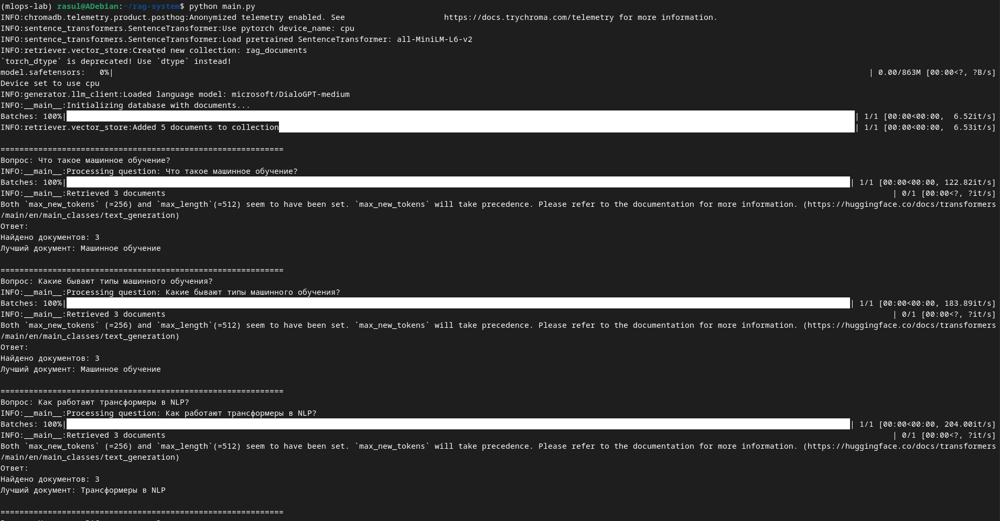

Результаты запуска формирования тестового отчёта из файла test_rag_system.py представлены ниже.
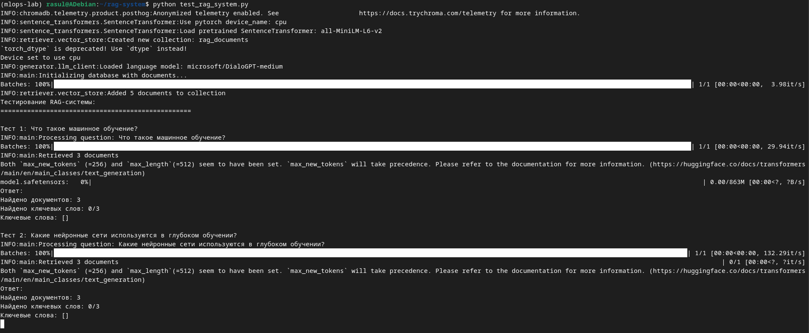

Выводы после старта модифицированной RAG-системы через скрипт main_optimized.py выглядят следующим образом.
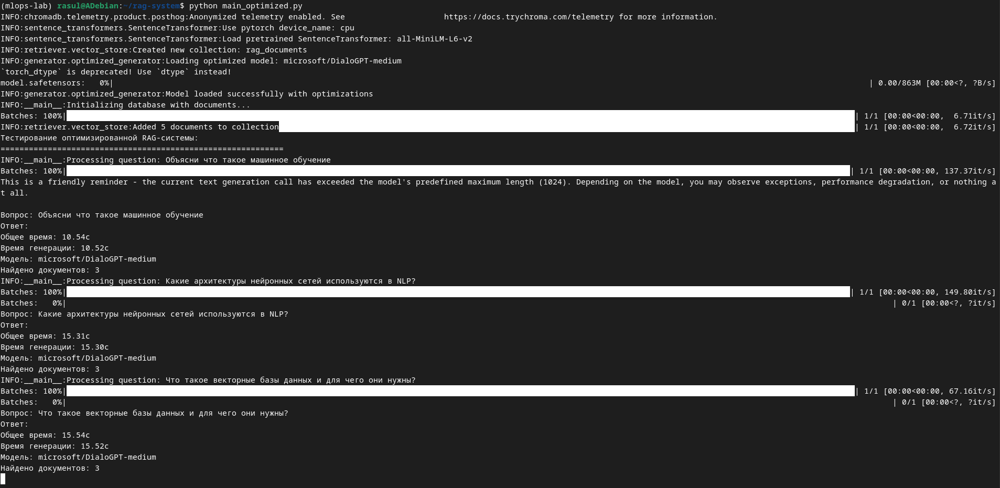

Результаты запуска генерации сравнительного отчёта через скрипт generate_report.py представлены ниже. Отчёты сохранены в файлах model_comprasion_detailed.csv и model_comprasion_summary.csv.
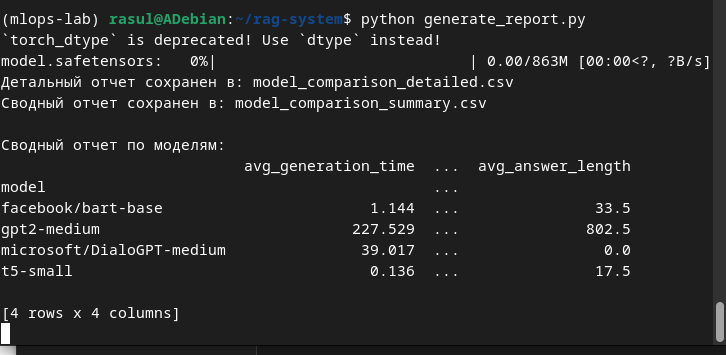

Результаты работы API-эндпоинта /ask с помощью команды curl представлены ниже.
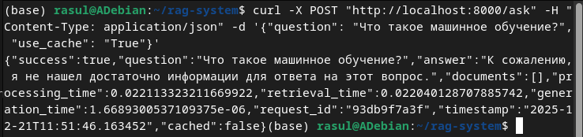

Выводы метрик эндпоинтом /metrics по соответствующему URL выглядят следующим образом.
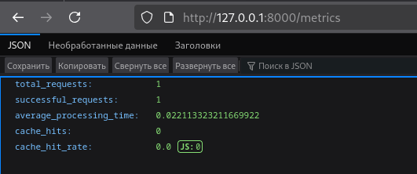

Данные о состоянии здоровья FastAPI-сервиса, выведенные /health представлены ниже.
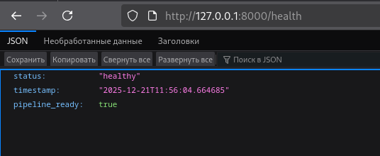

Выводы конфигурации системы после запуска /config выглядят следующим образом.
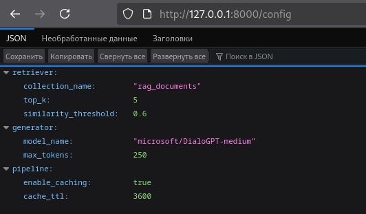

Выводы после комплексного теста через test_pipeline.py представлены ниже.
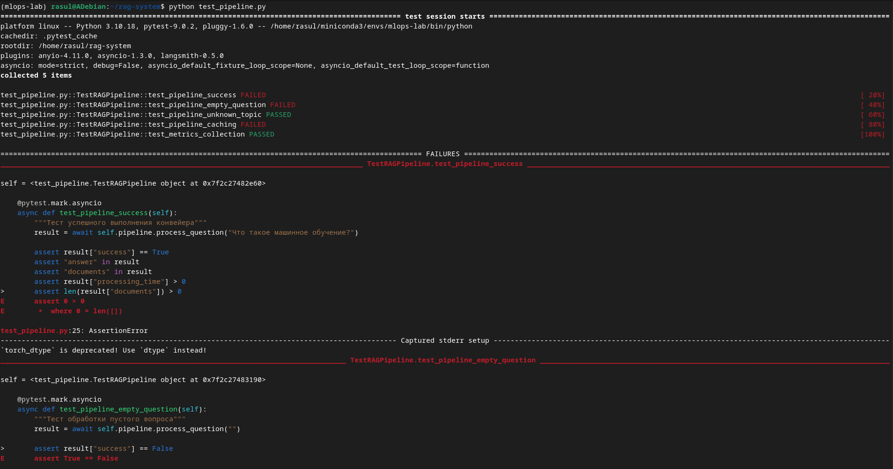

Результаты запуска демострационного скрипта demo_pipeline.py представлены ниже.
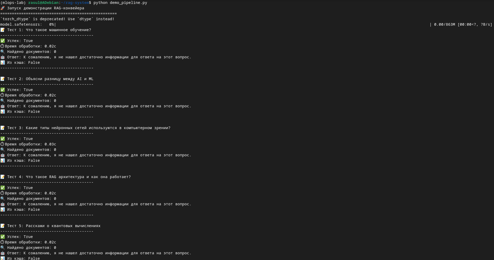

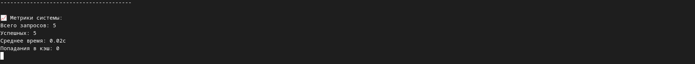

Результаты запуска скрипта для комплексной оценки из файла run_evaluation.py с отображением диаграмм в отдельных окнах выглядят следующим образом.
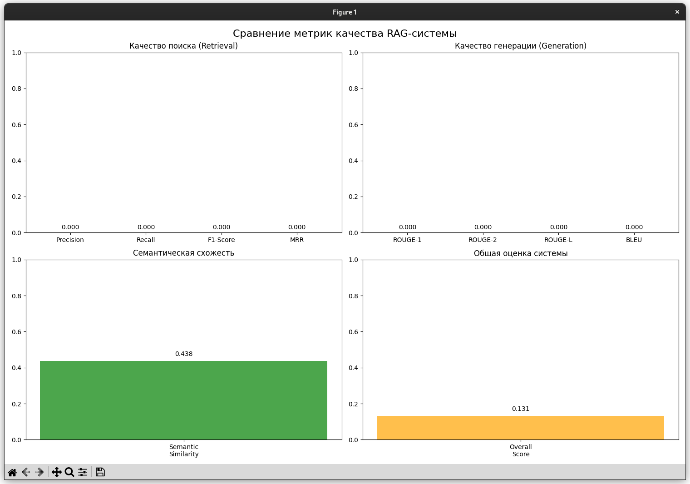

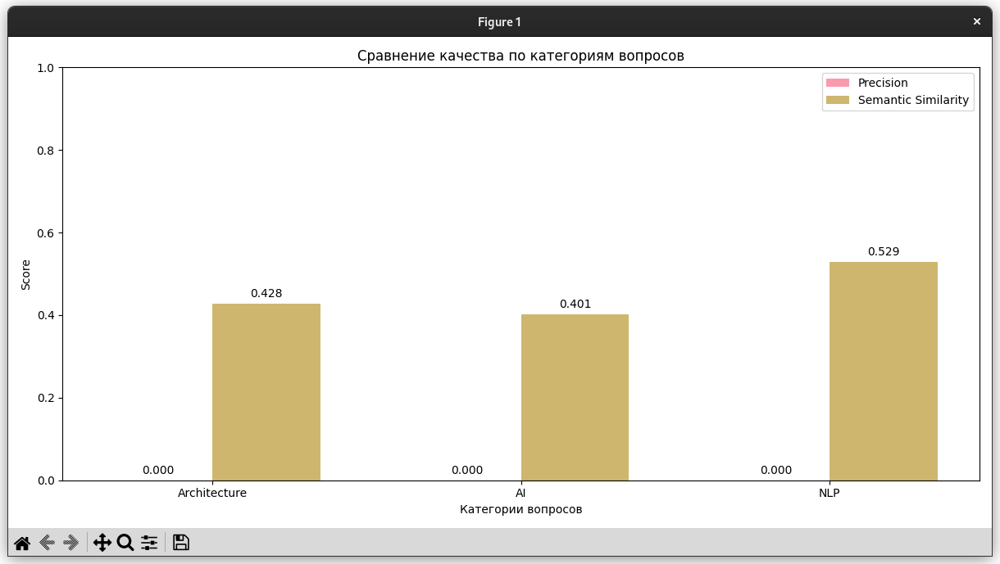

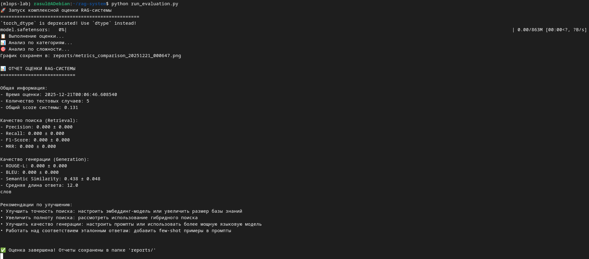

Данные, полученные после работы данной программы, сохранены в файле формата JSON, диаграммы category_analysis и metrics_comparison сохранены в формате PNG.

### Тестирование
- [x] Модульные тесты пройдены
- [x] Интеграционные тесты пройдены
- [x] Производительность соответствует требованиям

## Выводы
1. Освоены принципы построения RAG (Retrieval-Augmented Generation) систем путем интеграции векторного поиска и языковых моделей.
2. Создан работающий прототип системы, способной находить релевантную информацию в базе знаний и генерировать осмысленные ответы на основе извлеченного контекста.
3. Освоены продвинутые техники настройки и оптимизации языковых моделей для использования в качестве генеративного компонента RAG-системы.
4. Получены практические навыки работы с различными архитектурами моделей, оптимизации промптинга и оценки качества генерации.
5. Реализован полный конвейер RAG-системы, интегрирующий семантический поиск и генерацию ответов.
6. Освоено проектирование надежных пайплайнов, обработку ошибок, мониторинг производительности и оптимизацию взаимодействия между компонентами системы.
7. Освоены методы и метрики для комплексной оценки качества RAG-системы.
8. Получены умения проводить объективное тестирование ретривера и генератора, анализировать результаты и выявлять направления для улучшения системы.

## Приложения
- Ссылки на исходный код
1. demo_pipeline.py: [src/rag-system/demo_pipline.py](src/rag-system/demo_pipeline.py)
2. generate_report.py: [src/rag-system/generate_report.py](src/rag-system/generate_report.py)
3. main.py: [src/rag-system/main.py](src/rag-system/main.py)
4. main_optimized.py: [src/rag-system/main_optimized.py](src/rag-system/main_optimized.py)
5. pipeline_service.py^ [src/rag-system/pipeline_service.py](src/rag-system/pipeline_service.py)
6. run_evaluation.py: [src/rag-system/run_evaluation.py](src/rag-system/run_evaluation.py)
7. test.py: [src/rag-system/test.py](src/rag-system/test.py)
8. test_pipeline.py: [src/rag-system/test_pipeline.py](src/rag-system/test_pipeline.py)
9. test_rag_system.py: [src/rag-system/test_rag_system.py](src/rag-system/test_rag_system.py)
10. pipeline_config.py: [src/rag-system/config/pipeline_config.py](src/rag-system/config/pipeline_config.py)
11. tech_docs.py: [src/rag-system/documents/tech_docs.py](src/rag-system/documents/tech_docs.py)
12. generation_evaluator.py: [src/rag-system/evaluation/generation_evaluator.py](src/rag-system/evaluation/generation_evaluator.py)
13. rag_evaluator.py: [src/rag-system/evaluation/rag_evaluator.py](src/rag-system/evaluation/rag_evaluator.py)
14. retrieval_evaluator.py: [src/rag-system/evaluation/retrieval_evaluator.py](src/rag-system/evaluation/retrieval_evaluator.py)
15. test_dataset.py: [src/rag-system/evaluation/test_dataset.py](src/rag-system/evaluation/test_dataset.py)
16. visualization.py: [src/rag-system/evaluation/visualization.py](src/rag-system/evaluation/visualization.py)
17. benchmark_system.py: [src/rag-system/generator/benchmark_system.py](src/rag-system/generator/benchmark_system.py)
18. llm_client.py: [src/rag-system/generator/llm_client.py](src/rag-system/generator/llm_client.py)
19. model_comprasion.py: [src/rag-system/generator/model_comprasion.py](src/rag-system/generator/model_comparison.py)
20. optimized_generator.py: [src/rag-system/generator/optimized_generator.py](src/rag-system/generator/optimized_generator.py)
21. rag_pipeline.py: [src/rag-system/pipeline/rag_pipeline.py](src/rag-system/pipeline/rag_pipeline.py)
22. vector_store.py: [src/rag-system/retriever/vector_store.py](src/rag-system/retriever/vector_store.py)
- Диаграммы и графики:
1. category_analysis:
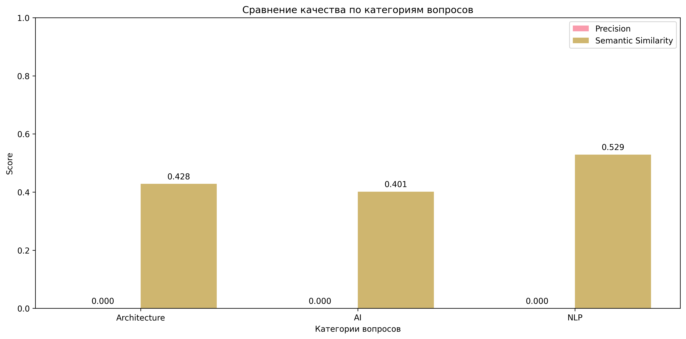

2. metrics_comparison:
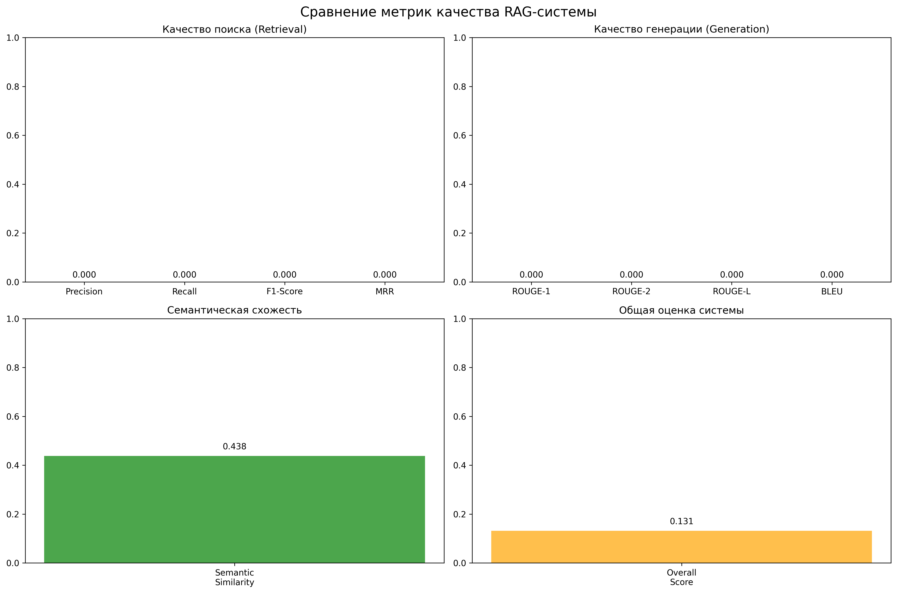

- Ссылки на дополнительные файлы:
1. full_evaluation_20251221_000647.json: [src/rag-system/reports/full_evaluation_20251221_000647.json](src/rag-system/reports/full_evaluation_20251221_000647.json)
2. model_comparison_detailed.csv: [src/rag-system/model_comparison_detailed.csv](src/rag-system/model_comparison_detailed.csv)
3. model_comparison_summary.csv: [src/rag-system/model_comparison_summary.csv](src/rag-system/model_comparison_summary.csv)